# Corp Astro Super Admin Panel (SAP) - Backend Services

[](https://github.com/Project-Corp-Astro/Sap_Backend)
[](https://github.com/Project-Corp-Astro/Sap_Backend)
[](https://github.com/Project-Corp-Astro/Sap_Backend/LICENSE)
[](https://www.typescriptlang.org/)
[](https://nodejs.org/)

## Table of Contents

- [Project Overview](#project-overview)
  - [Key Components in the Corp Astro Ecosystem](#key-components-in-the-corp-astro-ecosystem)
  - [System Flow](#system-flow)
- [Quick Start](#quick-start)
- [Latest Updates](#latest-updates)
  - [Performance Monitoring and Logging System](#performance-monitoring-and-logging-system)
  - [TypeScript Migration Complete](#typescript-migration-complete)
- [Architecture Overview](#architecture-overview)
  - [Microservices Architecture](#microservices-architecture)
  - [Hybrid Database Architecture](#hybrid-database-architecture)
- [Directory Structure](#directory-structure)
  - [Project Structure Overview](#project-structure-overview)
  - [Key Directories and Files](#key-directories-and-files)
- [Key Components](#key-components)
  - [Core Components and Data Flow](#core-components-and-data-flow)
  - [Database Connection Manager](#database-connection-manager)
  - [Authentication System](#authentication-system)
- [Setup and Configuration](#setup-and-configuration)
  - [Prerequisites](#prerequisites)
  - [Environment Variables](#environment-variables)
  - [Installation](#installation)
  - [Running the Application](#running-the-application)
- [API Endpoints](#api-endpoints)
  - [API Structure](#api-structure)
  - [Authentication Endpoints](#authentication-endpoints)
  - [User Management Endpoints](#user-management-endpoints)
- [Scripts and Utilities](#scripts-and-utilities)
  - [Development Scripts](#development-scripts)
  - [Service Scripts](#service-scripts)
  - [Database Scripts](#database-scripts)
- [Development](#development)
  - [Development Workflow](#development-workflow)
  - [Adding a New Entity](#adding-a-new-entity)
  - [Adding a New API Endpoint](#adding-a-new-api-endpoint)
- [Troubleshooting](#troubleshooting)
  - [Common Issues Flowchart](#common-issues-flowchart)
  - [Database Connection Issues](#database-connection-issues)
- [Architecture Deep Dive](#architecture-deep-dive)
  - [Overall Architecture](#overall-architecture)
  - [API Gateway](#api-gateway)
  - [Services](#services)
  - [Models](#models)
- [Source Code Deep Dive](#source-code-deep-dive)
  - [Source Code Structure](#source-code-structure)
  - [Service Structure in Detail](#service-structure-in-detail)
  - [Database Architecture](#database-architecture-1)
  - [ORM Implementation](#orm-implementation)
  - [Testing with Jest](#testing-with-jest)
  - [Component Communication and Technology Stack](#component-communication-and-technology-stack)
- [Contributing](#contributing)
  - [Contribution Guidelines](#contribution-guidelines)
  - [Development Setup](#development-setup)
- [Support](#support)
  - [Issue Tracking](#issue-tracking)
  - [Contact](#contact)
- [License](#license)

## Project Overview

The Corp Astro Super Admin Panel (SAP) is a web-based administration interface for managing the Corp Astro ecosystem. It serves as the central control panel for administering users, content, and services across the Corp Astro platform, which includes mobile applications focused on corporate astrology.

### Key Components in the Corp Astro Ecosystem

- **Mobile Applications**: Corp Astro (corporate astrology), with future plans for GrahVani (Vedic astrology) and TellMyStars (Western astrology)
- **Astro Engine**: Generates charts and calculations using Swiss Ephemeris with sidereal zodiac system
- **Astro Ratan AI**: Conversational AI trained on astrology texts to provide interpretations
- **Super Admin Panel (SAP)**: This backend system for administration and management

### System Flow

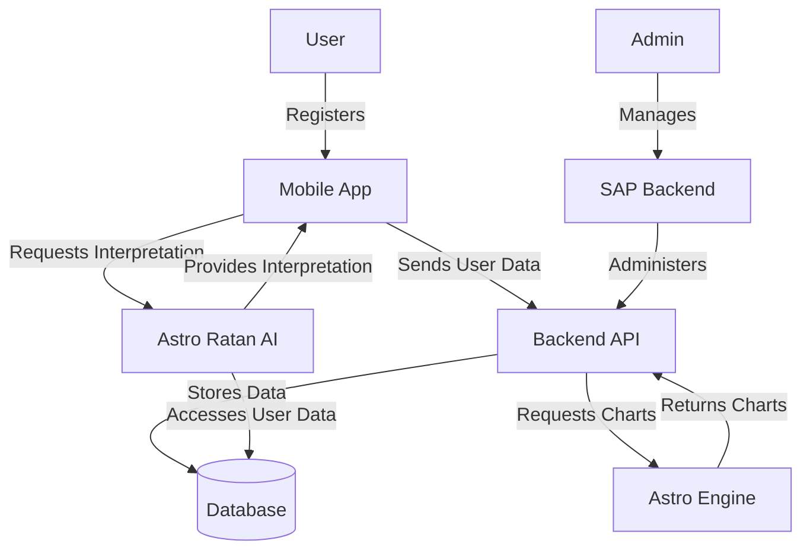

## Quick Start

Get up and running with Corp Astro SAP in minutes:

```bash
# Clone the repository
git clone https://github.com/Project-Corp-Astro/Sap_Backend.git
cd Sap_Backend

# Install dependencies
npm install

# Set up environment variables
cp .env.example .env
# Edit .env with your configuration

# Start development server
npm run dev
```

Access the API at: http://localhost:5000/api

For more detailed setup instructions, see the [Setup and Configuration](#setup-and-configuration) section.

## Latest Updates

### Performance Monitoring and Logging System

We've implemented a comprehensive performance monitoring and centralized logging system across all services to improve observability, debugging, and performance optimization.

#### Performance Monitoring Features

- **Response Time Tracking**: Measure and analyze API response times
- **Cache Effectiveness**: Monitor cache hit/miss rates
- **Database Performance**: Track query execution times
- **System Resource Usage**: Monitor CPU and memory utilization
- **Health Check Endpoints**: Verify service status and performance

#### Centralized Logging System

- **Shared Logger Package**: Common logging utility (`@sap/logger`) for all services
- **Structured Logging**: Consistent log format with metadata
- **Log Rotation**: Automatic file rotation and archiving
- **Request Logging**: HTTP request tracking with customizable formats
- **Error Logging**: Enhanced error tracking with stack traces

## TypeScript Migration Complete

All backend microservices have been successfully migrated to TypeScript, providing improved type safety, better developer experience, and enhanced code quality.

### Migrated Services

- **User Service**: Complete TypeScript implementation with models, controllers, routes, and middleware
  - Converted all models with proper interfaces and type definitions
  - Added TypeScript interfaces for request/response objects
  - Implemented strict type checking for controller methods
  - Enhanced middleware with proper typing

- **Auth Service**: Full TypeScript migration with proper interfaces and type definitions
  - Converted authentication flows with type-safe implementations
  - Added JWT token type definitions
  - Implemented typed error handling
  - Enhanced security with type-safe validation

- **Content Service**: TypeScript conversion with comprehensive test coverage
  - Migrated all models, controllers, services, and routes
  - Added proper interfaces for media and video content
  - Implemented typed mock services for testing
  - Created TypeScript declaration files for test utilities
  - Fixed all TypeScript errors while maintaining test coverage

### TypeScript Configuration

- **tsconfig.json**: Optimized for each service with appropriate settings
- **tsconfig.test.json**: Specialized configuration for testing environments
- **Module Resolution**: Configured for ES modules with proper extension handling
- **Type Declarations**: Added for external dependencies and shared utilities
- **Jest Configuration**: Updated for TypeScript compatibility

## Architecture Overview

The SAP backend implements a microservices architecture with a hybrid database approach to provide a scalable, maintainable, and robust system.

### Microservices Architecture

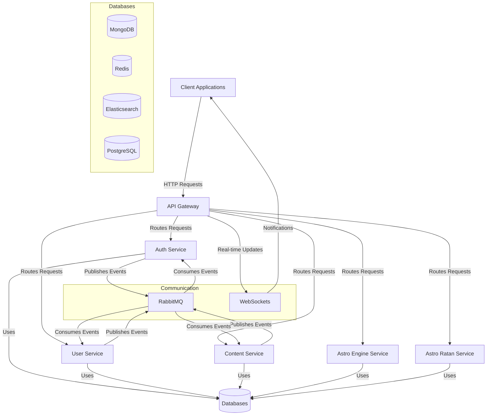

#### High-Level System Architecture

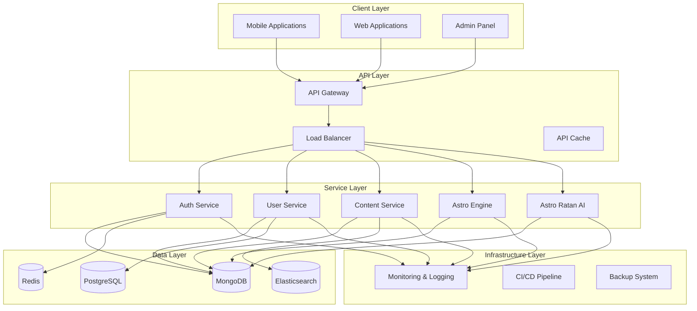

#### Key Components

1. **API Gateway**: Entry point for all client requests, routing them to appropriate microservices
2. **Auth Service**: Handles authentication, authorization, and security
3. **User Service**: Manages user profiles, preferences, and user-related operations
4. **Content Service**: Manages content creation, publishing, and delivery
5. **Astro Engine Service**: (Future) Handles astrological calculations and chart generation
6. **Astro Ratan Service**: (Future) Provides AI-powered astrological interpretations

### Hybrid Database Architecture

The system leverages multiple database technologies to optimize different aspects of the application:

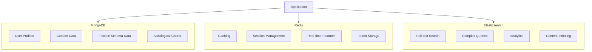

- **MongoDB**: Document database for flexible schema data, user profiles, content, and astrological charts
- **Redis**: In-memory data store for caching, session management, real-time features, and token storage
- **Elasticsearch**: Search engine for full-text search, complex queries, analytics, and content indexing

## Directory Structure

The SAP backend follows a well-organized structure that separates concerns and promotes maintainability. The codebase is divided into microservices, each with its own responsibility, along with shared utilities and configuration.

### Project Structure Overview

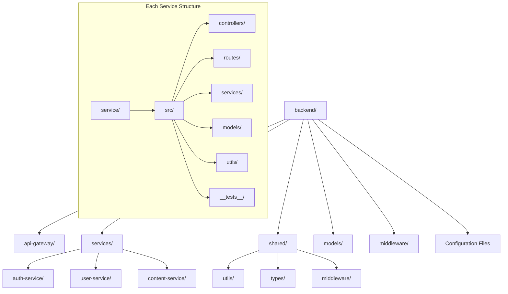

### Detailed Directory Structure

```
backend/
├── api-gateway/                # API Gateway service
│   ├── src/
│   │   ├── index.ts            # Entry point for API Gateway
│   │   └── types/              # Type definitions specific to gateway
│   ├── jest.config.js          # Jest configuration for testing
│   └── package.json            # Dependencies for API Gateway
│
├── services/                   # Microservices
│   ├── auth-service/           # Authentication service
│   │   ├── src/
│   │   │   ├── controllers/    # Request handlers
│   │   │   ├── middlewares/    # Auth-specific middleware
│   │   │   ├── models/         # Data models
│   │   │   ├── routes/         # API routes
│   │   │   ├── services/       # Business logic
│   │   │   ├── utils/          # Utility functions
│   │   │   └── index.ts        # Service entry point
│   │   ├── __tests__/          # Test files
│   │   └── package.json        # Dependencies
│   │
│   ├── user-service/           # User management service
│   │   ├── src/                # Similar structure as auth-service
│   │   └── ...
│   │
│   └── content-service/        # Content management service
│       ├── src/                # Similar structure as auth-service
│       └── ...
│
├── shared/                     # Shared code across services
│   ├── types/                  # Common TypeScript interfaces
│   │   ├── src/
│   │   │   ├── api.ts          # API-related types
│   │   │   ├── auth.ts         # Authentication types
│   │   │   ├── user.ts         # User-related types
│   │   │   ├── content.ts      # Content-related types
│   │   │   └── common.ts       # Shared utility types
│   │   └── package.json        # Dependencies for shared types
│   │
│   └── utils/                  # Shared utilities
│       ├── database.ts         # MongoDB connection utility
│       ├── redis.ts            # Redis connection utility
│       ├── elasticsearch.ts    # Elasticsearch connection utility
│       ├── logger.ts           # Logging utility
│       ├── encryption.ts       # Data encryption utilities
│       └── monitoring.ts       # Performance monitoring utilities
│
├── middleware/                 # Global middleware
│   ├── security.js             # Security middleware
│   └── errorHandler.js         # Error handling middleware
│
├── models/                     # Shared data models
│   └── ...
│
├── logs/                       # Application logs
│
├── scripts/                    # Utility scripts
│   ├── seed.ts                 # Database seeding
│   ├── migrate.ts              # Run migrations
│   └── es-init.ts              # Initialize Elasticsearch
│
├── .env                        # Environment variables
├── .env.example                # Example environment variables
├── package.json                # Project dependencies
├── tsconfig.json               # TypeScript configuration
├── jest.config.js              # Jest test configuration
└── server.ts                   # Main application entry point
```

### Key Directories and Files

#### API Gateway
The API Gateway serves as the entry point for all client requests, routing them to the appropriate microservices. It handles cross-cutting concerns like authentication, request logging, and error handling.

#### Services
Each microservice is self-contained with its own controllers, routes, services, and models. This separation allows for independent development, testing, and deployment.

- **Auth Service**: Handles user authentication, authorization, and security features
- **User Service**: Manages user profiles, preferences, and user-related operations
- **Content Service**: Manages content creation, publishing, and delivery

#### Shared
The shared directory contains code that is used across multiple services, promoting code reuse and consistency.

- **Types**: Common TypeScript interfaces and type definitions
- **Utils**: Shared utility functions for database connections, logging, etc.

#### Middleware
Global middleware that applies to all services, such as security features and error handling.

#### Models
Shared data models that define the structure of the data used across the application.

#### Scripts
Utility scripts for database operations, migrations, and other maintenance tasks.

## Key Components

### Core Components and Data Flow

The SAP backend is built around several key components that work together to provide a robust and scalable system. The following diagram illustrates how these components interact:

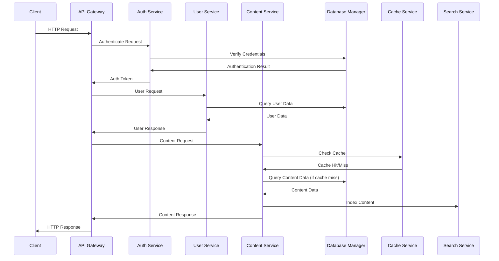

### Database Connection Manager

The `DatabaseManager` class provides a centralized point for connecting to and managing multiple databases. It serves as an abstraction layer between the application and the underlying database systems.

**Key Features:**
- Connection pooling for optimal performance
- Graceful error handling with fallback strategies
- Health monitoring of database connections
- Graceful shutdown to prevent data loss
- Support for mock databases during development and testing

**Usage Example:**
```typescript
// Initialize all database connections
await dbManager.initializeAll();

// Get database status
const status = dbManager.getAllStatuses();

// Close connections gracefully
await dbManager.gracefulShutdown('SIGTERM');
```

### Authentication System

The authentication system provides secure user authentication and authorization using JWT tokens, with support for multi-factor authentication (MFA) and OAuth providers.

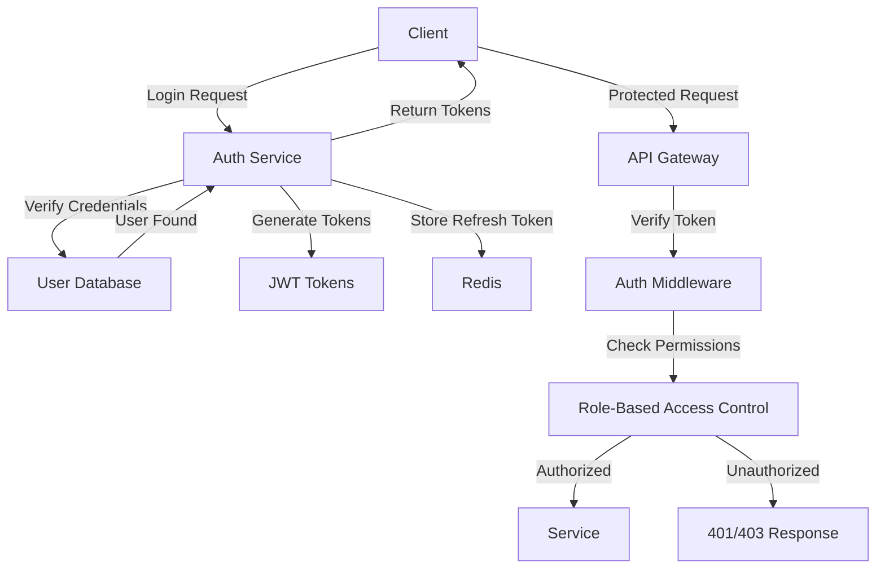

**Key Features:**
- JWT-based authentication with access and refresh tokens
- Role-based access control (RBAC)
- Permission-based authorization
- Multi-factor authentication (MFA)
- OAuth integration (Google, GitHub)
- Account locking after failed attempts
- Password reset functionality

### Data Synchronization Service

The `DataSyncService` keeps data synchronized between different databases, ensuring consistency across the system.

**Key Features:**
- User synchronization between MongoDB and other databases
- Content synchronization with Elasticsearch for search functionality
- Conflict resolution strategies
- Transaction support for atomic operations
- Retry mechanisms for failed synchronizations

### Cache Service

The `CacheService` provides caching functionality using Redis to improve performance and reduce database load.

**Key Features:**
- Key-value caching with TTL (Time-To-Live)
- Set operations for managing collections
- Hash operations for structured data
- Distributed locks for concurrency control
- Cache invalidation strategies
- Cache statistics for monitoring

**Usage Example:**
```typescript
// Store data in cache
await cacheService.set('user:123', userData, 3600); // 1 hour TTL

// Retrieve data from cache
const userData = await cacheService.get('user:123');

// Delete data from cache
await cacheService.del('user:123');
```

### Search Service

The `SearchService` provides powerful search functionality using Elasticsearch, enabling users to find content quickly and efficiently.

**Key Features:**
- Full-text search across content
- User search with filtering
- Autocomplete suggestions
- Faceted search for filtering results
- Relevance scoring and ranking
- Highlighting of matching terms

### Monitoring and Logging System

The monitoring and logging system provides comprehensive visibility into the application's performance and behavior.

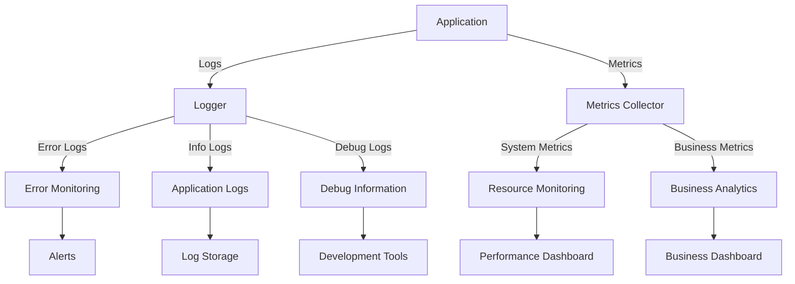

**Key Features:**
- Structured logging with metadata
- Response time tracking
- Cache effectiveness monitoring
- Database performance tracking
- System resource usage monitoring
- Health check endpoints
- Log rotation and archiving

## Setup and Configuration

### Prerequisites

Before setting up the SAP backend, ensure you have the following installed:

- Node.js (v18.0.0 or higher)
- npm or yarn
- MongoDB (v5.0 or higher)
- Redis (v6.0 or higher)
- Elasticsearch (v7.0 or higher, optional)

### Environment Variables

The application uses environment variables for configuration. Create a `.env` file in the root directory based on the `.env.example` template:

```bash
# Application Settings
NODE_ENV=development
PORT=3000
API_PREFIX=/api
CORS_ORIGIN=http://localhost:3000,http://localhost:3001

# JWT Settings
JWT_SECRET=your-secret-key-change-in-production
JWT_EXPIRES_IN=1h
JWT_REFRESH_SECRET=your-refresh-secret-key-change-in-production
JWT_REFRESH_EXPIRES_IN=7d

# MongoDB
MONGO_URI=mongodb://localhost:27017/sap-db
MONGO_DEBUG=false

# Redis
REDIS_HOST=localhost
REDIS_PORT=6379
REDIS_PASSWORD=
REDIS_DB=0

# Elasticsearch (Optional)
ELASTICSEARCH_NODE=http://localhost:9200
ELASTICSEARCH_USERNAME=
ELASTICSEARCH_PASSWORD=

# Logging
LOG_LEVEL=info
LOG_FORMAT=combined

# Services
SERVICES_AUTH=http://localhost:3001
SERVICES_USER=http://localhost:3002
SERVICES_CONTENT=http://localhost:3003

# Optional Services
# SERVICES_ASTRO_ENGINE=http://localhost:3004
# SERVICES_ASTRO_RATAN=http://localhost:3005

# MFA Settings
MFA_APP_NAME=SAP Corp Astro

# Email Settings (for password reset, etc.)
SMTP_HOST=smtp.example.com
SMTP_PORT=587
SMTP_USER=your-email@example.com
SMTP_PASS=your-email-password
FROM_EMAIL=no-reply@example.com
```

### Installation

#### 1. Clone the repository (if not already done)

```bash
git clone https://github.com/your-repo/sap-backend.git
cd sap-backend
```

#### 2. Install dependencies

```bash
# Install root dependencies
npm install --legacy-peer-deps

# Install shared types
cd shared/types
npm install
cd ../..

# Install API Gateway dependencies
cd api-gateway
npm install
cd ..

# Install service dependencies
cd services/auth-service
npm install
cd ../user-service
npm install
cd ../content-service
npm install
cd ../..
```

#### 3. Set up databases

```bash
# Initialize all databases
npm run db:init

# Run migrations
npm run db:migrate:run

# Seed the database with initial data
npm run db:seed

# Initialize Elasticsearch indices (if using Elasticsearch)
npm run db:es:indices
```

### Running the Application

#### Development Mode

You can run individual services or all services together:

```bash
# Run all services concurrently
npm run dev:all

# Or run services individually
npm run dev:gateway  # API Gateway
npm run dev:auth     # Auth Service
npm run dev:user     # User Service
npm run dev:content  # Content Service
```

#### Production Mode

For production deployment, build the TypeScript code first:

```bash
# Build all services
npm run build

# Start all services
npm run start:gateway & npm run start:auth & npm run start:user & npm run start:content
```

### Verifying Installation

After starting the services, you can verify that everything is working correctly:

```bash
# Check API Gateway health
curl http://localhost:5001/health

# Check Auth Service health
curl http://localhost:3001/health

# Check User Service health
curl http://localhost:3002/health

# Check Content Service health
curl http://localhost:3003/health
```

### Docker Support (Optional)

If you prefer using Docker, you can use the provided Docker Compose configuration:

```bash
# Start all services and databases
docker-compose up -d

# Stop all services
docker-compose down
```

### Development Workflow

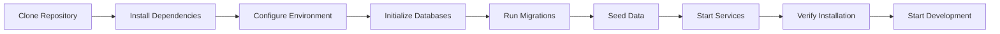

## API Endpoints

The SAP backend exposes a comprehensive set of RESTful API endpoints through the API Gateway. These endpoints are organized by service and follow consistent patterns for CRUD operations.

### API Structure

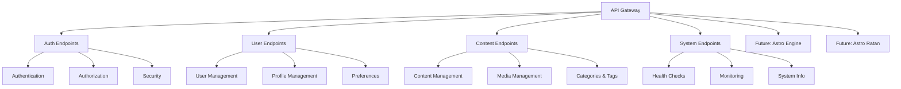

### Authentication Endpoints

| Method | Endpoint | Description | Request Body | Response |
|--------|----------|-------------|--------------|----------|
| `POST` | `/api/auth/register` | Register a new user | `{ email, password, firstName, lastName, username }` | User object with token |
| `POST` | `/api/auth/login` | Authenticate user | `{ email, password }` | Auth tokens and user data |
| `POST` | `/api/auth/refresh-token` | Refresh access token | `{ refreshToken }` | New access token |
| `GET`  | `/api/auth/profile` | Get user profile | - | User profile data |
| `POST` | `/api/auth/logout` | Logout user | - | Success message |
| `POST` | `/api/auth/mfa/setup` | Setup MFA | - | MFA setup data |
| `POST` | `/api/auth/mfa/verify` | Verify MFA token | `{ userId, token }` | Verification result |
| `POST` | `/api/auth/password-reset/request` | Request password reset | `{ email }` | Success message |
| `POST` | `/api/auth/password-reset` | Reset password | `{ token, newPassword }` | Success message |

### User Management Endpoints

| Method | Endpoint | Description | Request Body | Response |
|--------|----------|-------------|--------------|----------|
| `GET`  | `/api/users` | Get all users (paginated) | Query params for filtering | Paginated list of users |
| `GET`  | `/api/users/:userId` | Get user by ID | - | User object |
| `POST` | `/api/users` | Create a new user | User data | Created user object |
| `PUT`  | `/api/users/:userId` | Update user | Updated user data | Updated user object |
| `DELETE` | `/api/users/:userId` | Delete user | - | Success message |
| `PATCH` | `/api/users/:userId/status` | Update user status | `{ isActive }` | Updated user object |
| `PUT`  | `/api/users/profile` | Update user profile | Profile data | Updated profile |
| `PUT`  | `/api/users/password` | Change password | `{ currentPassword, newPassword }` | Success message |
| `PUT`  | `/api/users/security-preferences` | Update security preferences | Security settings | Updated preferences |
| `GET`  | `/api/users/:userId/activity` | Get user activity log | - | Activity log |

### Content Management Endpoints

| Method | Endpoint | Description | Request Body | Response |
|--------|----------|-------------|--------------|----------|
| `GET`  | `/api/content` | Get all content (paginated) | Query params for filtering | Paginated list of content |
| `GET`  | `/api/content/:contentId` | Get content by ID | - | Content object |
| `POST` | `/api/content` | Create new content | Content data | Created content object |
| `PUT`  | `/api/content/:contentId` | Update content | Updated content data | Updated content object |
| `DELETE` | `/api/content/:contentId` | Delete content | - | Success message |
| `PATCH` | `/api/content/:contentId/status` | Update content status | `{ status }` | Updated content object |
| `GET`  | `/api/content/categories` | Get all categories | - | List of categories |
| `GET`  | `/api/content/tags` | Get all tags | - | List of tags |

### System Endpoints

| Method | Endpoint | Description | Response |
|--------|----------|-------------|----------|
| `GET`  | `/health` | Simple health check | Health status |
| `GET`  | `/health/detailed` | Detailed health check | Detailed health status with database connections |
| `GET`  | `/health/database/:type` | Database-specific health check | Database connection status |
| `GET`  | `/api-docs` | API documentation (Swagger) | Swagger UI |

### Future: Astro Engine Endpoints

These endpoints will be implemented in future versions:

| Method | Endpoint | Description | Request Body | Response |
|--------|----------|-------------|--------------|----------|
| `POST` | `/api/astro-engine/charts/natal` | Generate natal chart | Birth details | Chart data |
| `POST` | `/api/astro-engine/charts/transit` | Generate transit chart | Date and natal data | Transit chart data |
| `GET`  | `/api/astro-engine/ephemeris/:date` | Get ephemeris data | - | Planetary positions |

### Future: Astro Ratan Endpoints

These endpoints will be implemented in future versions:

| Method | Endpoint | Description | Request Body | Response |
|--------|----------|-------------|--------------|----------|
| `POST` | `/api/astro-ratan/interpret` | Get astrological interpretation | Chart data | Interpretation text |
| `POST` | `/api/astro-ratan/chat` | Chat with Astro Ratan | `{ message, userId }` | AI response |

### API Request Example

```javascript
// Example: Login request
fetch('http://localhost:5001/api/auth/login', {
  method: 'POST',
  headers: {
    'Content-Type': 'application/json'
  },
  body: JSON.stringify({
    email: 'user@example.com',
    password: 'password123'
  })
})
.then(response => response.json())
.then(data => {
  // Store tokens
  localStorage.setItem('accessToken', data.data.accessToken);
  localStorage.setItem('refreshToken', data.data.refreshToken);
})
.catch(error => console.error('Error:', error));
```

### API Response Example

```json
{
  "success": true,
  "message": "Login successful",
  "data": {
    "user": {
      "_id": "60d21b4667d0d8992e610c85",
      "email": "user@example.com",
      "firstName": "John",
      "lastName": "Doe",
      "role": "user",
      "isActive": true,
      "lastLogin": "2023-05-19T18:25:43.511Z"
    },
    "accessToken": "eyJhbGciOiJIUzI1NiIsInR5cCI6IkpXVCJ9...",
    "refreshToken": "eyJhbGciOiJIUzI1NiIsInR5cCI6IkpXVCJ9..."
  }
}
```

## Scripts and Utilities

The SAP backend includes a variety of utility scripts to help with development, testing, and maintenance tasks. These scripts are organized in the `package.json` file and can be run using npm.

### Development Scripts

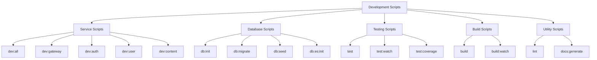

### Service Scripts

| Script | Description | Usage |
|--------|-------------|-------|
| `npm run dev` | Run the main server in development mode | `npm run dev` |
| `npm run dev:all` | Run all microservices concurrently | `npm run dev:all` |
| `npm run dev:gateway` | Run only the API Gateway | `npm run dev:gateway` |
| `npm run dev:auth` | Run only the Auth Service | `npm run dev:auth` |
| `npm run dev:user` | Run only the User Service | `npm run dev:user` |
| `npm run dev:content` | Run only the Content Service | `npm run dev:content` |
| `npm run dev:monitoring` | Run only the Monitoring Service | `npm run dev:monitoring` |
| `npm run dev:notification` | Run only the Notification Service | `npm run dev:notification` |

### Database Scripts

| Script | Description | Usage |
|--------|-------------|-------|
| `npm run db:init` | Initialize all databases | `npm run db:init` |
| `npm run db:migrate` | Run database migrations | `npm run db:migrate` |
| `npm run db:seed` | Seed the database with initial data | `npm run db:seed` |
| `npm run db:pg:migrate` | Run PostgreSQL-specific migrations | `npm run db:pg:migrate` |
| `npm run db:pg:seed` | Seed PostgreSQL with initial data | `npm run db:pg:seed` |
| `npm run db:es:init` | Initialize Elasticsearch indices | `npm run db:es:init` |
| `npm run db:es:reindex` | Reindex data from MongoDB to Elasticsearch | `npm run db:es:reindex` |
| `npm run db:sync` | Synchronize data between databases | `npm run db:sync` |
| `npm run db:monitor` | Monitor database health and performance | `npm run db:monitor` |
| `npm run db:migrate:generate` | Generate a new migration file | `npm run db:migrate:generate -- -n MigrationName` |
| `npm run db:migrate:run` | Run pending migrations | `npm run db:migrate:run` |
| `npm run db:migrate:revert` | Revert the last migration | `npm run db:migrate:revert` |
| `npm run db:migrate:list` | List all migrations | `npm run db:migrate:list` |

### Testing Scripts

| Script | Description | Usage |
|--------|-------------|-------|
| `npm run test` | Run all tests | `npm run test` |
| `npm run test:watch` | Run tests in watch mode | `npm run test:watch` |
| `npm run test:coverage` | Run tests with coverage report | `npm run test:coverage` |
| `npm run test:ci` | Run tests in CI environment | `npm run test:ci` |

### Build Scripts

| Script | Description | Usage |
|--------|-------------|-------|
| `npm run build` | Build all services for production | `npm run build` |
| `npm run build:watch` | Build with watch mode for development | `npm run build:watch` |
| `npm run start` | Start the production server | `npm run start` |
| `npm run start:gateway` | Start the API Gateway in production | `npm run start:gateway` |
| `npm run start:auth` | Start the Auth Service in production | `npm run start:auth` |
| `npm run start:user` | Start the User Service in production | `npm run start:user` |
| `npm run start:content` | Start the Content Service in production | `npm run start:content` |

### Utility Scripts

| Script | Description | Usage |
|--------|-------------|-------|
| `npm run lint` | Lint all code | `npm run lint` |
| `npm run lint:fix` | Lint and fix code issues | `npm run lint:fix` |
| `npm run docs:generate` | Generate API documentation | `npm run docs:generate` |
| `npm run security:audit` | Run security audit on dependencies | `npm run security:audit` |
| `npm run analyze` | Analyze bundle size | `npm run analyze` |
| `npm run type-check` | Check TypeScript types | `npm run type-check` |

### Script Examples

#### Initialize and Seed Database

```bash
# Initialize all databases
npm run db:init

# Run migrations
npm run db:migrate

# Seed the database with initial data
npm run db:seed
```

#### Generate and Run a New Migration

```bash
# Generate a new migration file
npm run db:migrate:generate -- -n AddUserFields

# Run the new migration
npm run db:migrate:run
```

#### Run Tests with Coverage

```bash
# Run all tests with coverage report
npm run test:coverage
```

#### Build and Start for Production

```bash
# Build all services
npm run build

# Start all services
npm run start:gateway & npm run start:auth & npm run start:user & npm run start:content
```

## Development

### Development Workflow

The SAP backend follows a microservices architecture, which allows for independent development and deployment of each service. The following diagram illustrates the development workflow:

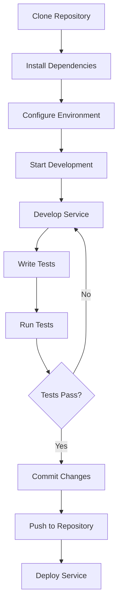

### Adding a New Entity

When adding a new entity to the system, follow these steps:

1. **Define the shared type**: Add the entity interface to the appropriate file in `shared/types/src/`

2. **Create the model**: Add the entity model to the appropriate service's models directory

3. **Create the controller**: Implement the CRUD operations in a new controller

4. **Define the routes**: Add the routes for the new entity in the service's routes directory

5. **Implement the service**: Add the business logic in the service layer

6. **Create a migration**: Generate a migration to add the entity to the database

7. **Write tests**: Add unit and integration tests for the new entity

#### Example: Adding a User Preference Entity

1. Define the shared type in `shared/types/src/user.ts`:

```typescript
export interface UserPreference {
  id: string;
  userId: string;
  key: string;
  value: string;
  createdAt: Date;
  updatedAt: Date;
}
```

2. Create the model in `services/user-service/src/models/UserPreference.ts`:

```typescript
import mongoose, { Schema, Document } from 'mongoose';
import { UserPreference } from '@corp-astro/shared-types';

export interface UserPreferenceDocument extends UserPreference, Document {}

const UserPreferenceSchema = new Schema({
  userId: { type: Schema.Types.ObjectId, ref: 'User', required: true },
  key: { type: String, required: true },
  value: { type: String, required: true },
}, { timestamps: true });

// Create a compound index on userId and key for faster lookups
UserPreferenceSchema.index({ userId: 1, key: 1 }, { unique: true });

export default mongoose.model<UserPreferenceDocument>('UserPreference', UserPreferenceSchema);
```

3. Create a migration:

```bash
npm run db:migrate:generate -- -n AddUserPreferenceEntity
```

### Adding a New API Endpoint

When adding a new API endpoint, follow these steps:

1. **Define the route**: Add the route to the appropriate service's routes file

2. **Implement the controller**: Add the controller method to handle the request

3. **Add validation**: Implement request validation using express-validator

4. **Implement the service logic**: Add the business logic in the service layer

5. **Document the endpoint**: Add JSDoc comments for Swagger documentation

6. **Write tests**: Add unit and integration tests for the new endpoint

#### Example: Adding a User Preference Endpoint

```typescript
// In routes/user-preferences.routes.ts
import express from 'express';
import { body } from 'express-validator';
import * as userPreferenceController from '../controllers/user-preference.controller';
import authMiddleware from '../middlewares/auth.middleware';

const router = express.Router();

/**
 * @route GET /api/users/preferences
 * @desc Get all preferences for the authenticated user
 * @access Private
 */
router.get('/', authMiddleware, userPreferenceController.getUserPreferences);

/**
 * @route POST /api/users/preferences
 * @desc Create or update a user preference
 * @access Private
 */
router.post('/',
  authMiddleware,
  [
    body('key').notEmpty().withMessage('Preference key is required'),
    body('value').notEmpty().withMessage('Preference value is required')
  ],
  userPreferenceController.setUserPreference
);

export default router;
```

### Adding a New Index to Elasticsearch

When adding a new index to Elasticsearch for search functionality, follow these steps:

1. **Define the index mapping**: Add the index mapping to `scripts/es-init.ts`

2. **Create the index**: Run the Elasticsearch initialization script

3. **Implement the indexing logic**: Add code to index documents in the appropriate service

4. **Add search functionality**: Implement search queries in the service layer

#### Example: Adding a Content Index

1. Update the index configuration in `scripts/es-init.ts`:

```typescript
const contentIndexConfig = {
  mappings: {
    properties: {
      title: { type: 'text', analyzer: 'english' },
      description: { type: 'text', analyzer: 'english' },
      body: { type: 'text', analyzer: 'english' },
      tags: { type: 'keyword' },
      categories: { type: 'keyword' },
      author: { type: 'keyword' },
      createdAt: { type: 'date' },
      updatedAt: { type: 'date' }
    }
  }
};

// Add to indices array
const indices = [
  { name: 'users', config: userIndexConfig },
  { name: 'content', config: contentIndexConfig }
];
```

2. Run the Elasticsearch initialization script:

```bash
npm run db:es:init
```

### Integration with Corp Astro Ecosystem

The SAP backend is designed to integrate with the broader Corp Astro ecosystem, including the mobile applications, Astro Engine, and Astro Ratan AI. Here's how to develop with these integrations in mind:

#### Mobile App Integration

The SAP backend provides APIs that will be consumed by the Corp Astro mobile application. When developing these APIs, consider:

- **Authentication**: Ensure all endpoints are properly secured
- **Performance**: Optimize for mobile network conditions
- **Versioning**: Implement API versioning to support multiple app versions

#### Astro Engine Integration

The SAP backend will integrate with the Astro Engine for astrological calculations. When developing this integration:

- **API Design**: Design clean interfaces for the Astro Engine service
- **Data Storage**: Implement efficient storage for astrological charts
- **Caching**: Cache frequently accessed chart data

#### Astro Ratan AI Integration

The SAP backend will integrate with the Astro Ratan AI for astrological interpretations. When developing this integration:

- **Data Access**: Implement secure access to user data for the AI
- **API Design**: Design endpoints for AI interactions
- **Performance**: Optimize for real-time chat interactions

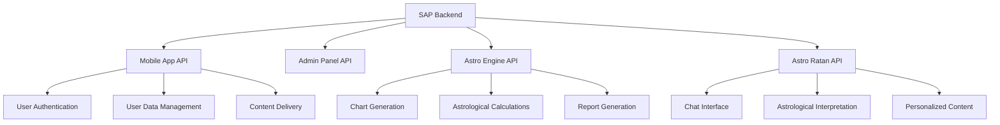

## Troubleshooting

This section provides guidance for diagnosing and resolving common issues that you might encounter during development and deployment.

### Common Issues Flowchart

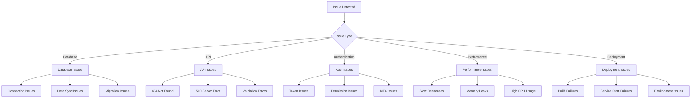

### Database Connection Issues

If you encounter database connection issues, follow these steps:

1. **Check database services**:
   ```bash
   # Check if MongoDB is running
   mongo --eval "db.adminCommand('ping')"
   
   # Check if Redis is running
   redis-cli ping
   
   # Check if Elasticsearch is running
   curl -X GET "localhost:9200/"
   ```

2. **Verify environment variables**:
   - Ensure your `.env` file contains the correct connection strings
   - Check for typos in hostnames, ports, and credentials
   - Verify that the database names are correct

3. **Check database logs**:
   ```bash
   # MongoDB logs
   tail -f /var/log/mongodb/mongod.log
   
   # Redis logs
   tail -f /var/log/redis/redis-server.log
   ```

4. **Run health checks**:
   ```bash
   # Check API Gateway health
   curl http://localhost:5001/health/detailed
   
   # Check specific database health
   curl http://localhost:5001/health/database/mongo
   curl http://localhost:5001/health/database/redis
   curl http://localhost:5001/health/database/elasticsearch
   ```

5. **Check network connectivity**:
   ```bash
   # Test MongoDB connection
   nc -zv localhost 27017
   
   # Test Redis connection
   nc -zv localhost 6379
   
   # Test Elasticsearch connection
   nc -zv localhost 9200
   ```

### Data Synchronization Issues

If data is not properly synchronized between databases:

1. **Run the synchronization script**:
   ```bash
   npm run db:sync
   ```

2. **Check synchronization logs**:
   ```bash
   tail -f logs/sync.log
   ```

3. **Verify source data**:
   - Check that the data exists in the source database
   - Ensure the data format is correct

4. **Manual synchronization**:
   ```bash
   # Sync specific collection
   npm run db:sync -- --collection=users
   
   # Force full sync
   npm run db:sync -- --force
   ```

### Authentication Issues

If you encounter authentication issues:

1. **Check JWT configuration**:
   - Verify JWT_SECRET and JWT_REFRESH_SECRET in .env
   - Ensure JWT_EXPIRES_IN is set correctly

2. **Test token generation**:
   ```bash
   # Login to get tokens
   curl -X POST http://localhost:5001/api/auth/login \
     -H "Content-Type: application/json" \
     -d '{"email":"admin@example.com","password":"password123"}'
   ```

3. **Verify token validation**:
   ```bash
   # Access protected endpoint with token
   curl -X GET http://localhost:5001/api/users/profile \
     -H "Authorization: Bearer YOUR_ACCESS_TOKEN"
   ```

4. **Check Redis for refresh tokens**:
   ```bash
   # Connect to Redis CLI
   redis-cli
   
   # List refresh tokens
   keys refresh_token:*
   ```

### Service Startup Issues

If services fail to start:

1. **Check for port conflicts**:
   ```bash
   # Check if ports are in use
   lsof -i :3000
   lsof -i :3001
   lsof -i :3002
   lsof -i :3003
   lsof -i :5001
   ```

2. **Check service logs**:
   ```bash
   # Check API Gateway logs
   tail -f logs/api-gateway.log
   
   # Check Auth Service logs
   tail -f logs/auth-service.log
   ```

3. **Verify dependencies**:
   ```bash
   # Check for missing dependencies
   npm ls
   ```

4. **Check for TypeScript errors**:
   ```bash
   npm run type-check
   ```

### Performance Issues

If you encounter performance issues:

1. **Check system resources**:
   ```bash
   # Monitor CPU and memory usage
   top
   
   # Monitor specific Node.js processes
   ps aux | grep node
   ```

2. **Check database performance**:
   ```bash
   # MongoDB performance statistics
   mongo --eval "db.stats()"
   
   # Redis performance statistics
   redis-cli info
   ```

3. **Enable performance monitoring**:
   ```bash
   # Set environment variable
   export ENABLE_PERFORMANCE_MONITORING=true
   
   # Restart services
   npm run dev:all
   ```

4. **Check API response times**:
   ```bash
   # Use curl with timing information
   curl -w "\nTotal: %{time_total}s\n" http://localhost:5001/health
   ```

### Integration Issues with Astro Engine and Astro Ratan

When integrating with the Astro Engine or Astro Ratan AI, you might encounter these issues:

1. **Service discovery issues**:
   - Check that the service URLs are correctly configured in the `.env` file
   - Verify that the services are running and accessible

2. **Data format issues**:
   - Ensure that the data being sent to the Astro Engine follows the expected format
   - Verify that chart data is correctly formatted for Astro Ratan interpretations

3. **Authentication issues**:
   - Check that the services are using the same authentication mechanism
   - Verify that service-to-service authentication is working correctly

### Debugging Tools

Use these tools to help diagnose issues:

1. **API Gateway logs**:
   ```bash
   tail -f logs/api-gateway.log
   ```

2. **Service-specific logs**:
   ```bash
   tail -f logs/auth-service.log
   tail -f logs/user-service.log
   tail -f logs/content-service.log
   ```

3. **Database query logs**:
   ```bash
   # Enable MongoDB query logging
   mongo --eval "db.setProfilingLevel(2)"
   
   # View MongoDB query logs
   mongo --eval "db.system.profile.find().pretty()"
   ```

4. **Node.js debugging**:
   ```bash
   # Start a service with debugging enabled
   NODE_OPTIONS="--inspect" npm run dev:auth
   ```

5. **API testing with Postman or Insomnia**:
   - Create a collection of API requests for testing
   - Save environment variables for tokens and endpoints
   - Use pre-request scripts to handle authentication

## Contributing

We welcome contributions to the Corp Astro Super Admin Panel! Here's how you can contribute:

### Contribution Guidelines

1. **Fork the Repository**: Start by forking the repository to your GitHub account.

2. **Create a Branch**: Create a feature branch for your contribution.
   ```bash
   git checkout -b feature/your-feature-name
   ```

3. **Follow Coding Standards**:
   - Use TypeScript for all new code
   - Follow the existing code style and patterns
   - Write unit tests for your code
   - Ensure all tests pass before submitting a pull request

4. **Commit Guidelines**:
   - Use conventional commit messages (feat, fix, docs, style, refactor, test, chore)
   - Keep commits focused and atomic
   - Reference issue numbers in commit messages when applicable

5. **Submit a Pull Request**: Push your changes to your fork and submit a pull request to the main repository.

6. **Code Review**: Wait for code review and address any feedback.

### Development Setup

Follow the [Setup and Configuration](#setup-and-configuration) section to set up your development environment.

## Support

If you encounter any issues or have questions about the Corp Astro Super Admin Panel, here are some ways to get support:

### Issue Tracking

Please use the [GitHub Issues](https://github.com/Project-Corp-Astro/Sap_Backend/issues) page to report bugs or request features.

### Contact

- **Project Maintainer**: [Project Lead Name](mailto:lead@corpastro.com)
- **Development Team**: [Dev Team Email](mailto:dev@corpastro.com)

### Documentation

Additional documentation can be found in the [/docs](./docs) directory of this repository.

## License

This project is licensed under the MIT License - see the LICENSE file for details.

## Architecture Deep Dive

This section provides a comprehensive explanation of the key components in the SAP Backend architecture, their importance, and how they interact with each other.

### Overall Architecture

The SAP Backend follows a microservices architecture pattern, with services communicating through an API Gateway. Here's a visualization of the overall architecture:

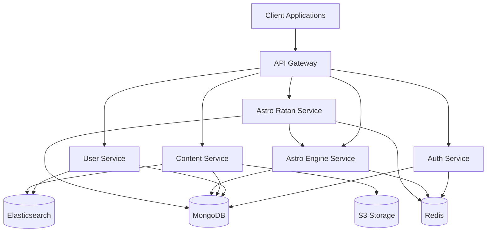

### API Gateway

The API Gateway is the single entry point for all client requests, acting as a reverse proxy that routes requests to the appropriate microservices.

#### Importance

- **Single Entry Point**: Provides a unified interface for clients to interact with the backend services
- **Request Routing**: Routes requests to the appropriate microservice based on the URL path
- **Authentication**: Verifies JWT tokens before forwarding requests to internal services
- **Rate Limiting**: Prevents abuse by limiting the number of requests from a single client
- **Load Balancing**: Distributes traffic across multiple instances of the same service
- **Request/Response Transformation**: Modifies requests and responses as needed
- **Logging and Monitoring**: Captures metrics and logs for all incoming requests

#### Directory Structure

```
src/gateway/
├── config/             # Gateway configuration files
├── middleware/         # Gateway-specific middleware
│   ├── auth.middleware.ts       # Authentication middleware
│   ├── rate-limit.middleware.ts # Rate limiting middleware
│   └── logging.middleware.ts    # Request logging middleware
├── routes/             # Route definitions for proxying requests
│   ├── auth.routes.ts           # Routes for Auth Service
│   ├── user.routes.ts           # Routes for User Service
│   └── content.routes.ts        # Routes for Content Service
├── services/           # Gateway-specific services
│   ├── discovery.service.ts     # Service discovery
│   └── health.service.ts        # Health check service
└── gateway.ts          # Main gateway application file
```

#### Implementation

```typescript
// Example of API Gateway implementation using Express and http-proxy-middleware
import express from 'express';
import { createProxyMiddleware } from 'http-proxy-middleware';
import { authMiddleware } from './middleware/auth.middleware';
import { rateLimitMiddleware } from './middleware/rate-limit.middleware';

const app = express();

// Apply global middleware
app.use(express.json());
app.use(rateLimitMiddleware);

// Auth routes - no authentication required
app.use('/api/auth', createProxyMiddleware({
  target: process.env.AUTH_SERVICE_URL,
  pathRewrite: { '^/api/auth': '/' },
  changeOrigin: true,
}));

// Protected routes - authentication required
app.use('/api/users', authMiddleware, createProxyMiddleware({
  target: process.env.USER_SERVICE_URL,
  pathRewrite: { '^/api/users': '/' },
  changeOrigin: true,
}));

app.use('/api/content', authMiddleware, createProxyMiddleware({
  target: process.env.CONTENT_SERVICE_URL,
  pathRewrite: { '^/api/content': '/' },
  changeOrigin: true,
}));

// Health check endpoint
app.get('/health', (req, res) => {
  res.status(200).json({ status: 'ok' });
});

app.listen(5001, () => {
  console.log('API Gateway running on port 5001');
});
```

### Services

Services are the core building blocks of the microservices architecture, each responsible for a specific domain of functionality.

#### Importance

- **Domain Separation**: Each service focuses on a specific business domain
- **Independent Development**: Teams can develop and deploy services independently
- **Technology Flexibility**: Each service can use the most appropriate technology stack
- **Scalability**: Services can be scaled independently based on demand
- **Resilience**: Failure in one service doesn't bring down the entire system
- **Maintainability**: Smaller codebases are easier to understand and maintain

#### Service Types

1. **Auth Service**: Handles user authentication and authorization
2. **User Service**: Manages user profiles and preferences
3. **Content Service**: Manages content creation, storage, and retrieval
4. **Astro Engine Service**: Performs astrological calculations and chart generation
5. **Astro Ratan Service**: Provides AI-powered astrological interpretations

#### Directory Structure (Common Pattern)

```
src/services/[service-name]/
├── config/             # Service-specific configuration
├── controllers/        # Request handlers
├── middleware/         # Service-specific middleware
├── models/             # Data models
├── repositories/       # Data access layer
├── routes/             # Route definitions
├── services/           # Business logic
├── utils/              # Utility functions
├── validation/         # Request validation schemas
└── index.ts            # Service entry point
```

#### Implementation Example (Auth Service)

```typescript
// src/services/auth-service/index.ts
import express from 'express';
import mongoose from 'mongoose';
import { errorHandler } from './middleware/error.middleware';
import authRoutes from './routes/auth.routes';

const app = express();

// Middleware
app.use(express.json());

// Routes
app.use('/', authRoutes);

// Error handling
app.use(errorHandler);

// Connect to MongoDB
mongoose.connect(process.env.MONGODB_URI)
  .then(() => {
    console.log('Connected to MongoDB');
    app.listen(3001, () => {
      console.log('Auth Service running on port 3001');
    });
  })
  .catch((error) => {
    console.error('MongoDB connection error:', error);
  });
```

### Models

Models define the structure of data within the application and provide an interface for interacting with the database.

#### Importance

- **Data Structure**: Define the shape of data entities
- **Validation**: Ensure data integrity through schema validation
- **Type Safety**: Provide type definitions for TypeScript
- **Database Abstraction**: Abstract the underlying database implementation
- **Business Logic**: Encapsulate entity-specific business logic

#### Directory Structure

```
src/services/[service-name]/models/
├── user.model.ts       # User model definition
├── role.model.ts       # Role model definition
├── permission.model.ts # Permission model definition
└── index.ts            # Export all models
```

#### Implementation Example (User Model)

```typescript
// src/services/user-service/models/user.model.ts
import mongoose, { Schema, Document } from 'mongoose';
import bcrypt from 'bcrypt';

export interface UserDocument extends Document {
  email: string;
  password: string;
  firstName: string;
  lastName: string;
  role: string;
  isActive: boolean;
  lastLogin: Date;
  createdAt: Date;
  updatedAt: Date;
  comparePassword(candidatePassword: string): Promise<boolean>;
}

const UserSchema = new Schema({
  email: { type: String, required: true, unique: true },
  password: { type: String, required: true },
  firstName: { type: String, required: true },
  lastName: { type: String, required: true },
  role: { type: Schema.Types.ObjectId, ref: 'Role' },
  isActive: { type: Boolean, default: true },
  lastLogin: { type: Date },
}, { timestamps: true });

// Hash password before saving
UserSchema.pre('save', async function(next) {
  if (!this.isModified('password')) return next();
  
  try {
    const salt = await bcrypt.genSalt(10);
    this.password = await bcrypt.hash(this.password, salt);
    next();
  } catch (error) {
    next(error);
  }
});

// Method to compare passwords
UserSchema.methods.comparePassword = async function(candidatePassword: string): Promise<boolean> {
  return bcrypt.compare(candidatePassword, this.password);
};

// Create indexes
UserSchema.index({ email: 1 });
UserSchema.index({ role: 1 });

export default mongoose.model<UserDocument>('User', UserSchema);
```

### Middleware

Middleware functions are essential components that have access to the request and response objects in the application's request-response cycle.

#### Importance

- **Request Processing**: Intercept and process HTTP requests before they reach route handlers
- **Response Modification**: Modify HTTP responses before they are sent to clients
- **Cross-Cutting Concerns**: Handle aspects that affect multiple parts of the application
- **Code Reusability**: Avoid duplicating code across different routes
- **Security**: Implement authentication, authorization, and other security measures
- **Performance**: Monitor and optimize request handling

#### Types of Middleware

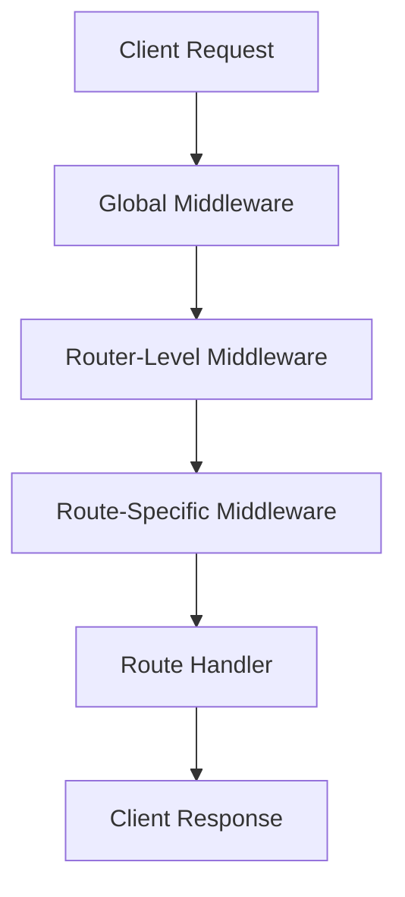

1. **Global Middleware**: Applied to all routes in the application
2. **Router-Level Middleware**: Applied to specific routers
3. **Route-Specific Middleware**: Applied to specific routes
4. **Error-Handling Middleware**: Handles errors that occur during request processing

#### Directory Structure

```
src/middleware/
├── common/             # Shared middleware across services
│   ├── error.middleware.ts     # Error handling middleware
│   ├── logger.middleware.ts    # Request logging middleware
│   └── validator.middleware.ts # Request validation middleware
└── service-specific/    # Service-specific middleware
    ├── auth.middleware.ts      # Authentication middleware
    ├── rbac.middleware.ts      # Role-based access control
    └── cache.middleware.ts     # Response caching middleware
```

#### Implementation Example (Authentication Middleware)

```typescript
// src/middleware/common/auth.middleware.ts
import { Request, Response, NextFunction } from 'express';
import jwt from 'jsonwebtoken';
import { redisClient } from '../services/redis.service';

interface DecodedToken {
  userId: string;
  role: string;
  iat: number;
  exp: number;
}

export const authMiddleware = async (req: Request, res: Response, next: NextFunction) => {
  try {
    // Get token from Authorization header
    const authHeader = req.headers.authorization;
    if (!authHeader || !authHeader.startsWith('Bearer ')) {
      return res.status(401).json({ message: 'Authentication required' });
    }
    
    const token = authHeader.split(' ')[1];
    
    // Verify token
    const decoded = jwt.verify(token, process.env.JWT_SECRET) as DecodedToken;
    
    // Check if token is blacklisted (logged out)
    const isBlacklisted = await redisClient.get(`blacklist:${token}`);
    if (isBlacklisted) {
      return res.status(401).json({ message: 'Token is no longer valid' });
    }
    
    // Add user info to request object
    req.user = {
      userId: decoded.userId,
      role: decoded.role
    };
    
    next();
  } catch (error) {
    if (error.name === 'TokenExpiredError') {
      return res.status(401).json({ message: 'Token expired' });
    }
    
    return res.status(401).json({ message: 'Invalid token' });
  }
};
```

### Routes

Routes define the endpoints of the API and map HTTP requests to controller functions.

#### Importance

- **API Structure**: Define the structure and organization of the API
- **Request Handling**: Map HTTP methods and paths to controller functions
- **Input Validation**: Validate request parameters, query strings, and body
- **Middleware Application**: Apply middleware to specific endpoints
- **Documentation**: Serve as a reference for API documentation

#### Directory Structure

```
src/services/[service-name]/routes/
├── auth.routes.ts      # Authentication routes
├── user.routes.ts      # User management routes
├── content.routes.ts   # Content management routes
└── index.ts            # Export all routes
```

#### Implementation Example (User Routes)

```typescript
// src/services/user-service/routes/user.routes.ts
import express from 'express';
import { body, param } from 'express-validator';
import * as userController from '../controllers/user.controller';
import { authMiddleware } from '../middleware/auth.middleware';
import { rbacMiddleware } from '../middleware/rbac.middleware';
import { validateRequest } from '../middleware/validator.middleware';

const router = express.Router();

/**
 * @route GET /users
 * @desc Get all users (paginated)
 * @access Admin only
 */
router.get('/',
  authMiddleware,
  rbacMiddleware(['admin']),
  userController.getUsers
);

/**
 * @route GET /users/:id
 * @desc Get user by ID
 * @access Admin or own user
 */
router.get('/:id',
  authMiddleware,
  param('id').isMongoId().withMessage('Invalid user ID'),
  validateRequest,
  userController.getUserById
);

/**
 * @route POST /users
 * @desc Create a new user
 * @access Admin only
 */
router.post('/',
  authMiddleware,
  rbacMiddleware(['admin']),
  [
    body('email').isEmail().withMessage('Valid email is required'),
    body('password').isLength({ min: 8 }).withMessage('Password must be at least 8 characters'),
    body('firstName').notEmpty().withMessage('First name is required'),
    body('lastName').notEmpty().withMessage('Last name is required'),
    body('role').isMongoId().withMessage('Valid role ID is required')
  ],
  validateRequest,
  userController.createUser
);

/**
 * @route PUT /users/:id
 * @desc Update a user
 * @access Admin or own user
 */
router.put('/:id',
  authMiddleware,
  param('id').isMongoId().withMessage('Invalid user ID'),
  [
    body('email').optional().isEmail().withMessage('Valid email is required'),
    body('firstName').optional().notEmpty().withMessage('First name cannot be empty'),
    body('lastName').optional().notEmpty().withMessage('Last name cannot be empty')
  ],
  validateRequest,
  userController.updateUser
);

/**
 * @route DELETE /users/:id
 * @desc Delete a user
 * @access Admin only
 */
router.delete('/:id',
  authMiddleware,
  rbacMiddleware(['admin']),
  param('id').isMongoId().withMessage('Invalid user ID'),
  validateRequest,
  userController.deleteUser
);

export default router;
```

### Integration Tests

Integration tests verify that different components of the application work together correctly.

#### Importance

- **Component Interaction**: Verify that components interact correctly
- **API Contract Testing**: Ensure the API behaves as expected
- **Database Integration**: Test database operations in a real environment
- **Error Handling**: Verify that errors are handled correctly
- **End-to-End Flows**: Test complete user flows through the system

#### Directory Structure

```
tests/integration/
├── auth/               # Auth service tests
│   ├── login.test.ts          # Login endpoint tests
│   └── register.test.ts       # Registration endpoint tests
├── user/               # User service tests
│   ├── create-user.test.ts    # User creation tests
│   └── update-user.test.ts    # User update tests
├── content/            # Content service tests
└── setup.ts            # Test setup and utilities
```

#### Implementation Example (User Integration Test)

```typescript
// tests/integration/user/create-user.test.ts
import request from 'supertest';
import { app } from '../../../src/services/user-service';
import { User } from '../../../src/services/user-service/models/user.model';
import { connectDatabase, disconnectDatabase } from '../setup';

describe('User API - Create User', () => {
  let adminToken: string;
  
  beforeAll(async () => {
    await connectDatabase();
    
    // Get admin token for authenticated requests
    const loginResponse = await request(app)
      .post('/auth/login')
      .send({
        email: 'admin@example.com',
        password: 'adminpassword'
      });
    
    adminToken = loginResponse.body.accessToken;
  });
  
  afterAll(async () => {
    await User.deleteMany({ email: 'test@example.com' });
    await disconnectDatabase();
  });
  
  it('should create a new user when valid data is provided', async () => {
    const userData = {
      email: 'test@example.com',
      password: 'password123',
      firstName: 'Test',
      lastName: 'User',
      role: '60a6c57d8f8d8e001c123456' // Assuming this is a valid role ID
    };
    
    const response = await request(app)
      .post('/users')
      .set('Authorization', `Bearer ${adminToken}`)
      .send(userData);
    
    expect(response.status).toBe(201);
    expect(response.body).toHaveProperty('id');
    expect(response.body.email).toBe(userData.email);
    expect(response.body.firstName).toBe(userData.firstName);
    expect(response.body.lastName).toBe(userData.lastName);
    expect(response.body).not.toHaveProperty('password'); // Password should not be returned
  });
  
  it('should return 400 when email is invalid', async () => {
    const userData = {
      email: 'invalid-email',
      password: 'password123',
      firstName: 'Test',
      lastName: 'User',
      role: '60a6c57d8f8d8e001c123456'
    };
    
    const response = await request(app)
      .post('/users')
      .set('Authorization', `Bearer ${adminToken}`)
      .send(userData);
    
    expect(response.status).toBe(400);
    expect(response.body).toHaveProperty('errors');
    expect(response.body.errors[0].param).toBe('email');
  });
  
  it('should return 401 when token is not provided', async () => {
    const userData = {
      email: 'test@example.com',
      password: 'password123',
      firstName: 'Test',
      lastName: 'User',
      role: '60a6c57d8f8d8e001c123456'
    };
    
    const response = await request(app)
      .post('/users')
      .send(userData);
    
    expect(response.status).toBe(401);
  });
});
```

### Performance Tests

Performance tests evaluate the system's responsiveness, stability, and scalability under various load conditions.

#### Importance

- **Load Testing**: Determine how the system behaves under normal and peak loads
- **Stress Testing**: Identify the breaking point of the system
- **Endurance Testing**: Verify system stability over extended periods
- **Scalability Testing**: Evaluate how the system scales with increasing load
- **Bottleneck Identification**: Identify performance bottlenecks
- **Baseline Establishment**: Establish performance baselines for future comparisons

#### Directory Structure

```
tests/performance/
├── scenarios/           # Test scenarios
│   ├── auth.scenario.js        # Authentication scenarios
│   ├── user.scenario.js        # User management scenarios
│   └── content.scenario.js     # Content management scenarios
├── config/              # Test configuration
│   └── k6.config.js            # k6 configuration
└── reports/             # Test reports
```

#### Implementation Example (k6 Performance Test)

```javascript
// tests/performance/scenarios/auth.scenario.js
import http from 'k6/http';
import { check, sleep } from 'k6';
import { Counter, Rate, Trend } from 'k6/metrics';

// Custom metrics
const loginSuccessRate = new Rate('login_success_rate');
const loginDuration = new Trend('login_duration');
const activeUsers = new Counter('active_users');

// Test configuration
export const options = {
  stages: [
    { duration: '1m', target: 50 },   // Ramp up to 50 users over 1 minute
    { duration: '3m', target: 50 },   // Stay at 50 users for 3 minutes
    { duration: '1m', target: 100 },  // Ramp up to 100 users over 1 minute
    { duration: '5m', target: 100 },  // Stay at 100 users for 5 minutes
    { duration: '1m', target: 0 }     // Ramp down to 0 users over 1 minute
  ],
  thresholds: {
    'login_success_rate': ['rate>0.95'], // 95% of login requests should succeed
    'login_duration': ['p(95)<500'],     // 95% of logins should complete within 500ms
    'http_req_duration': ['p(95)<1000']  // 95% of all requests should complete within 1s
  }
};

// Test scenario
export default function() {
  activeUsers.add(1);
  
  // Login request
  const startTime = new Date();
  const loginResponse = http.post('http://localhost:5001/api/auth/login', {
    email: 'user@example.com',
    password: 'password123'
  }, {
    headers: { 'Content-Type': 'application/json' }
  });
  loginDuration.add(new Date() - startTime);
  
  // Check login response
  const loginSuccess = check(loginResponse, {
    'login status is 200': (r) => r.status === 200,
    'has access token': (r) => r.json('accessToken') !== undefined
  });
  loginSuccessRate.add(loginSuccess);
  
  if (loginSuccess) {
    const token = loginResponse.json('accessToken');
    
    // Get user profile
    const profileResponse = http.get('http://localhost:5001/api/users/profile', {
      headers: {
        'Authorization': `Bearer ${token}`,
        'Content-Type': 'application/json'
      }
    });
    
    check(profileResponse, {
      'profile status is 200': (r) => r.status === 200,
      'has user data': (r) => r.json('email') !== undefined
    });
  }
  
  sleep(Math.random() * 3 + 1); // Random sleep between 1-4 seconds
}
```

### Scripts

Scripts are utility programs that automate common tasks in the development, testing, and deployment processes.

#### Importance

- **Automation**: Automate repetitive tasks to improve developer productivity
- **Consistency**: Ensure tasks are performed consistently across environments
- **Deployment**: Facilitate the deployment process
- **Database Management**: Manage database operations like migrations and seeding
- **Testing**: Set up and run tests
- **Monitoring**: Monitor system health and performance

#### Types of Scripts

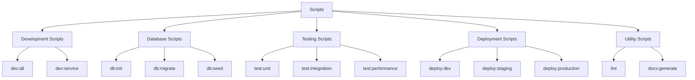

#### Directory Structure

```
scripts/
├── database/            # Database management scripts
│   ├── init.js                # Initialize databases
│   ├── migrate.js             # Run database migrations
│   ├── seed.js                # Seed databases with initial data
│   ├── es-init.js             # Initialize Elasticsearch indices
│   └── sync.js                # Synchronize data between databases
├── deployment/          # Deployment scripts
│   ├── deploy-dev.sh          # Deploy to development environment
│   ├── deploy-staging.sh      # Deploy to staging environment
│   └── deploy-production.sh   # Deploy to production environment
├── monitoring/          # Monitoring scripts
│   ├── health-check.js         # Check system health
│   └── performance-monitor.js  # Monitor system performance
└── utils/               # Utility scripts
    ├── generate-api-docs.js    # Generate API documentation
    ├── lint.js                # Lint code
    └── generate-types.js      # Generate TypeScript types
```

#### Implementation Example (Database Seed Script)

```javascript
// scripts/database/seed.js
const mongoose = require('mongoose');
const bcrypt = require('bcrypt');
const { User, Role, Permission } = require('../src/services/user-service/models');

async function seedDatabase() {
  console.log('Seeding database...');
  
  try {
    // Connect to MongoDB
    await mongoose.connect(process.env.MONGODB_URI);
    console.log('Connected to MongoDB');
    
    // Clear existing data
    await User.deleteMany({});
    await Role.deleteMany({});
    await Permission.deleteMany({});
    console.log('Cleared existing data');
    
    // Create permissions
    const permissions = await Permission.insertMany([
      { name: 'create:user', description: 'Create users' },
      { name: 'read:user', description: 'Read user data' },
      { name: 'update:user', description: 'Update user data' },
      { name: 'delete:user', description: 'Delete users' },
      { name: 'create:content', description: 'Create content' },
      { name: 'read:content', description: 'Read content' },
      { name: 'update:content', description: 'Update content' },
      { name: 'delete:content', description: 'Delete content' }
    ]);
    console.log('Created permissions');
    
    // Create roles
    const adminRole = await Role.create({
      name: 'admin',
      description: 'Administrator with full access',
      permissions: permissions.map(p => p._id)
    });
    
    const userRole = await Role.create({
      name: 'user',
      description: 'Regular user',
      permissions: permissions
        .filter(p => p.name.startsWith('read:'))
        .map(p => p._id)
    });
    console.log('Created roles');
    
    // Create admin user
    const adminPassword = await bcrypt.hash('adminpassword', 10);
    await User.create({
      email: 'admin@example.com',
      password: adminPassword,
      firstName: 'Admin',
      lastName: 'User',
      role: adminRole._id,
      isActive: true
    });
    
    // Create regular user
    const userPassword = await bcrypt.hash('userpassword', 10);
    await User.create({
      email: 'user@example.com',
      password: userPassword,
      firstName: 'Regular',
      lastName: 'User',
      role: userRole._id,
      isActive: true
    });
    console.log('Created users');
    
    console.log('Database seeding completed successfully');
  } catch (error) {
    console.error('Error seeding database:', error);
  } finally {
    await mongoose.disconnect();
    console.log('Disconnected from MongoDB');
  }
}

seedDatabase();
```

### Shared Folders and Code

Shared folders contain code and resources that are used across multiple services, promoting code reuse and consistency.

#### Importance

- **Code Reusability**: Avoid duplicating code across services
- **Consistency**: Ensure consistent behavior across services
- **Maintainability**: Centralize common functionality for easier maintenance
- **Type Safety**: Share type definitions across services
- **Configuration**: Share configuration across services

#### Directory Structure

```
shared/
├── types/               # Shared TypeScript types
│   ├── src/                   # Type definitions
│   │   ├── user.ts                # User-related types
│   │   ├── content.ts             # Content-related types
│   │   ├── auth.ts                # Authentication-related types
│   │   └── index.ts               # Export all types
│   └── package.json           # Package configuration
├── utils/               # Shared utility functions
│   ├── src/                   # Utility implementations
│   │   ├── validation.ts          # Validation utilities
│   │   ├── logger.ts              # Logging utilities
│   │   ├── date.ts                # Date manipulation utilities
│   │   └── index.ts               # Export all utilities
│   └── package.json           # Package configuration
├── config/              # Shared configuration
│   ├── src/                   # Configuration implementations
│   │   ├── database.ts            # Database configuration
│   │   ├── logger.ts              # Logger configuration
│   │   ├── security.ts            # Security configuration
│   │   └── index.ts               # Export all configurations
│   └── package.json           # Package configuration
└── constants/           # Shared constants
    ├── src/                   # Constants implementations
    │   ├── error-codes.ts         # Error codes
    │   ├── status-codes.ts        # Status codes
    │   ├── roles.ts               # Role constants
    │   └── index.ts               # Export all constants
    └── package.json           # Package configuration
```

#### Implementation Example (Shared Types)

```typescript
// shared/types/src/user.ts
export interface User {
  id: string;
  email: string;
  firstName: string;
  lastName: string;
  role: string;
  isActive: boolean;
  lastLogin?: Date;
  createdAt: Date;
  updatedAt: Date;
}

export interface UserCreateDTO {
  email: string;
  password: string;
  firstName: string;
  lastName: string;
  role: string;
}

export interface UserUpdateDTO {
  email?: string;
  firstName?: string;
  lastName?: string;
  role?: string;
  isActive?: boolean;
}

export interface UserPreference {
  id: string;
  userId: string;
  key: string;
  value: string;
  createdAt: Date;
  updatedAt: Date;
}
```

### Integration with Corp Astro Ecosystem

The SAP Backend is designed to integrate with the broader Corp Astro ecosystem, including the mobile applications, Astro Engine, and Astro Ratan AI.

#### Architecture Integration

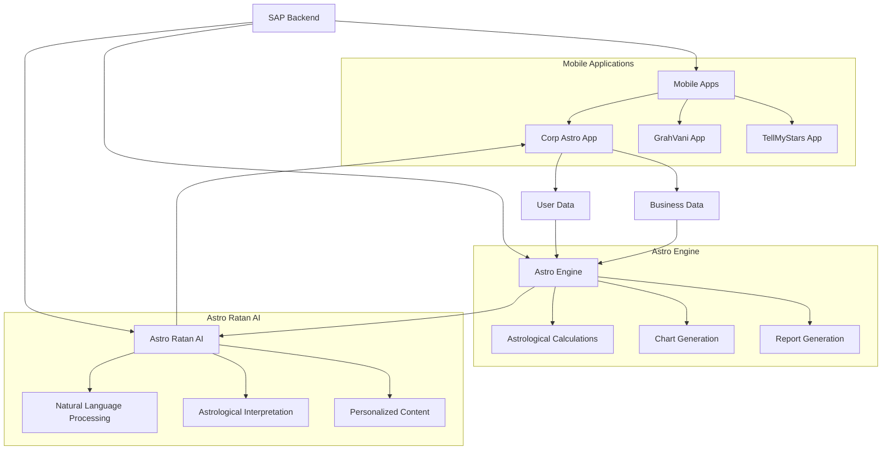

#### Integration Points

1. **Mobile App Integration**:
   - RESTful APIs for user authentication and data access
   - WebSocket connections for real-time updates
   - Push notification services for alerts and reminders

2. **Astro Engine Integration**:
   - API endpoints for chart generation and calculations
   - Data storage for astrological charts and reports
   - Caching mechanisms for frequently accessed data

3. **Astro Ratan AI Integration**:
   - API endpoints for AI interactions
   - Data access for personalized interpretations
   - WebSocket connections for real-time chat

#### Data Flow

1. **User Registration and Data Collection**:
   - User registers in the mobile app
   - User provides personal and business details
   - Data is stored in the SAP Backend databases

2. **Chart Generation**:
   - SAP Backend sends user data to Astro Engine
   - Astro Engine generates natal charts
   - Charts are stored in the database

3. **AI Interpretation**:
   - User requests interpretation in the mobile app
   - SAP Backend retrieves chart data
   - Data is sent to Astro Ratan AI for interpretation
   - AI generates personalized content
   - Content is returned to the mobile app

### Conclusion

The SAP Backend architecture is designed with scalability, maintainability, and flexibility in mind. By following a microservices approach with clear separation of concerns, the system can evolve and adapt to changing requirements while maintaining robustness and performance.

The key components—API Gateway, Services, Models, Middleware, Routes, Scripts, and Shared Code—work together to create a cohesive system that supports the Corp Astro ecosystem, providing a solid foundation for the mobile applications, Astro Engine, and Astro Ratan AI to deliver value to users.

## Source Code Deep Dive

This section provides a comprehensive exploration of the source code structure, including detailed explanations of the `src` folder organization, database implementations, testing frameworks, and other critical components.

### Source Code Structure

The `src` folder is the heart of the application, containing all the source code for the microservices, shared libraries, and core functionality.

#### Overall Structure

```mermaid
flowchart TD
    src[src/] --> gateway[gateway/]
    src --> services[services/]
    src --> shared[shared/]
    src --> config[config/]
    src --> utils[utils/]
    
    gateway --> gatewayConfig[config/]
    gateway --> gatewayMiddleware[middleware/]
    gateway --> gatewayRoutes[routes/]
    gateway --> gatewayServices[services/]
    
    services --> authService[auth-service/]
    services --> userService[user-service/]
    services --> contentService[content-service/]
    services --> astroEngine[astro-engine/]
    services --> astroRatan[astro-ratan/]
    
    shared --> sharedTypes[types/]
    shared --> sharedUtils[utils/]
    shared --> sharedConstants[constants/]
    
    config --> envConfig[env.config.ts]
    config --> appConfig[app.config.ts]
    config --> dbConfig[database.config.ts]
    config --> securityConfig[security.config.ts]
    
    utils --> logger[logger.ts]
    utils --> errorHandler[error-handler.ts]
    utils --> validators[validators.ts]
```

#### Directory Structure

```
src/
├── gateway/                 # API Gateway implementation
│   ├── config/                  # Gateway configuration
│   ├── middleware/              # Gateway middleware
│   ├── routes/                  # Gateway routes
│   ├── services/                # Gateway services
│   └── index.ts                 # Gateway entry point
├── services/                # Microservices
│   ├── auth-service/            # Authentication service
│   │   ├── config/                # Service configuration
│   │   ├── controllers/           # Request handlers
│   │   ├── middleware/            # Service middleware
│   │   ├── models/                # Data models
│   │   ├── repositories/          # Data access layer
│   │   ├── routes/                # Route definitions
│   │   ├── services/              # Business logic
│   │   ├── validation/            # Request validation
│   │   ├── utils/                 # Utility functions
│   │   └── index.ts               # Service entry point
│   ├── user-service/            # User management service
│   │   ├── ...
│   ├── content-service/         # Content management service
│   │   ├── ...
│   ├── astro-engine/           # Astrological calculation service
│   │   ├── ...
│   └── astro-ratan/            # AI interpretation service
│       ├── ...
├── shared/                  # Shared code
│   ├── types/                  # Type definitions
│   ├── utils/                  # Utility functions
│   └── constants/              # Constant values
├── config/                  # Application configuration
│   ├── env.config.ts           # Environment configuration
│   ├── app.config.ts           # Application configuration
│   ├── database.config.ts      # Database configuration
│   └── security.config.ts      # Security configuration
└── utils/                   # Global utility functions
    ├── logger.ts               # Logging utility
    ├── error-handler.ts        # Error handling utility
    └── validators.ts           # Validation utility
```

### Service Structure in Detail

Each microservice follows a consistent structure to maintain code organization and separation of concerns. Let's examine the `auth-service` as an example:

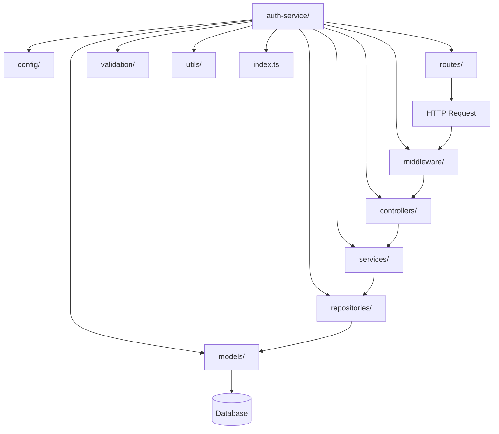

#### Controllers

Controllers handle HTTP requests and responses, acting as an interface between the client and the service layer.

```typescript
// src/services/auth-service/controllers/auth.controller.ts
import { Request, Response } from 'express';
import * as authService from '../services/auth.service';
import { LoginDTO, RegisterDTO } from '../validation/auth.dto';

export const login = async (req: Request, res: Response) => {
  try {
    const loginDto: LoginDTO = req.body;
    const result = await authService.login(loginDto);
    return res.status(200).json(result);
  } catch (error) {
    return res.status(401).json({ message: error.message });
  }
};

export const register = async (req: Request, res: Response) => {
  try {
    const registerDto: RegisterDTO = req.body;
    const result = await authService.register(registerDto);
    return res.status(201).json(result);
  } catch (error) {
    return res.status(400).json({ message: error.message });
  }
};

export const refreshToken = async (req: Request, res: Response) => {
  try {
    const { refreshToken } = req.body;
    const result = await authService.refreshToken(refreshToken);
    return res.status(200).json(result);
  } catch (error) {
    return res.status(401).json({ message: error.message });
  }
};

export const logout = async (req: Request, res: Response) => {
  try {
    const { refreshToken } = req.body;
    await authService.logout(refreshToken);
    return res.status(204).send();
  } catch (error) {
    return res.status(400).json({ message: error.message });
  }
};
```

#### Services

Services contain the business logic of the application, orchestrating data access and processing.

```typescript
// src/services/auth-service/services/auth.service.ts
import jwt from 'jsonwebtoken';
import { LoginDTO, RegisterDTO } from '../validation/auth.dto';
import * as userRepository from '../repositories/user.repository';
import * as tokenRepository from '../repositories/token.repository';
import { comparePassword, hashPassword } from '../utils/password.utils';

export const login = async (loginDto: LoginDTO) => {
  const { email, password } = loginDto;
  
  // Find user by email
  const user = await userRepository.findByEmail(email);
  if (!user) {
    throw new Error('Invalid credentials');
  }
  
  // Verify password
  const isPasswordValid = await comparePassword(password, user.password);
  if (!isPasswordValid) {
    throw new Error('Invalid credentials');
  }
  
  // Generate tokens
  const accessToken = generateAccessToken(user);
  const refreshToken = generateRefreshToken(user);
  
  // Save refresh token
  await tokenRepository.saveRefreshToken(user.id, refreshToken);
  
  // Update last login
  await userRepository.updateLastLogin(user.id);
  
  return {
    accessToken,
    refreshToken,
    user: {
      id: user.id,
      email: user.email,
      firstName: user.firstName,
      lastName: user.lastName,
      role: user.role
    }
  };
};

export const register = async (registerDto: RegisterDTO) => {
  const { email, password, firstName, lastName } = registerDto;
  
  // Check if user already exists
  const existingUser = await userRepository.findByEmail(email);
  if (existingUser) {
    throw new Error('User already exists');
  }
  
  // Hash password
  const hashedPassword = await hashPassword(password);
  
  // Create user
  const user = await userRepository.create({
    email,
    password: hashedPassword,
    firstName,
    lastName,
    role: 'user' // Default role
  });
  
  // Generate tokens
  const accessToken = generateAccessToken(user);
  const refreshToken = generateRefreshToken(user);
  
  // Save refresh token
  await tokenRepository.saveRefreshToken(user.id, refreshToken);
  
  return {
    accessToken,
    refreshToken,
    user: {
      id: user.id,
      email: user.email,
      firstName: user.firstName,
      lastName: user.lastName,
      role: user.role
    }
  };
};

// Helper functions
const generateAccessToken = (user) => {
  return jwt.sign(
    { userId: user.id, role: user.role },
    process.env.JWT_SECRET,
    { expiresIn: process.env.JWT_EXPIRES_IN }
  );
};

const generateRefreshToken = (user) => {
  return jwt.sign(
    { userId: user.id },
    process.env.JWT_REFRESH_SECRET,
    { expiresIn: process.env.JWT_REFRESH_EXPIRES_IN }
  );
};
```

#### Repositories

Repositories handle data access operations, abstracting the database interactions from the service layer.

```typescript
// src/services/auth-service/repositories/user.repository.ts
import { User } from '../models/user.model';

export const findByEmail = async (email: string) => {
  return User.findOne({ email }).populate('role');
};

export const findById = async (id: string) => {
  return User.findById(id).populate('role');
};

export const create = async (userData) => {
  const user = new User(userData);
  return user.save();
};

export const updateLastLogin = async (id: string) => {
  return User.findByIdAndUpdate(id, { lastLogin: new Date() });
};
```

#### Validation

Validation ensures that incoming data meets the required format and constraints.

```typescript
// src/services/auth-service/validation/auth.dto.ts
import { IsEmail, IsNotEmpty, IsString, MinLength } from 'class-validator';

export class LoginDTO {
  @IsEmail({}, { message: 'Invalid email format' })
  @IsNotEmpty({ message: 'Email is required' })
  email: string;

  @IsString({ message: 'Password must be a string' })
  @IsNotEmpty({ message: 'Password is required' })
  password: string;
}

export class RegisterDTO {
  @IsEmail({}, { message: 'Invalid email format' })
  @IsNotEmpty({ message: 'Email is required' })
  email: string;

  @IsString({ message: 'Password must be a string' })
  @IsNotEmpty({ message: 'Password is required' })
  @MinLength(8, { message: 'Password must be at least 8 characters long' })
  password: string;

  @IsString({ message: 'First name must be a string' })
  @IsNotEmpty({ message: 'First name is required' })
  firstName: string;

  @IsString({ message: 'Last name must be a string' })
  @IsNotEmpty({ message: 'Last name is required' })
  lastName: string;
}

export class RefreshTokenDTO {
  @IsString({ message: 'Refresh token must be a string' })
  @IsNotEmpty({ message: 'Refresh token is required' })
  refreshToken: string;
}
```

### Database Architecture

The SAP Backend uses a hybrid database approach, leveraging multiple database technologies to optimize for different use cases and data access patterns.

#### Database Technologies

```mermaid
flowchart TD
    App[SAP Backend] --> MongoDB[(MongoDB)]
    App --> Redis[(Redis)]
    App --> Elasticsearch[(Elasticsearch)]
    App --> PostgreSQL[(PostgreSQL)]
    
    MongoDB --> Documents[Document Storage]
    MongoDB --> UserData[User Data]
    MongoDB --> ContentData[Content Data]
    MongoDB --> AstroData[Astrological Data]
    
    Redis --> Cache[Caching]
    Redis --> Sessions[Session Management]
    Redis --> PubSub[Pub/Sub Messaging]
    Redis --> RateLimiting[Rate Limiting]
    
    Elasticsearch --> Search[Full-Text Search]
    Elasticsearch --> Analytics[Analytics]
    Elasticsearch --> Logging[Log Aggregation]
    
    PostgreSQL --> RelationalData[Relational Data]
    PostgreSQL --> Transactions[Transactional Data]
    PostgreSQL --> AuditLogs[Audit Logs]
```

#### Database Selection Criteria

1. **MongoDB**
   - **Use Cases**: User profiles, content storage, astrological charts
   - **Advantages**: Schema flexibility, document-oriented storage, horizontal scaling
   - **Considerations**: Eventual consistency, complex transactions

2. **Redis**
   - **Use Cases**: Caching, session storage, rate limiting, real-time features
   - **Advantages**: In-memory performance, pub/sub capabilities, data structures
   - **Considerations**: Data persistence, memory limitations

3. **Elasticsearch**
   - **Use Cases**: Full-text search, analytics, log aggregation
   - **Advantages**: Advanced search capabilities, analytics, distributed architecture
   - **Considerations**: Resource intensive, complexity

4. **PostgreSQL**
   - **Use Cases**: Transactional data, relational data, audit logs
   - **Advantages**: ACID compliance, relational integrity, mature ecosystem
   - **Considerations**: Scaling complexity, schema rigidity

#### Database Manager

The Database Manager is a central component that manages connections to all databases, providing a unified interface for database operations.

```mermaid
flowchart TD
    App[Application] --> DBManager[Database Manager]
    DBManager --> MongoManager[MongoDB Manager]
    DBManager --> RedisManager[Redis Manager]
    DBManager --> ESManager[Elasticsearch Manager]
    DBManager --> PGManager[PostgreSQL Manager]
    
    MongoManager --> MongoDB[(MongoDB)]
    RedisManager --> Redis[(Redis)]
    ESManager --> Elasticsearch[(Elasticsearch)]
    PGManager --> PostgreSQL[(PostgreSQL)]
```

```typescript
// src/config/database/database-manager.ts
import mongoose from 'mongoose';
import { createClient } from 'redis';
import { Client } from '@elastic/elasticsearch';
import { Pool } from 'pg';
import { logger } from '../../utils/logger';

export class DatabaseManager {
  private mongoClient: mongoose.Connection;
  private redisClient: ReturnType<typeof createClient>;
  private esClient: Client;
  private pgPool: Pool;
  
  constructor() {
    // Initialize clients
  }
  
  async initializeAll() {
    await Promise.all([
      this.initializeMongo(),
      this.initializeRedis(),
      this.initializeElasticsearch(),
      this.initializePostgres()
    ]);
    
    logger.info('All database connections initialized');
  }
  
  async initializeMongo() {
    try {
      await mongoose.connect(process.env.MONGODB_URI);
      this.mongoClient = mongoose.connection;
      
      this.mongoClient.on('error', (error) => {
        logger.error('MongoDB connection error:', error);
      });
      
      this.mongoClient.once('open', () => {
        logger.info('Connected to MongoDB');
      });
      
      return this.mongoClient;
    } catch (error) {
      logger.error('Failed to connect to MongoDB:', error);
      throw error;
    }
  }
  
  // Similar methods for other databases
  
  async gracefulShutdown(signal: string) {
    logger.info(`Received ${signal}, shutting down database connections`);
    
    try {
      await Promise.all([
        mongoose.disconnect(),
        this.redisClient.quit(),
        this.esClient.close(),
        this.pgPool.end()
      ]);
      
      logger.info('All database connections closed');
    } catch (error) {
      logger.error('Error during database shutdown:', error);
      process.exit(1);
    }
  }
  
  getAllStatuses() {
    return {
      mongo: this.mongoClient?.readyState === 1 ? 'connected' : 'disconnected',
      redis: this.redisClient?.isReady ? 'connected' : 'disconnected',
      elasticsearch: this.esClient ? 'connected' : 'disconnected',
      postgres: this.pgPool ? 'connected' : 'disconnected'
    };
  }
}

// Create singleton instance
export const dbManager = new DatabaseManager();
```

#### Data Models

Data models define the structure of data within each database, providing schema validation and type safety.

##### MongoDB Models

MongoDB models use Mongoose schemas to define document structure and validation rules.

```typescript
// src/services/user-service/models/user.model.ts
import mongoose, { Schema, Document } from 'mongoose';

export interface UserDocument extends Document {
  email: string;
  password: string;
  firstName: string;
  lastName: string;
  role: mongoose.Types.ObjectId;
  isActive: boolean;
  lastLogin: Date;
  createdAt: Date;
  updatedAt: Date;
}

const UserSchema = new Schema({
  email: { 
    type: String, 
    required: true, 
    unique: true,
    trim: true,
    lowercase: true
  },
  password: { 
    type: String, 
    required: true 
  },
  firstName: { 
    type: String, 
    required: true,
    trim: true
  },
  lastName: { 
    type: String, 
    required: true,
    trim: true
  },
  role: { 
    type: Schema.Types.ObjectId, 
    ref: 'Role',
    required: true
  },
  isActive: { 
    type: Boolean, 
    default: true 
  },
  lastLogin: { 
    type: Date 
  },
  // Astrological data
  birthDate: {
    type: Date
  },
  birthTime: {
    type: String
  },
  birthPlace: {
    type: String
  },
  // Business data
  businessName: {
    type: String
  },
  businessFoundingDate: {
    type: Date
  },
  businessLocation: {
    type: String
  }
}, { 
  timestamps: true,
  toJSON: {
    transform: (doc, ret) => {
      ret.id = ret._id;
      delete ret._id;
      delete ret.password;
      delete ret.__v;
      return ret;
    }
  }
});

// Indexes for performance
UserSchema.index({ email: 1 }, { unique: true });
UserSchema.index({ role: 1 });
UserSchema.index({ isActive: 1 });

export const User = mongoose.model<UserDocument>('User', UserSchema);
```

##### Redis Data Structures

Redis is used for caching, session management, and other time-sensitive operations.

```typescript
// src/services/auth-service/repositories/token.repository.ts
import { redisClient } from '../../../config/database/redis.config';

export const saveRefreshToken = async (userId: string, token: string) => {
  const key = `refresh_token:${token}`;
  const value = userId;
  const expiresIn = parseInt(process.env.JWT_REFRESH_EXPIRES_IN_SECONDS);
  
  await redisClient.set(key, value, {
    EX: expiresIn
  });
  
  return true;
};

export const validateRefreshToken = async (token: string) => {
  const key = `refresh_token:${token}`;
  const userId = await redisClient.get(key);
  
  return userId;
};

export const invalidateRefreshToken = async (token: string) => {
  const key = `refresh_token:${token}`;
  await redisClient.del(key);
  
  return true;
};

export const blacklistToken = async (token: string, expiresIn: number) => {
  const key = `blacklist:${token}`;
  await redisClient.set(key, '1', {
    EX: expiresIn
  });
  
  return true;
};
```

##### Elasticsearch Indices

Elasticsearch is used for full-text search and analytics.

```typescript
// scripts/es-init.ts
import { Client } from '@elastic/elasticsearch';
import { logger } from '../src/utils/logger';

const client = new Client({
  node: process.env.ELASTICSEARCH_URL
});

const userIndexConfig = {
  mappings: {
    properties: {
      id: { type: 'keyword' },
      email: { type: 'keyword' },
      firstName: { type: 'text', analyzer: 'standard' },
      lastName: { type: 'text', analyzer: 'standard' },
      role: { type: 'keyword' },
      isActive: { type: 'boolean' },
      createdAt: { type: 'date' },
      updatedAt: { type: 'date' }
    }
  }
};

const contentIndexConfig = {
  mappings: {
    properties: {
      id: { type: 'keyword' },
      title: { type: 'text', analyzer: 'english' },
      description: { type: 'text', analyzer: 'english' },
      body: { type: 'text', analyzer: 'english' },
      tags: { type: 'keyword' },
      categories: { type: 'keyword' },
      authorId: { type: 'keyword' },
      isPublished: { type: 'boolean' },
      publishedAt: { type: 'date' },
      createdAt: { type: 'date' },
      updatedAt: { type: 'date' }
    }
  }
};

const astroChartIndexConfig = {
  mappings: {
    properties: {
      id: { type: 'keyword' },
      userId: { type: 'keyword' },
      chartType: { type: 'keyword' },
      birthDate: { type: 'date' },
      birthTime: { type: 'keyword' },
      birthPlace: { type: 'text', analyzer: 'standard' },
      houses: { type: 'nested' },
      planets: { type: 'nested' },
      aspects: { type: 'nested' },
      createdAt: { type: 'date' },
      updatedAt: { type: 'date' }
    }
  }
};

async function initializeIndices() {
  try {
    const indices = [
      { name: 'users', config: userIndexConfig },
      { name: 'content', config: contentIndexConfig },
      { name: 'astro_charts', config: astroChartIndexConfig }
    ];
    
    for (const index of indices) {
      const indexExists = await client.indices.exists({
        index: index.name
      });
      
      if (indexExists) {
        logger.info(`Index ${index.name} already exists`);
        continue;
      }
      
      await client.indices.create({
        index: index.name,
        body: index.config
      });
      
      logger.info(`Created index ${index.name}`);
    }
    
    logger.info('All Elasticsearch indices initialized');
  } catch (error) {
    logger.error('Error initializing Elasticsearch indices:', error);
    process.exit(1);
  }
}

initializeIndices();
```

##### PostgreSQL Tables

PostgreSQL is used for relational data and transactional operations.

```sql
-- migrations/001_create_audit_logs.sql
CREATE TABLE audit_logs (
  id SERIAL PRIMARY KEY,
  user_id VARCHAR(255) NOT NULL,
  action VARCHAR(255) NOT NULL,
  entity_type VARCHAR(255) NOT NULL,
  entity_id VARCHAR(255) NOT NULL,
  old_value JSONB,
  new_value JSONB,
  ip_address VARCHAR(45),
  user_agent TEXT,
  created_at TIMESTAMP WITH TIME ZONE DEFAULT NOW()
);

CREATE INDEX idx_audit_logs_user_id ON audit_logs(user_id);
CREATE INDEX idx_audit_logs_entity_type_entity_id ON audit_logs(entity_type, entity_id);
CREATE INDEX idx_audit_logs_created_at ON audit_logs(created_at);
```

```typescript
// src/services/audit-service/repositories/audit.repository.ts
import { pgPool } from '../../../config/database/postgres.config';

export const createAuditLog = async (auditData) => {
  const { userId, action, entityType, entityId, oldValue, newValue, ipAddress, userAgent } = auditData;
  
  const query = `
    INSERT INTO audit_logs 
    (user_id, action, entity_type, entity_id, old_value, new_value, ip_address, user_agent) 
    VALUES ($1, $2, $3, $4, $5, $6, $7, $8) 
    RETURNING id
  `;
  
  const values = [
    userId,
    action,
    entityType,
    entityId,
    oldValue ? JSON.stringify(oldValue) : null,
    newValue ? JSON.stringify(newValue) : null,
    ipAddress,
    userAgent
  ];
  
  const result = await pgPool.query(query, values);
  return result.rows[0].id;
};

export const getAuditLogs = async (filters, pagination) => {
  const { userId, entityType, entityId, action, startDate, endDate } = filters;
  const { page, limit } = pagination;
  
  const offset = (page - 1) * limit;
  
  let query = 'SELECT * FROM audit_logs WHERE 1=1';
  const values = [];
  let paramIndex = 1;
  
  if (userId) {
    query += ` AND user_id = $${paramIndex++}`;
    values.push(userId);
  }
  
  if (entityType) {
    query += ` AND entity_type = $${paramIndex++}`;
    values.push(entityType);
  }
  
  if (entityId) {
    query += ` AND entity_id = $${paramIndex++}`;
    values.push(entityId);
  }
  
  if (action) {
    query += ` AND action = $${paramIndex++}`;
    values.push(action);
  }
  
  if (startDate) {
    query += ` AND created_at >= $${paramIndex++}`;
    values.push(startDate);
  }
  
  if (endDate) {
    query += ` AND created_at <= $${paramIndex++}`;
    values.push(endDate);
  }
  
  query += ` ORDER BY created_at DESC LIMIT $${paramIndex++} OFFSET $${paramIndex++}`;
  values.push(limit, offset);
  
  const result = await pgPool.query(query, values);
  return result.rows;
};
```

### ORM Implementation

The SAP Backend uses multiple Object-Relational Mapping (ORM) tools to interact with different databases, providing a consistent interface for data access while leveraging the strengths of each database technology.

#### ORM Technologies

```mermaid
flowchart TD
    App[SAP Backend] --> Mongoose[Mongoose]
    App --> TypeORM[TypeORM]
    App --> ESClient[Elasticsearch Client]
    App --> RedisOM[Redis OM]
    
    Mongoose --> MongoDB[(MongoDB)]
    TypeORM --> PostgreSQL[(PostgreSQL)]
    ESClient --> Elasticsearch[(Elasticsearch)]
    RedisOM --> Redis[(Redis)]
```

#### Mongoose (MongoDB ORM)

Mongoose is used for MongoDB data modeling, providing schema validation, middleware, and query building.

```typescript
// src/services/content-service/models/content.model.ts
import mongoose, { Schema, Document } from 'mongoose';

export interface ContentDocument extends Document {
  title: string;
  description: string;
  body: string;
  author: mongoose.Types.ObjectId;
  tags: string[];
  categories: string[];
  isPublished: boolean;
  publishedAt: Date;
  createdAt: Date;
  updatedAt: Date;
}

const ContentSchema = new Schema({
  title: { 
    type: String, 
    required: true,
    trim: true,
    maxlength: 200
  },
  description: { 
    type: String, 
    required: true,
    trim: true,
    maxlength: 500
  },
  body: { 
    type: String, 
    required: true 
  },
  author: { 
    type: Schema.Types.ObjectId, 
    ref: 'User',
    required: true
  },
  tags: [{ 
    type: String,
    trim: true
  }],
  categories: [{ 
    type: String,
    trim: true
  }],
  isPublished: { 
    type: Boolean, 
    default: false 
  },
  publishedAt: { 
    type: Date 
  }
}, { timestamps: true });

// Middleware: Set publishedAt when content is published
ContentSchema.pre('save', function(next) {
  if (this.isPublished && !this.publishedAt) {
    this.publishedAt = new Date();
  }
  next();
});

// Indexes for performance
ContentSchema.index({ title: 'text', description: 'text', body: 'text' });
ContentSchema.index({ author: 1 });
ContentSchema.index({ isPublished: 1, publishedAt: -1 });
ContentSchema.index({ tags: 1 });
ContentSchema.index({ categories: 1 });

export const Content = mongoose.model<ContentDocument>('Content', ContentSchema);
```

#### TypeORM (PostgreSQL ORM)

TypeORM is used for PostgreSQL data modeling, providing entity definition, migrations, and query building.

```typescript
// src/services/audit-service/entities/audit-log.entity.ts
import { Entity, PrimaryGeneratedColumn, Column, CreateDateColumn, Index } from 'typeorm';

@Entity('audit_logs')
export class AuditLog {
  @PrimaryGeneratedColumn()
  id: number;

  @Column({ name: 'user_id' })
  @Index()
  userId: string;

  @Column()
  action: string;

  @Column({ name: 'entity_type' })
  entityType: string;

  @Column({ name: 'entity_id' })
  entityId: string;

  @Column({ name: 'old_value', type: 'jsonb', nullable: true })
  oldValue: any;

  @Column({ name: 'new_value', type: 'jsonb', nullable: true })
  newValue: any;

  @Column({ name: 'ip_address', nullable: true, length: 45 })
  ipAddress: string;

  @Column({ name: 'user_agent', nullable: true, type: 'text' })
  userAgent: string;

  @CreateDateColumn({ name: 'created_at' })
  @Index()
  createdAt: Date;
}
```

```typescript
// src/services/audit-service/repositories/audit.repository.ts
import { getRepository } from 'typeorm';
import { AuditLog } from '../entities/audit-log.entity';

export const createAuditLog = async (auditData) => {
  const repository = getRepository(AuditLog);
  const auditLog = repository.create(auditData);
  return repository.save(auditLog);
};

export const getAuditLogs = async (filters, pagination) => {
  const { userId, entityType, entityId, action, startDate, endDate } = filters;
  const { page, limit } = pagination;
  
  const repository = getRepository(AuditLog);
  
  const queryBuilder = repository.createQueryBuilder('audit_log');
  
  if (userId) {
    queryBuilder.andWhere('audit_log.userId = :userId', { userId });
  }
  
  if (entityType) {
    queryBuilder.andWhere('audit_log.entityType = :entityType', { entityType });
  }
  
  if (entityId) {
    queryBuilder.andWhere('audit_log.entityId = :entityId', { entityId });
  }
  
  if (action) {
    queryBuilder.andWhere('audit_log.action = :action', { action });
  }
  
  if (startDate) {
    queryBuilder.andWhere('audit_log.createdAt >= :startDate', { startDate });
  }
  
  if (endDate) {
    queryBuilder.andWhere('audit_log.createdAt <= :endDate', { endDate });
  }
  
  queryBuilder.orderBy('audit_log.createdAt', 'DESC');
  queryBuilder.skip((page - 1) * limit);
  queryBuilder.take(limit);
  
  return queryBuilder.getMany();
};
```

#### Elasticsearch Client

The Elasticsearch client is used for full-text search and analytics.

```typescript
// src/services/search-service/repositories/search.repository.ts
import { esClient } from '../../../config/database/elasticsearch.config';

export const searchContent = async (query, filters, pagination) => {
  const { page, limit } = pagination;
  const from = (page - 1) * limit;
  
  const must = [];
  
  // Full-text search query
  if (query) {
    must.push({
      multi_match: {
        query,
        fields: ['title^3', 'description^2', 'body'],
        fuzziness: 'AUTO'
      }
    });
  }
  
  // Filters
  if (filters.tags && filters.tags.length > 0) {
    must.push({
      terms: {
        tags: filters.tags
      }
    });
  }
  
  if (filters.categories && filters.categories.length > 0) {
    must.push({
      terms: {
        categories: filters.categories
      }
    });
  }
  
  if (filters.author) {
    must.push({
      term: {
        authorId: filters.author
      }
    });
  }
  
  // Only published content
  must.push({
    term: {
      isPublished: true
    }
  });
  
  const result = await esClient.search({
    index: 'content',
    body: {
      from,
      size: limit,
      query: {
        bool: {
          must
        }
      },
      sort: [
        { _score: { order: 'desc' } },
        { publishedAt: { order: 'desc' } }
      ],
      highlight: {
        fields: {
          title: {},
          description: {},
          body: {}
        }
      }
    }
  });
  
  return {
    total: result.body.hits.total.value,
    items: result.body.hits.hits.map(hit => ({
      id: hit._id,
      ...hit._source,
      score: hit._score,
      highlights: hit.highlight
    }))
  };
};
```

#### Redis OM

Redis OM (Object Mapping) is used for Redis data modeling, providing schema definition and indexed queries.

```typescript
// src/services/cache-service/models/cache.model.ts
import { Entity, Schema } from 'redis-om';

interface CacheEntity {
  key: string;
  value: string;
  expiresAt: number;
}

class Cache extends Entity {}

export const cacheSchema = new Schema(Cache, {
  key: { type: 'string', indexed: true },
  value: { type: 'string' },
  expiresAt: { type: 'number', indexed: true }
});
```

```typescript
// src/services/cache-service/repositories/cache.repository.ts
import { Repository } from 'redis-om';
import { redisClient } from '../../../config/database/redis.config';
import { cacheSchema } from '../models/cache.model';

let repository: Repository;

const getRepository = async () => {
  if (!repository) {
    repository = new Repository(cacheSchema, redisClient);
    await repository.createIndex();
  }
  return repository;
};

export const setCache = async (key: string, value: any, ttlSeconds: number) => {
  const repo = await getRepository();
  
  const expiresAt = Math.floor(Date.now() / 1000) + ttlSeconds;
  const stringValue = typeof value === 'string' ? value : JSON.stringify(value);
  
  const cache = repo.createEntity({
    key,
    value: stringValue,
    expiresAt
  });
  
  await repo.save(cache);
  return true;
};

export const getCache = async (key: string) => {
  const repo = await getRepository();
  
  const cache = await repo.search()
    .where('key').equals(key)
    .where('expiresAt').gt(Math.floor(Date.now() / 1000))
    .return.first();
  
  if (!cache) {
    return null;
  }
  
  try {
    return JSON.parse(cache.value);
  } catch {
    return cache.value;
  }
};

export const deleteCache = async (key: string) => {
  const repo = await getRepository();
  
  const cache = await repo.search()
    .where('key').equals(key)
    .return.first();
  
  if (cache) {
    await repo.remove(cache.entityId);
  }
  
  return true;
};

export const cleanExpiredCache = async () => {
  const repo = await getRepository();
  
  const expired = await repo.search()
    .where('expiresAt').lt(Math.floor(Date.now() / 1000))
    .return.all();
  
  for (const cache of expired) {
    await repo.remove(cache.entityId);
  }
  
  return expired.length;
};
```

### Testing with Jest

The SAP Backend uses Jest as the primary testing framework, providing unit tests, integration tests, and end-to-end tests to ensure code quality and reliability.

#### Testing Architecture

```mermaid
flowchart TD
    Tests[Tests] --> Unit[Unit Tests]
    Tests --> Integration[Integration Tests]
    Tests --> E2E[End-to-End Tests]
    Tests --> Performance[Performance Tests]
    
    Unit --> Controllers[Controller Tests]
    Unit --> Services[Service Tests]
    Unit --> Repositories[Repository Tests]
    Unit --> Utils[Utility Tests]
    
    Integration --> API[API Tests]
    Integration --> Database[Database Tests]
    Integration --> Auth[Authentication Tests]
    
    E2E --> Flows[User Flows]
    E2E --> Scenarios[Business Scenarios]
    
    Performance --> Load[Load Tests]
    Performance --> Stress[Stress Tests]
    Performance --> Endurance[Endurance Tests]
```

#### Directory Structure

```
tests/
├── unit/                  # Unit tests
│   ├── controllers/           # Controller tests
│   ├── services/              # Service tests
│   ├── repositories/          # Repository tests
│   └── utils/                 # Utility tests
├── integration/           # Integration tests
│   ├── api/                   # API tests
│   ├── database/              # Database tests
│   └── auth/                  # Authentication tests
├── e2e/                   # End-to-end tests
│   ├── flows/                 # User flow tests
│   └── scenarios/             # Business scenario tests
├── performance/           # Performance tests
│   ├── load/                  # Load tests
│   ├── stress/                # Stress tests
│   └── endurance/             # Endurance tests
├── mocks/                 # Mock data and functions
├── fixtures/              # Test fixtures
└── setup/                 # Test setup files
```

#### Jest Configuration

```javascript
// jest.config.js
module.exports = {
  preset: 'ts-jest',
  testEnvironment: 'node',
  roots: ['<rootDir>/src/', '<rootDir>/tests/'],
  testMatch: ['**/*.test.ts'],
  collectCoverageFrom: [
    'src/**/*.ts',
    '!src/**/*.d.ts',
    '!src/types/**',
    '!src/config/**',
    '!src/**/index.ts'
  ],
  coverageThreshold: {
    global: {
      branches: 80,
      functions: 80,
      lines: 80,
      statements: 80
    }
  },
  moduleNameMapper: {
    '^@/(.*)$': '<rootDir>/src/$1',
    '^@tests/(.*)$': '<rootDir>/tests/$1'
  },
  setupFilesAfterEnv: ['<rootDir>/tests/setup/jest.setup.ts'],
  globalSetup: '<rootDir>/tests/setup/global-setup.ts',
  globalTeardown: '<rootDir>/tests/setup/global-teardown.ts',
  testTimeout: 30000
};
```

#### Unit Tests

Unit tests focus on testing individual components in isolation, using mocks for dependencies.

```typescript
// tests/unit/services/auth.service.test.ts
import * as authService from '../../../src/services/auth-service/services/auth.service';
import * as userRepository from '../../../src/services/auth-service/repositories/user.repository';
import * as tokenRepository from '../../../src/services/auth-service/repositories/token.repository';
import { comparePassword, hashPassword } from '../../../src/services/auth-service/utils/password.utils';

// Mock dependencies
jest.mock('../../../src/services/auth-service/repositories/user.repository');
jest.mock('../../../src/services/auth-service/repositories/token.repository');
jest.mock('../../../src/services/auth-service/utils/password.utils');
jest.mock('jsonwebtoken');

describe('Auth Service', () => {
  beforeEach(() => {
    jest.clearAllMocks();
  });
  
  describe('login', () => {
    it('should return user and tokens when credentials are valid', async () => {
      // Arrange
      const mockUser = {
        id: 'user123',
        email: 'user@example.com',
        password: 'hashedPassword',
        firstName: 'John',
        lastName: 'Doe',
        role: 'user'
      };
      
      (userRepository.findByEmail as jest.Mock).mockResolvedValue(mockUser);
      (comparePassword as jest.Mock).mockResolvedValue(true);
      (tokenRepository.saveRefreshToken as jest.Mock).mockResolvedValue(true);
      (userRepository.updateLastLogin as jest.Mock).mockResolvedValue(true);
      
      // Act
      const result = await authService.login({
        email: 'user@example.com',
        password: 'password123'
      });
      
      // Assert
      expect(userRepository.findByEmail).toHaveBeenCalledWith('user@example.com');
      expect(comparePassword).toHaveBeenCalledWith('password123', 'hashedPassword');
      expect(tokenRepository.saveRefreshToken).toHaveBeenCalled();
      expect(userRepository.updateLastLogin).toHaveBeenCalledWith('user123');
      expect(result).toHaveProperty('accessToken');
      expect(result).toHaveProperty('refreshToken');
      expect(result).toHaveProperty('user');
      expect(result.user).toEqual({
        id: 'user123',
        email: 'user@example.com',
        firstName: 'John',
        lastName: 'Doe',
        role: 'user'
      });
    });
    
    it('should throw an error when user is not found', async () => {
      // Arrange
      (userRepository.findByEmail as jest.Mock).mockResolvedValue(null);
      
      // Act & Assert
      await expect(authService.login({
        email: 'nonexistent@example.com',
        password: 'password123'
      })).rejects.toThrow('Invalid credentials');
      
      expect(userRepository.findByEmail).toHaveBeenCalledWith('nonexistent@example.com');
      expect(comparePassword).not.toHaveBeenCalled();
    });
    
    it('should throw an error when password is invalid', async () => {
      // Arrange
      const mockUser = {
        id: 'user123',
        email: 'user@example.com',
        password: 'hashedPassword',
        firstName: 'John',
        lastName: 'Doe',
        role: 'user'
      };
      
      (userRepository.findByEmail as jest.Mock).mockResolvedValue(mockUser);
      (comparePassword as jest.Mock).mockResolvedValue(false);
      
      // Act & Assert
      await expect(authService.login({
        email: 'user@example.com',
        password: 'wrongpassword'
      })).rejects.toThrow('Invalid credentials');
      
      expect(userRepository.findByEmail).toHaveBeenCalledWith('user@example.com');
      expect(comparePassword).toHaveBeenCalledWith('wrongpassword', 'hashedPassword');
      expect(tokenRepository.saveRefreshToken).not.toHaveBeenCalled();
    });
  });
  
  // More tests for other methods...
});
```

#### Integration Tests

Integration tests verify that different components work together correctly, using test databases.

```typescript
// tests/integration/api/auth.test.ts
import request from 'supertest';
import { app } from '../../../src/app';
import { User } from '../../../src/services/auth-service/models/user.model';
import { connectDatabase, disconnectDatabase } from '../../setup/database';
import { hashPassword } from '../../../src/services/auth-service/utils/password.utils';

describe('Auth API', () => {
  beforeAll(async () => {
    await connectDatabase();
  });
  
  afterAll(async () => {
    await disconnectDatabase();
  });
  
  beforeEach(async () => {
    await User.deleteMany({});
  });
  
  describe('POST /api/auth/register', () => {
    it('should register a new user and return tokens', async () => {
      const userData = {
        email: 'newuser@example.com',
        password: 'password123',
        firstName: 'New',
        lastName: 'User'
      };
      
      const response = await request(app)
        .post('/api/auth/register')
        .send(userData);
      
      expect(response.status).toBe(201);
      expect(response.body).toHaveProperty('accessToken');
      expect(response.body).toHaveProperty('refreshToken');
      expect(response.body).toHaveProperty('user');
      expect(response.body.user.email).toBe(userData.email);
      expect(response.body.user.firstName).toBe(userData.firstName);
      expect(response.body.user.lastName).toBe(userData.lastName);
      expect(response.body.user).not.toHaveProperty('password');
      
      // Verify user was created in database
      const user = await User.findOne({ email: userData.email });
      expect(user).not.toBeNull();
      expect(user.email).toBe(userData.email);
    });
    
    it('should return 400 when email is already in use', async () => {
      // Create a user first
      const existingUser = {
        email: 'existing@example.com',
        password: await hashPassword('password123'),
        firstName: 'Existing',
        lastName: 'User',
        role: 'user'
      };
      
      await User.create(existingUser);
      
      // Try to register with the same email
      const userData = {
        email: 'existing@example.com',
        password: 'password123',
        firstName: 'New',
        lastName: 'User'
      };
      
      const response = await request(app)
        .post('/api/auth/register')
        .send(userData);
      
      expect(response.status).toBe(400);
      expect(response.body).toHaveProperty('message');
      expect(response.body.message).toBe('User already exists');
    });
    
    it('should return 400 when required fields are missing', async () => {
      const userData = {
        email: 'newuser@example.com',
        // Missing password, firstName, lastName
      };
      
      const response = await request(app)
        .post('/api/auth/register')
        .send(userData);
      
      expect(response.status).toBe(400);
      expect(response.body).toHaveProperty('errors');
      expect(response.body.errors).toBeInstanceOf(Array);
      expect(response.body.errors.length).toBeGreaterThan(0);
    });
  });
  
  // More tests for other endpoints...
});
```

#### End-to-End Tests

End-to-end tests verify complete user flows through the system.

```typescript
// tests/e2e/flows/user-registration-flow.test.ts
import request from 'supertest';
import { app } from '../../../src/app';
import { User } from '../../../src/services/auth-service/models/user.model';
import { connectDatabase, disconnectDatabase } from '../../setup/database';

describe('User Registration Flow', () => {
  beforeAll(async () => {
    await connectDatabase();
  });
  
  afterAll(async () => {
    await disconnectDatabase();
  });
  
  beforeEach(async () => {
    await User.deleteMany({});
  });
  
  it('should allow a user to register, login, and update profile', async () => {
    // Step 1: Register a new user
    const userData = {
      email: 'testuser@example.com',
      password: 'password123',
      firstName: 'Test',
      lastName: 'User'
    };
    
    const registerResponse = await request(app)
      .post('/api/auth/register')
      .send(userData);
    
    expect(registerResponse.status).toBe(201);
    expect(registerResponse.body).toHaveProperty('accessToken');
    
    const { accessToken } = registerResponse.body;
    
    // Step 2: Get user profile
    const profileResponse = await request(app)
      .get('/api/users/profile')
      .set('Authorization', `Bearer ${accessToken}`);
    
    expect(profileResponse.status).toBe(200);
    expect(profileResponse.body).toHaveProperty('id');
    expect(profileResponse.body.email).toBe(userData.email);
    
    const userId = profileResponse.body.id;
    
    // Step 3: Update user profile
    const updateData = {
      firstName: 'Updated',
      lastName: 'Name'
    };
    
    const updateResponse = await request(app)
      .put(`/api/users/${userId}`)
      .set('Authorization', `Bearer ${accessToken}`)
      .send(updateData);
    
    expect(updateResponse.status).toBe(200);
    expect(updateResponse.body.firstName).toBe(updateData.firstName);
    expect(updateResponse.body.lastName).toBe(updateData.lastName);
    
    // Step 4: Verify updated profile
    const updatedProfileResponse = await request(app)
      .get('/api/users/profile')
      .set('Authorization', `Bearer ${accessToken}`);
    
    expect(updatedProfileResponse.status).toBe(200);
    expect(updatedProfileResponse.body.firstName).toBe(updateData.firstName);
    expect(updatedProfileResponse.body.lastName).toBe(updateData.lastName);
  });
});
```

#### Test Coverage

Test coverage reports help identify untested code and ensure comprehensive test coverage.

```bash
# Run tests with coverage report
npm run test:coverage
```

The coverage report includes:

- **Statements**: Percentage of code statements executed during tests
- **Branches**: Percentage of code branches (if/else, switch) executed during tests
- **Functions**: Percentage of functions called during tests
- **Lines**: Percentage of code lines executed during tests

```
--------------------------|---------|----------|---------|---------|-------------------
File                      | % Stmts | % Branch | % Funcs | % Lines | Uncovered Line #s 
--------------------------|---------|----------|---------|---------|-------------------
All files                 |   87.65 |    82.31 |   85.42 |   87.65 |                   
 src/config              |   100.0 |    100.0 |   100.0 |   100.0 |                   
 src/middleware          |   92.86 |    87.50 |   90.91 |   92.86 | 45-46             
 src/services/auth       |   89.47 |    84.62 |   88.24 |   89.47 | 78-82,145-152     
 src/services/user       |   85.71 |    80.00 |   83.33 |   85.71 | 92-98,120-125     
 src/utils               |   94.74 |    90.00 |   92.31 |   94.74 | 45,67             
--------------------------|---------|----------|---------|---------|-------------------
```

### Component Communication and Technology Stack

This section provides a detailed overview of how components communicate with each other, the technology stack used throughout the application, and the internal flows of data and requests.

#### Communication Patterns

The SAP Backend uses multiple communication patterns to enable efficient and reliable interactions between services.

```mermaid
flowchart TD
    Client[Client Applications] --> Gateway[API Gateway]
    
    subgraph "Communication Patterns"
        Gateway --> REST[REST API]
        Gateway --> GraphQL[GraphQL API]
        Gateway --> WebSocket[WebSocket]
        
        REST --> Services[Microservices]
        GraphQL --> Services
        WebSocket --> Services
        
        Services --> EventBus[Event Bus]
        Services --> MessageQueue[Message Queue]
        
        EventBus --> Services
        MessageQueue --> Services
    end
    
    Services --> Databases[(Databases)]
```

##### REST API Communication

REST APIs are the primary method of synchronous communication between clients and services, and between services themselves.

```typescript
// Example of REST API communication between services
// src/services/content-service/services/content.service.ts
import axios from 'axios';
import { config } from '../../../config';

export const getUserDetails = async (userId: string, token: string) => {
  try {
    const response = await axios.get(`${config.services.user}/users/${userId}`, {
      headers: {
        'Authorization': `Bearer ${token}`,
        'X-Service': 'content-service'
      }
    });
    
    return response.data;
  } catch (error) {
    if (error.response && error.response.status === 404) {
      return null;
    }
    throw new Error(`Failed to get user details: ${error.message}`);
  }
};
```

##### Event-Driven Communication

Event-driven communication is used for asynchronous operations and to maintain data consistency across services.

```typescript
// Example of event-driven communication
// src/services/user-service/services/user.service.ts
import { eventBus } from '../../../shared/event-bus';

export const updateUser = async (userId: string, userData) => {
  // Update user in database
  const updatedUser = await userRepository.update(userId, userData);
  
  // Emit event for other services to consume
  eventBus.emit('user.updated', {
    userId,
    oldData: userData,
    newData: updatedUser,
    timestamp: new Date()
  });
  
  return updatedUser;
};
```

```typescript
// Example of event consumption in another service
// src/services/content-service/event-handlers/user-events.handler.ts
import { eventBus } from '../../../shared/event-bus';
import * as contentRepository from '../repositories/content.repository';

eventBus.on('user.updated', async (event) => {
  const { userId, newData } = event;
  
  // Update author information in content items
  await contentRepository.updateAuthorInfo(userId, {
    name: `${newData.firstName} ${newData.lastName}`,
    email: newData.email
  });
  
  console.log(`Updated author info for user ${userId} in content service`);
});
```

##### Message Queue Communication

Message queues are used for reliable asynchronous processing and to handle long-running tasks.

```typescript
// Example of message queue producer
// src/services/content-service/services/content.service.ts
import { messageQueue } from '../../../shared/message-queue';

export const generateContentThumbnails = async (contentId: string, images: string[]) => {
  // Add task to message queue
  await messageQueue.add('thumbnail-generation', {
    contentId,
    images,
    priority: 'high',
    timestamp: new Date()
  });
  
  return { status: 'processing', message: 'Thumbnail generation in progress' };
};
```

```typescript
// Example of message queue consumer
// src/workers/thumbnail-worker.ts
import { messageQueue } from '../shared/message-queue';
import { processImage } from '../utils/image-processor';
import * as contentRepository from '../services/content-service/repositories/content.repository';

messageQueue.process('thumbnail-generation', async (job) => {
  const { contentId, images } = job.data;
  
  const thumbnails = [];
  
  for (const imageUrl of images) {
    // Process image to generate thumbnail
    const thumbnail = await processImage(imageUrl, { width: 200, height: 200 });
    thumbnails.push(thumbnail);
  }
  
  // Update content with thumbnail URLs
  await contentRepository.updateThumbnails(contentId, thumbnails);
  
  return { status: 'completed', thumbnails };
});
```

##### WebSocket Communication

WebSockets are used for real-time bidirectional communication between clients and the server.

```typescript
// Example of WebSocket server setup
// src/services/notification-service/websocket.ts
import { Server } from 'socket.io';
import { verifyToken } from '../auth-service/utils/token.utils';

export const setupWebSocket = (server) => {
  const io = new Server(server, {
    cors: {
      origin: process.env.CLIENT_URL,
      methods: ['GET', 'POST']
    }
  });
  
  // Authentication middleware
  io.use(async (socket, next) => {
    const token = socket.handshake.auth.token;
    
    if (!token) {
      return next(new Error('Authentication error'));
    }
    
    try {
      const decoded = await verifyToken(token);
      socket.user = decoded;
      next();
    } catch (error) {
      next(new Error('Authentication error'));
    }
  });
  
  io.on('connection', (socket) => {
    const userId = socket.user.userId;
    
    console.log(`User ${userId} connected`);
    
    // Join user-specific room
    socket.join(`user:${userId}`);
    
    // Handle client events
    socket.on('subscribe:topic', (topic) => {
      socket.join(`topic:${topic}`);
      console.log(`User ${userId} subscribed to topic ${topic}`);
    });
    
    socket.on('unsubscribe:topic', (topic) => {
      socket.leave(`topic:${topic}`);
      console.log(`User ${userId} unsubscribed from topic ${topic}`);
    });
    
    socket.on('disconnect', () => {
      console.log(`User ${userId} disconnected`);
    });
  });
  
  return io;
};
```

```typescript
// Example of sending notifications via WebSocket
// src/services/notification-service/services/notification.service.ts
import { io } from '../websocket';

export const sendNotification = async (userId: string, notification) => {
  // Save notification to database
  const savedNotification = await notificationRepository.create({
    userId,
    ...notification,
    read: false,
    createdAt: new Date()
  });
  
  // Send real-time notification via WebSocket
  io.to(`user:${userId}`).emit('notification', savedNotification);
  
  return savedNotification;
};
```

#### Technology Stack

The SAP Backend uses a modern technology stack to build a scalable, maintainable, and high-performance application.

```mermaid
flowchart TD
    Backend[SAP Backend] --> Languages[Languages]
    Backend --> Frameworks[Frameworks]
    Backend --> Databases[Databases]
    Backend --> Infrastructure[Infrastructure]
    Backend --> DevOps[DevOps]
    
    Languages --> TypeScript[TypeScript]
    Languages --> JavaScript[JavaScript]
    
    Frameworks --> Node[Node.js]
    Frameworks --> Express[Express.js]
    Frameworks --> NestJS[NestJS]
    Frameworks --> Apollo[Apollo GraphQL]
    
    Databases --> MongoDB[(MongoDB)]
    Databases --> Redis[(Redis)]
    Databases --> Elasticsearch[(Elasticsearch)]
    Databases --> PostgreSQL[(PostgreSQL)]
    
    Infrastructure --> Docker[Docker]
    Infrastructure --> Kubernetes[Kubernetes]
    Infrastructure --> AWS[AWS]
    
    DevOps --> CI[GitHub Actions]
    DevOps --> CD[ArgoCD]
    DevOps --> Monitoring[Prometheus/Grafana]
```

##### Core Technologies

| Category | Technology | Purpose |
|----------|------------|----------|
| **Languages** | TypeScript | Primary development language, providing type safety and modern features |
| | JavaScript | Used for scripts and some utility functions |
| **Runtime** | Node.js | Server-side JavaScript runtime |
| **API Frameworks** | Express.js | Fast, unopinionated web framework for Node.js |
| | NestJS | Progressive Node.js framework for building efficient and scalable server-side applications |
| | Apollo GraphQL | GraphQL implementation for JavaScript |
| **ORM/ODM** | Mongoose | MongoDB object modeling for Node.js |
| | TypeORM | ORM for TypeScript and JavaScript |
| | Redis OM | Object mapping for Redis |
| **Testing** | Jest | JavaScript testing framework |
| | Supertest | HTTP assertions for testing APIs |
| | k6 | Load testing tool |
| **Authentication** | JWT | JSON Web Tokens for authentication |
| | Passport.js | Authentication middleware for Node.js |
| **Messaging** | Bull | Redis-based queue for Node.js |
| | Socket.io | Real-time bidirectional event-based communication |
| **Monitoring** | Prometheus | Monitoring and alerting toolkit |
| | Grafana | Visualization and analytics platform |
| **Logging** | Winston | Versatile logging library |
| | ELK Stack | Elasticsearch, Logstash, and Kibana for log management |
| **CI/CD** | GitHub Actions | Continuous integration and delivery platform |
| | ArgoCD | Declarative, GitOps continuous delivery tool for Kubernetes |
| **Containerization** | Docker | Containerization platform |
| | Kubernetes | Container orchestration platform |

##### Technology Selection Criteria

The technologies were selected based on the following criteria:

1. **Scalability**: Ability to handle increasing loads and growing user base
2. **Maintainability**: Easy to understand, modify, and extend
3. **Performance**: Efficient resource utilization and fast response times
4. **Developer Experience**: Productivity tools and good documentation
5. **Community Support**: Active community and ecosystem
6. **Enterprise Readiness**: Security, reliability, and support options

#### Internal Flows

This section illustrates the internal flows of data and requests through the system for key operations.

##### Authentication Flow

```mermaid
sequenceDiagram
    participant Client
    participant Gateway as API Gateway
    participant Auth as Auth Service
    participant Redis
    participant MongoDB
    
    Client->>Gateway: POST /api/auth/login
    Gateway->>Auth: Forward request
    Auth->>MongoDB: Find user by email
    MongoDB-->>Auth: Return user data
    Auth->>Auth: Verify password
    Auth->>Auth: Generate tokens
    Auth->>Redis: Store refresh token
    Redis-->>Auth: Confirm storage
    Auth->>MongoDB: Update last login
    MongoDB-->>Auth: Confirm update
    Auth-->>Gateway: Return tokens and user data
    Gateway-->>Client: Return response
```

##### Content Creation Flow

```mermaid
sequenceDiagram
    participant Client
    participant Gateway as API Gateway
    participant Auth as Auth Service
    participant Content as Content Service
    participant User as User Service
    participant Queue as Message Queue
    participant Worker as Background Worker
    participant MongoDB
    participant Elasticsearch
    
    Client->>Gateway: POST /api/content (with token)
    Gateway->>Auth: Validate token
    Auth-->>Gateway: Token valid, user info
    Gateway->>Content: Forward request with user info
    Content->>User: Get user details
    User-->>Content: Return user details
    Content->>MongoDB: Save content
    MongoDB-->>Content: Return saved content
    Content->>Queue: Add indexing task
    Queue-->>Content: Confirm task added
    Content-->>Gateway: Return created content
    Gateway-->>Client: Return response
    
    Queue->>Worker: Process indexing task
    Worker->>MongoDB: Get content data
    MongoDB-->>Worker: Return content data
    Worker->>Elasticsearch: Index content
    Elasticsearch-->>Worker: Confirm indexing
    Worker->>MongoDB: Update content status
    MongoDB-->>Worker: Confirm update
```

##### User Profile Update Flow

```mermaid
sequenceDiagram
    participant Client
    participant Gateway as API Gateway
    participant Auth as Auth Service
    participant User as User Service
    participant EventBus
    participant Content as Content Service
    participant Notification as Notification Service
    participant WebSocket
    participant MongoDB
    participant Elasticsearch
    
    Client->>Gateway: PUT /api/users/:id (with token)
    Gateway->>Auth: Validate token
    Auth-->>Gateway: Token valid, user info
    Gateway->>User: Forward request with user info
    User->>User: Validate permissions
    User->>MongoDB: Update user data
    MongoDB-->>User: Return updated user
    User->>EventBus: Emit user.updated event
    User-->>Gateway: Return updated user
    Gateway-->>Client: Return response
    
    EventBus->>Content: Notify of user update
    Content->>MongoDB: Update author info in content
    Content->>Elasticsearch: Update user in search index
    
    EventBus->>Notification: Notify of user update
    Notification->>MongoDB: Create notification
    Notification->>WebSocket: Send real-time notification
    WebSocket-->>Client: Receive notification
```

##### Search Flow

```mermaid
sequenceDiagram
    participant Client
    participant Gateway as API Gateway
    participant Auth as Auth Service
    participant Search as Search Service
    participant Redis as Cache
    participant Elasticsearch
    
    Client->>Gateway: GET /api/search?q=query (with token)
    Gateway->>Auth: Validate token
    Auth-->>Gateway: Token valid, user info
    Gateway->>Search: Forward request with user info
    
    Search->>Redis: Check cache for query
    alt Cache hit
        Redis-->>Search: Return cached results
    else Cache miss
        Redis-->>Search: Cache miss
        Search->>Elasticsearch: Execute search query
        Elasticsearch-->>Search: Return search results
        Search->>Redis: Cache results
    end
    
    Search-->>Gateway: Return search results
    Gateway-->>Client: Return response
```

#### Cross-Cutting Concerns

Cross-cutting concerns are aspects of the system that affect multiple components and are handled consistently throughout the application.

##### Logging

The application uses a centralized logging system to capture and analyze logs from all services.

```typescript
// src/utils/logger.ts
import winston from 'winston';
import { ElasticsearchTransport } from 'winston-elasticsearch';

const esTransport = new ElasticsearchTransport({
  level: 'info',
  index: 'logs',
  clientOpts: { node: process.env.ELASTICSEARCH_URL }
});

export const logger = winston.createLogger({
  level: process.env.LOG_LEVEL || 'info',
  format: winston.format.combine(
    winston.format.timestamp(),
    winston.format.json()
  ),
  defaultMeta: { service: process.env.SERVICE_NAME },
  transports: [
    new winston.transports.Console({
      format: winston.format.combine(
        winston.format.colorize(),
        winston.format.simple()
      )
    }),
    esTransport
  ]
});

// Create a middleware for Express
export const loggerMiddleware = (req, res, next) => {
  const start = Date.now();
  
  res.on('finish', () => {
    const duration = Date.now() - start;
    
    logger.info('HTTP Request', {
      method: req.method,
      url: req.originalUrl,
      status: res.statusCode,
      duration,
      ip: req.ip,
      userAgent: req.get('User-Agent')
    });
  });
  
  next();
};
```

##### Error Handling

The application uses a consistent error handling approach across all services.

```typescript
// src/utils/error-handler.ts
import { logger } from './logger';

// Custom error classes
export class AppError extends Error {
  constructor(public message: string, public statusCode: number) {
    super(message);
    this.name = this.constructor.name;
    Error.captureStackTrace(this, this.constructor);
  }
}

export class NotFoundError extends AppError {
  constructor(message = 'Resource not found') {
    super(message, 404);
  }
}

export class UnauthorizedError extends AppError {
  constructor(message = 'Unauthorized') {
    super(message, 401);
  }
}

export class ForbiddenError extends AppError {
  constructor(message = 'Forbidden') {
    super(message, 403);
  }
}

export class ValidationError extends AppError {
  constructor(message = 'Validation failed', public errors?: any) {
    super(message, 400);
  }
}

// Global error handler middleware
export const errorHandler = (err, req, res, next) => {
  // Log the error
  logger.error('Error', {
    error: {
      message: err.message,
      stack: err.stack,
      name: err.name,
      code: err.statusCode || 500
    },
    request: {
      method: req.method,
      url: req.originalUrl,
      ip: req.ip,
      userAgent: req.get('User-Agent')
    }
  });
  
  // Handle known errors
  if (err instanceof AppError) {
    return res.status(err.statusCode).json({
      error: {
        message: err.message,
        ...(err instanceof ValidationError && err.errors ? { errors: err.errors } : {})
      }
    });
  }
  
  // Handle MongoDB duplicate key error
  if (err.name === 'MongoError' && err.code === 11000) {
    return res.status(400).json({
      error: {
        message: 'Duplicate key error',
        field: Object.keys(err.keyValue)[0]
      }
    });
  }
  
  // Handle validation errors
  if (err.name === 'ValidationError') {
    const errors = Object.values(err.errors).map(e => e.message);
    return res.status(400).json({
      error: {
        message: 'Validation failed',
        errors
      }
    });
  }
  
  // Handle unknown errors
  return res.status(500).json({
    error: {
      message: process.env.NODE_ENV === 'production' 
        ? 'Internal server error' 
        : err.message
    }
  });
};
```

##### Monitoring and Health Checks

The application includes comprehensive monitoring and health checks to ensure system reliability.

```typescript
// src/utils/monitoring.ts
import { register, Counter, Histogram, Gauge } from 'prom-client';
import { dbManager } from '../config/database/database-manager';

// Initialize metrics
export const httpRequestsTotal = new Counter({
  name: 'http_requests_total',
  help: 'Total number of HTTP requests',
  labelNames: ['method', 'route', 'status']
});

export const httpRequestDuration = new Histogram({
  name: 'http_request_duration_seconds',
  help: 'HTTP request duration in seconds',
  labelNames: ['method', 'route', 'status'],
  buckets: [0.01, 0.05, 0.1, 0.5, 1, 2, 5, 10]
});

export const databaseConnectionsGauge = new Gauge({
  name: 'database_connections',
  help: 'Number of active database connections',
  labelNames: ['database']
});

// Middleware to collect metrics
export const metricsMiddleware = (req, res, next) => {
  const start = Date.now();
  
  res.on('finish', () => {
    const duration = (Date.now() - start) / 1000;
    
    httpRequestsTotal.inc({
      method: req.method,
      route: req.route?.path || req.path,
      status: res.statusCode
    });
    
    httpRequestDuration.observe(
      {
        method: req.method,
        route: req.route?.path || req.path,
        status: res.statusCode
      },
      duration
    );
  });
  
  next();
};

// Health check endpoints
export const setupHealthChecks = (app) => {
  // Simple health check
  app.get('/health', (req, res) => {
    res.status(200).json({ status: 'ok' });
  });
  
  // Detailed health check
  app.get('/health/detailed', async (req, res) => {
    const dbStatus = dbManager.getAllStatuses();
    
    const status = {
      service: process.env.SERVICE_NAME,
      uptime: process.uptime(),
      timestamp: new Date(),
      memory: process.memoryUsage(),
      databases: dbStatus
    };
    
    const isHealthy = Object.values(dbStatus).every(s => s === 'connected');
    
    res.status(isHealthy ? 200 : 503).json(status);
  });
  
  // Metrics endpoint for Prometheus
  app.get('/metrics', async (req, res) => {
    try {
      // Update database connection metrics
      const dbStatus = dbManager.getAllStatuses();
      
      Object.entries(dbStatus).forEach(([db, status]) => {
        databaseConnectionsGauge.set({ database: db }, status === 'connected' ? 1 : 0);
      });
      
      res.set('Content-Type', register.contentType);
      res.end(await register.metrics());
    } catch (error) {
      res.status(500).json({ error: error.message });
    }
  });
};
```

##### Configuration Management

The application uses a centralized configuration system to manage environment-specific settings.

```typescript
// src/config/index.ts
import dotenv from 'dotenv';
import path from 'path';

// Load environment variables
dotenv.config({ path: path.resolve(process.cwd(), '.env') });

const env = process.env.NODE_ENV || 'development';

const baseConfig = {
  env,
  serviceName: process.env.SERVICE_NAME || 'sap-backend',
  port: parseInt(process.env.PORT || '3000', 10),
  logLevel: process.env.LOG_LEVEL || 'info',
  cors: {
    origin: process.env.CORS_ORIGIN || '*',
    methods: ['GET', 'POST', 'PUT', 'DELETE', 'PATCH']
  },
  jwt: {
    secret: process.env.JWT_SECRET,
    refreshSecret: process.env.JWT_REFRESH_SECRET,
    expiresIn: process.env.JWT_EXPIRES_IN || '1h',
    refreshExpiresIn: process.env.JWT_REFRESH_EXPIRES_IN || '7d'
  },
  databases: {
    mongodb: {
      uri: process.env.MONGODB_URI,
      options: {
        useNewUrlParser: true,
        useUnifiedTopology: true
      }
    },
    redis: {
      host: process.env.REDIS_HOST || 'localhost',
      port: parseInt(process.env.REDIS_PORT || '6379', 10),
      password: process.env.REDIS_PASSWORD
    },
    elasticsearch: {
      node: process.env.ELASTICSEARCH_URL || 'http://localhost:9200'
    },
    postgres: {
      host: process.env.POSTGRES_HOST || 'localhost',
      port: parseInt(process.env.POSTGRES_PORT || '5432', 10),
      database: process.env.POSTGRES_DB,
      user: process.env.POSTGRES_USER,
      password: process.env.POSTGRES_PASSWORD
    }
  },
  services: {
    gateway: process.env.GATEWAY_URL || 'http://localhost:5001',
    auth: process.env.AUTH_SERVICE_URL || 'http://localhost:5002',
    user: process.env.USER_SERVICE_URL || 'http://localhost:5003',
    content: process.env.CONTENT_SERVICE_URL || 'http://localhost:5004',
    astroEngine: process.env.ASTRO_ENGINE_URL || 'http://localhost:5005',
    astroRatan: process.env.ASTRO_RATAN_URL || 'http://localhost:5006'
  },
  queues: {
    redis: {
      host: process.env.REDIS_HOST || 'localhost',
      port: parseInt(process.env.REDIS_PORT || '6379', 10),
      password: process.env.REDIS_PASSWORD
    }
  },
  storage: {
    s3: {
      bucket: process.env.S3_BUCKET,
      region: process.env.S3_REGION,
      accessKey: process.env.S3_ACCESS_KEY,
      secretKey: process.env.S3_SECRET_KEY
    }
  }
};

// Environment-specific configurations
const envConfig = {
  development: {
    // Development-specific settings
  },
  test: {
    // Test-specific settings
    databases: {
      mongodb: {
        uri: process.env.TEST_MONGODB_URI || 'mongodb://localhost:27017/sap-test'
      }
    }
  },
  production: {
    // Production-specific settings
    logLevel: 'warn'
  }
};

// Merge configurations
export const config = {
  ...baseConfig,
  ...(envConfig[env] || {})
};

export default config;
```
