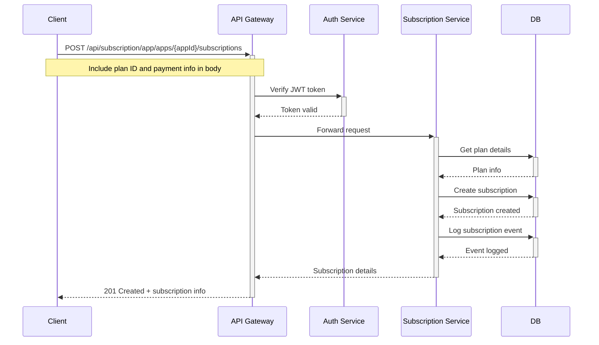

# Subscription Management Service Documentation

## System Architecture

The Subscription Management Service follows a modular architecture with clear separation of concerns:

```
┌─────────────────┐     ┌─────────────────┐     ┌─────────────────┐
│     Client      │────▶│   API Gateway   │────▶│  Subscription   │
│  Applications   │◀────│                 │◀────│     Service     │
└─────────────────┘     └─────────────────┘     └────────┬────────┘
                                                         │
                                                         ▼
                                                ┌─────────────────┐
                                                │    Database     │
                                                │   PostgreSQL    │
                                                └─────────────────┘
```

### Key Components

1. **API Gateway** - Routes requests to the appropriate service
2. **Subscription Service** - Core business logic for subscription management
3. **Authentication Service** - Shared authentication module for all services
4. **Database Layer** - TypeORM with PostgreSQL for data persistence

## API Routes Overview

The service provides two main route groups:

### 1. App Routes (`/api/subscription/app/*`)

For end-users and applications consuming the subscription service.

| Method | Endpoint                                  | Description                            | Authentication |
|--------|-------------------------------------------|----------------------------------------|----------------|
| GET    | `/apps/:appId/plans`                      | Get available plans for an app         | Required       |
| GET    | `/apps/:appId/subscriptions`              | Get user's subscription for an app     | Required       |
| POST   | `/apps/:appId/subscriptions`              | Create a new subscription              | Required       |
| POST   | `/apps/:appId/validate-promo-code`        | Validate promo code for a plan         | Required       |
| POST   | `/subscriptions/:subscriptionId/cancel`   | Cancel a subscription                  | Required       |

### 2. Admin Routes (`/api/subscription/admin/*`)

For management of subscriptions, plans, and promo codes.

| Method | Endpoint                                   | Description                           | Authentication |
|--------|-------------------------------------------|---------------------------------------|----------------|
| GET    | `/subscriptions`                           | Get all subscriptions                 | Admin only     |
| GET    | `/subscriptions/app/:appId`                | Get subscriptions by app              | Admin only     |
| GET    | `/subscriptions/user/:userId`              | Get user's subscriptions              | Admin only     |
| GET    | `/subscriptions/:id`                       | Get subscription by ID                | Admin only     |
| PATCH  | `/subscriptions/:id/status`                | Update subscription status            | Admin only     |
| POST   | `/subscriptions/:id/renew`                 | Renew a subscription                  | Admin only     |
| GET    | `/plans`                                   | Get all subscription plans            | Admin only     |
| GET    | `/plans/:id`                               | Get plan by ID                        | Admin only     |
| POST   | `/plans`                                   | Create new subscription plan          | Admin only     |
| PUT    | `/plans/:id`                               | Update subscription plan              | Admin only     |
| DELETE | `/plans/:id`                               | Delete plan (soft)                    | Admin only     |
| DELETE | `/plans/:id/permanent`                     | Delete plan permanently               | Admin only     |
| POST   | `/plans/:planId/features`                  | Add feature to plan                   | Admin only     |
| PUT    | `/features/:featureId`                     | Update plan feature                   | Admin only     |
| DELETE | `/features/:featureId`                     | Delete plan feature                   | Admin only     |
| GET    | `/promo-codes`                             | Get all promo codes                   | Admin only     |
| GET    | `/promo-codes/:id`                         | Get promo code by ID                  | Admin only     |
| POST   | `/promo-codes`                             | Create new promo code                 | Admin only     |
| PUT    | `/promo-codes/:id`                         | Update promo code                     | Admin only     |
| DELETE | `/promo-codes/:id`                         | Delete promo code                     | Admin only     |
| POST   | `/promo-codes/:promoCodeId/plans`           | Add applicable plans to promo code    | Admin only     |
| POST   | `/promo-codes/:promoCodeId/users`           | Add applicable users to promo code    | Admin only     |

## Authentication Flow

```
┌─────────┐                 ┌─────────────────┐                ┌─────────────┐
│  Client │                 │  API Gateway    │                │   Auth      │
│         │                 │                 │                │   Service   │
└────┬────┘                 └────────┬────────┘                └──────┬──────┘
     │                              │                                │
     │      1. Request with         │                                │\
     │         JWT Token            │                                │
     │ ─────────────────────────────>                                │
     │                              │                                │
     
     │                              │     2. Verify Token            │
     │                              │ ─────────────────────────────> │
     │                              │                                │
     │                              │     3. Token Valid/Invalid     │
     │                              │ <─────────────────────────────┘
     │                              │           │
     │                              │           │
     │      4. Response or 401      │           │
     │ <─────────────────────────────           │
     │                                          │
```

1. Client sends request with JWT token in Authorization header
2. Authentication middleware verifies the token
3. If valid, request proceeds to appropriate controller

4. If invalid, returns 401 Unauthorized

## Database Schema Overview

The subscription management service uses a relational database with the following key entities:

### Core Entities

1. **App (`app` table)**
   - Central entity representing an application that offers subscription plans
   - Tracks app information and plan counts

2. **SubscriptionPlan (`subscription_plan` table)**
   - Defines available subscription plans with pricing tiers
   - Contains plan metadata, feature sets, and billing options

3. **PlanFeature (`plan_feature` table)**
   - Details individual features within subscription plans
   - Supports feature limits, categories, and popularity flags

4. **Subscription (`subscription` table)**
   - Records active user subscriptions
   - Manages subscription lifecycle and status

5. **Payment (`payment` table)**
   - Tracks payment transactions for subscriptions
   - Records payment status and external payment IDs

6. **SubscriptionEvent (`subscription_event` table)**
   - Event log for subscription lifecycle events
   - Used for auditing and analytics

### Promo Code System

7. **PromoCode (`promo_codes` table)**
   - Defines promotional offers with various discount types
   - Configures validity periods and usage restrictions

8. **PromoCodeApplicablePlan (`promo_code_applicable_plans` table)**
   - Junction table linking promo codes to specific plans
   - Controls promo code applicability

9. **PromoCodeApplicableUser (`promo_code_applicable_users` table)**
   - Junction table linking promo codes to specific users
   - Enables targeted promotions

10. **SubscriptionPromoCode (`subscription_promo_codes` table)**
    - Records applied promo codes on subscriptions
    - Tracks discount amounts and activation status

## Redis Caching and Scaling Architecture

### Overview
The system implements a scalable and fault-tolerant Redis caching strategy with service isolation and granular cache management to support the distributed microservices architecture.

### Core Redis Components

1. **Redis Manager** (`redis-manager.ts`)
   - Creates service-isolated Redis clients with dedicated logical databases
   - Maps services to specific Redis DB numbers:
     ```typescript
     'api-gateway': 0,
     'auth': 1,
     'user': 2,
     'subscription': 3,
     'content': 4,
     // etc.
     ```
   - Provides circuit breaker pattern for resilient connections
   - Exponential backoff retry strategy with jitter
   - Manages client connection pool with service-specific prefixes
   - Creates clients with configurable options via environment variables

2. **Redis Legacy Adapter** (`redis-legacy-adapter.ts`)
   - Provides backwards compatibility for code using the original Redis client
   - Implements the legacy interface but uses the new Redis Manager
   - Supports gradual migration with minimal disruption
   - Maintains reference compatibility with existing application code

3. **Service-Specific Redis Implementation** (`services/*/src/utils/redis.ts`)
   - Creates purpose-specific caches (e.g., `planCache`, `userSubsCache` for subscription service)
   - Implements fallback mechanisms for resilience
   - Consolidated error handling and logging
   - Type-safe interfaces with TypeScript

### Usage Flow

1. **Service Initialization**:
   ```typescript
   // Initialize Redis with service isolation
   const SERVICE_NAME = 'subscription';
   const defaultCache = new RedisCache(SERVICE_NAME);
   const planCache = new RedisCache(SERVICE_NAME, { keyPrefix: `${SERVICE_NAME}:plans:` });
   ```

2. **Cache Operations with Fallback**:
   ```typescript
   async function getSubscriptionPlan(planId: string): Promise<SubscriptionPlan | null> {
     try {
       // Try with new RedisCache client first
       return await planCache.get<SubscriptionPlan>(planId);
     } catch (error: unknown) {
       try {
         // Fall back to legacy client
         return await redisClient.get(`plans:${planId}`);
       } catch (fallbackError: unknown) {
         // Consolidated error logging
         logger.error('Error fetching plan cache', { 
           primaryError: error instanceof Error ? error.message : String(error),
           fallbackError: fallbackError instanceof Error ? fallbackError.message : String(fallbackError)
         });
         return null;
       }
     }
   }
   ```

3. **Invalidation Pattern**:
   ```typescript
   async function invalidateUserCache(userId: string): Promise<void> {
     // Delete by pattern with service-specific prefixes
     await userSubsCache.deleteByPattern(`user:${userId}:*`);
   }
   ```

### Benefits and Features

1. **Service Isolation**: Each microservice uses a dedicated logical database to prevent key collisions
2. **Purpose-Specific Caching**: Different data types use dedicated caches with appropriate prefixes
3. **Resilience**: Circuit breaker pattern and fallback mechanisms ensure fault tolerance
4. **Backward Compatibility**: Legacy adapter supports gradual migration
5. **Monitoring**: Health metrics for Redis usage and performance
6. **Type Safety**: TypeScript interfaces ensure correct data handling

### Scale-Out Strategy

The Redis architecture supports horizontal scaling through:

1. **Logical Database Separation**: Each service uses a designated DB number
2. **Key Prefix Isolation**: Prevents collisions even within the same database
3. **Ready for Cluster/Sentinel**: Structure supports migration to Redis Cluster or Sentinel
4. **Minimal Memory Footprint**: Purpose-specific caching limits cached data volume

## Subscription Lifecycle Management

### Plan Creation and Management
1. **Plan Definition**
   - Create a `SubscriptionPlan` record with pricing details
   - Define billing cycles (monthly, quarterly, yearly)
   - Set trial period settings if applicable
   - Assign to a specific application via `appId`

2. **Feature Configuration**
   - Create `PlanFeature` records for each plan feature
   - Define feature limits, categories, and highlight popular features
   - Link features to plans via `planId`

### Subscription Process

1. **Initial Subscription**
   ```
   User selects plan → System creates Subscription record → Set initial status (PENDING or TRIAL) → Create SubscriptionEvent (CREATED or TRIAL_STARTED)
   ```

2. **Trial Management**
   ```
   If plan includes trial → Set trialEndDate → When trial ends → Create SubscriptionEvent (TRIAL_ENDED) → Update status to ACTIVE or PENDING based on payment
   ```

3. **Billing Cycle Processing**
   ```
   At billing cycle start → Create Payment record → Process payment → Update subscription status based on payment result
   ```

4. **Renewal Process**
   ```
   Before endDate → Check autoRenew flag → If true, process renewal payment → Update billing period → Create SubscriptionEvent (RENEWED)
   ```

5. **Cancellation Flow**
   ```
   User requests cancellation → Set canceledAt timestamp → If immediate: update status to CANCELED → If end-of-period: set cancelAtPeriodEnd flag → Create SubscriptionEvent (CANCELED) → Record cancellationReason
   ```

6. **Subscription Status Transitions**
   - `PENDING` → `TRIAL` → `ACTIVE` → (`PAST_DUE` | `UNPAID` | `CANCELED` | `EXPIRED`)
   - Each transition creates a corresponding `SubscriptionEvent`

## Payment Processing

1. **Payment Creation**
   ```
   Subscription billing due → Create Payment record with PENDING status → Call external payment gateway
   ```

2. **Payment Status Updates**
   ```
   Payment gateway response → Update Payment status (SUCCEEDED, FAILED, etc.) → Update Subscription status accordingly → Create SubscriptionEvent (PAYMENT_FAILED if applicable)
   ```

3. **Refund Handling**
   ```
   Refund requested → Update Payment status to REFUNDED or PARTIAL_REFUND → Adjust subscription details if necessary
   ```

## Promo Code Management

1. **Promo Code Setup**
   ```
   Create PromoCode record → Define discount type (percentage/fixed) → Set usage limits → Configure validity period
   ```

2. **Targeting Configuration**
   - **By Plan**: Create `PromoCodeApplicablePlan` records linking promo code to allowed plans
   - **By User**: Create `PromoCodeApplicableUser` records linking promo code to allowed users
   - **General**: Set `applicableTo` to `ALL` for universal promo codes

3. **Promo Code Application**
   ```
   User applies code → System validates eligibility → Calculate discount amount → Create SubscriptionPromoCode record → Apply discount to subscription amount
   ```

4. **Validation Logic**
   - Check code validity period (current date between `startDate` and `endDate`)
   - Verify usage count is below `usageLimit`
   - For first-time-only codes, check `isFirstTimeOnly` flag
   - For plan-specific codes, check against `PromoCodeApplicablePlan`
   - For user-specific codes, check against `PromoCodeApplicableUser`

5. **Discount Application**
   - For percentage discounts: `amount * (discountValue / 100)`
   - For fixed discounts: `amount - discountValue`
   - Apply `maxDiscountAmount` cap if configured

## Analytics and Reporting

The database schema supports analytics and reporting through:

1. **Subscription Analytics**
   - Track conversion rates from `SubscriptionEvent` records
   - Analyze churn based on cancellation data
   - Monitor trial-to-paid conversion rates

2. **Revenue Analytics**
   - Calculate recurring revenue from active subscriptions
   - Track payment success/failure rates
   - Analyze discount impact from promo code usage

3. **User Engagement**
   - Monitor subscription lifecycle events
   - Track feature usage and popularity
   - Analyze cancellation reasons for improvement opportunities

## Subscription Service Implementation

### Service Layer Structure

The service follows a layered architecture:

```
┌────────────────────────┐
│      Controllers       │  Handle HTTP requests/responses
└───────────┬────────────┘
            ↓
┌────────────────────────┐
│       Services         │  Implement business logic
└───────────┬────────────┘
            ↓
┌────────────────────────┐
│      Repositories      │  Data access layer (TypeORM)
└───────────┬────────────┘
            ↓
┌────────────────────────┐
│       Database         │  PostgreSQL
└────────────────────────┘
```

### Key Service Components

1. **SubscriptionService**: Core service managing subscription lifecycle
2. **SubscriptionPlanService**: Handles plan management and features
3. **PromoCodeService**: Manages promotional code validation and application
4. **PaymentService**: Handles payment processing and tracking

## Subscription Data Flow Examples

### User Subscribing to a Plan



### Detailed Flow Explanation

1. **Initial User Request**:
   - User selects a subscription plan from the app UI
   - Frontend sends POST request with plan ID and optional promo code

2. **Authentication & Authorization**:
   - `auth.middleware.authenticate` verifies the JWT token
   - Extracts user information and attaches to request

3. **Controller Processing**:
   - `appSubscriptionController.createSubscription` validates inputs
   - Checks if plan exists and belongs to the specified app

4. **Promo Code Handling** (if applicable):
   - Validates promo code using `promoCodeService.validatePromoCode`
   - Calculates discount amount based on promo code type

5. **Subscription Creation**:
   - Calls `subscriptionService.createSubscription`
   - Creates database record with initial status

6. **Trial Handling** (if applicable):
   - Sets trial dates if plan includes trial period
   - Sets appropriate status ('trialing' vs 'active')

7. **Event Logging**:
   - Creates subscription event record for auditing
   - Records metadata about the subscription creation

8. **Response**:
   - Returns subscription details to user

## Promo Code Implementation

### Promo Code Types & Logic

The system supports several types of promotional discounts:

1. **Percentage Discount**: Reduces subscription price by percentage
   - Example: "SAVE20" gives 20% off the subscription price
   - Implementation: `finalPrice = originalPrice * (1 - percentage/100)`

2. **Fixed Amount Discount**: Reduces subscription by fixed amount
   - Example: "SAVE10DOLLARS" gives $10 off the subscription
   - Implementation: `finalPrice = originalPrice - fixedAmount`

3. **Free Trial Extension**: Extends trial period
   - Example: "EXTENDTRIAL" adds 14 days to trial period
   - Implementation: `trialEnd = originalTrialEnd + days*86400000`

### Promo Code Validation Flow

```
┌───────────┐     ┌───────────────┐     ┌────────────────────┐     ┌───────────────────┐
│  Receive  │     │  Check Code   │     │  Check Eligibility │     │  Calculate        │
│  Request  │────▶│  Existence    │────▶│  & Applicability   │────▶│  Discount Amount  │
└───────────┘     └───────────────┘     └────────────────────┘     └─────────┬─────────┘
                                                                             │
┌────────────┐     ┌───────────────┐                                         │
│  Return    │     │  Update Usage │                                         │
│  Response  │◀────│  Statistics   │◀────────────────────────────────────────┘
└────────────┘     └───────────────┘
```

### Promo Code Validation Steps

1. **Basic Validation**:
   - Check if code exists and is not expired
   - Verify usage limits haven't been exceeded

2. **User Eligibility**:
   - For user-specific codes: Check in `PromoCodeApplicableUser`
   - For first-time users: Check user's subscription history

3. **Plan Eligibility**:
   - For plan-specific codes: Check in `PromoCodeApplicablePlan`
   - For tier-specific codes: Check plan's tier level

4. **Application Logic**:
   - Apply discount based on promo code type
   - Record usage in `SubscriptionPromoCode` table

### Promo Code API Example

```json
// Request: POST /api/subscription/app/apps/123/validate-promo-code
{
  "code": "WELCOME20",
  "planId": "550e8400-e29b-41d4-a716-446655440000"
}

// Response (Success)
{
  "isValid": true,
  "message": "Promo code applied successfully",
  "discountAmount": 19.99,
  "discountType": "percentage"
}

// Response (Failed)
{
  "isValid": false,
  "message": "This promo code has expired"
}
```

## Error Handling Strategy

The service implements a consistent error handling approach:

1. **Controller Layer**: Catch exceptions and format responses
2. **Service Layer**: Throw specific error types with context
3. **HTTP Status Codes**: Use appropriate codes for different errors
   - 400: Bad Request (validation errors)
   - 401: Unauthorized (auth issues)
   - 403: Forbidden (permission denied)
   - 404: Not Found (resource missing) 
   - 409: Conflict (state conflicts)
   - 500: Server Error (unexpected issues)

### Error Response Format

```json
{
  "success": false,
  "message": "Human-readable error message",
  "error": {
    "type": "ERROR_TYPE_CODE",
    "details": { /* Additional context */ }
  },
  "timestamp": "2025-06-14T06:32:41.843Z"
}
```

## Implementation Notes

- The system uses TypeORM with PostgreSQL for database operations
- All tables use UUID primary keys for security and scalability
- Appropriate indexes are created on foreign key columns for query performance
- Timestamps are maintained for created/updated tracking
- JSON fields allow flexible metadata storage
- Enum types ensure consistent status values
- Authentication leverages shared JWT verification mechanisms
- Middleware chain handles authorization, logging, and validation


# Redis CLI Commands Reference for Subscription Service

This document provides a comprehensive list of Redis CLI commands specifically tailored for our microservices architecture with service isolation.

## Redis Database Organization

Our Redis instance is organized with logical DB separation for service isolation:

| DB Number | Service                    | Purpose                              |
|-----------|----------------------------|--------------------------------------|
| 0         | API Gateway & Legacy       | Gateway cache, refresh tokens        |
| 1         | Auth Service               | OTPs, sessions                       |
| 2         | User Service               | User data, permissions, roles        |
| 3         | Content Service            | Content items, categories           |
| 4         | Subscription Service       | Plans, subscriptions, payments      |

## Key Naming Conventions

Our Redis keys follow these patterns:
- `{service}:{entity}:{identifier}`
- Example: `auth:otp:user@example.com`
- Example: `user:684128d8885a671a5ecd6f56`
- Example: `subscription:plan:premium`

## Redis Key Documentation

## Redis Database Structure

Each service uses its own Redis logical database:
- DB 0: API Gateway & Legacy Data
- DB 1: Auth Service (Sessions, OTPs)
- DB 2: User Service (Users, Permissions, Roles)
- DB 3: Content Service
- DB 4: Subscription Service
- DB 5: Notification Service
- DB 6: Payment Service
- DB 7: Monitoring Service
- DB 8: Analytics Service

All keys follow this pattern: `sap:<service>:<purpose>:<identifier>`

## Auth Service (DB 1)

### OTP Keys
```bash
# Connect to Auth DB
SELECT 1

# View all OTP keys
KEYS sap:auth:otp:*

# Check specific OTP
GET sap:auth:otp:password_reset:<userId>
GET sap:auth:otp:direct:<userId>

# Get TTL for OTP
TTL sap:auth:otp:password_reset:<userId>

# Delete OTP
DEL sap:auth:otp:password_reset:<userId>
```

### Session Keys
```bash
# View all session keys
KEYS sap:auth:session:*

# Check specific session
GET sap:auth:session:<session_id>

# Delete session
DEL sap:auth:session:<session_id>
```

## User Service (DB 2)
{{ ... }}
```bash
# Connect to User Service DB
SELECT 2

# View all User service cache entries
KEYS user:*
KEYS users:*
KEYS role:*
KEYS permission:*

# Get a specific user by ID
GET user:<user_id>

# Check TTL for user cache
TTL user:<user_id>

# Clear all user-related caches
DEL users:*
```

## Content Service (DB 3)

```bash
# Connect to Content Service DB
SELECT 3

# View content cache entries
KEYS content:*
KEYS category:*

# Get specific content item
GET content:<content_id>

# Check content collection TTL
TTL content:collection:*
```

## Subscription Service (DB 4)

```bash
# Connect to Subscription Service DB
SELECT 4

# View subscription-related keys
KEYS subscription:*
KEYS plan:*

# Get specific subscription details
GET subscription:<subscription_id>

# View active subscriptions
KEYS subscription:active:*

# Check subscription expiration
TTL subscription:<subscription_id>

# Get all plans
KEYS plan:*

# Get specific plan details
GET plan:<plan_id>

# View payment-related data
KEYS payment:*
```

## General Monitoring Commands

```bash
# Get memory usage per database
INFO keyspace

# Get total memory usage
INFO memory

# Get client connections
INFO clients

# Get database size for current DB
DBSIZE

# Analyze key distribution (warning: slow on large DBs)
--stat # Add this flag to redis-cli command

# Monitor real-time Redis operations
MONITOR

# Check Redis server health
PING
```

## Service Health Checks

```bash
# Check all DBs for service health
SELECT 1
KEYS auth:health:*
SELECT 2
KEYS user:health:*
SELECT 3
KEYS content:health:*
SELECT 4
KEYS subscription:health:*
```

## Pattern-Based Key Operations

```bash
# Delete all keys matching pattern in current DB
EVAL "for _,k in ipairs(redis.call('keys','user:temp:*')) do redis.call('del',k) end" 0

# Count keys matching a pattern
EVAL "return #redis.call('keys', ARGV[1])" 0 "subscription:*"
```

## Performance Monitoring Shortcuts

```bash
# Get hit/miss ratio for current DB
INFO stats | grep hit_rate

# Check memory fragmentation
INFO memory | grep mem_fragmentation_ratio

# Check if Redis is swapping
INFO memory | grep used_memory_swap

# Check connected clients
INFO clients | grep connected_clients
```

## Redis CLI Shorthand Commands

```bash
# Connect directly to a specific DB
redis-cli -n 4  # Connect directly to subscription service DB

# Execute command without entering CLI
redis-cli -n 2 KEYS "user:*"

# Output in CSV format
redis-cli -n 4 --csv KEYS "subscription:*"

# Monitor commands in a readable format
redis-cli MONITOR | grep -E "SETEX|GET"
```

## Troubleshooting Commands

```bash
# Find slow commands
redis-cli --latency-history

# Check for keyspace notifications
CONFIG GET notify-keyspace-events

# Get biggest keys (potentially performance issues)
redis-cli --bigkeys

# Get memory usage for specific pattern
redis-cli --memkeys --pattern "subscription:*"
```

## Redis Cache Invalidation Examples

```bash
# Invalidate specific user cache
DEL user:<user_id>

# Invalidate all users list cache
DEL users:*

# Invalidate specific plan cache
DEL plan:<plan_id>

# Invalidate all subscription caches
DEL subscription:*
```

---

**Note**: This document is intended as a reference for developers working with the subscription service. Remember that Redis performance can be impacted by running intensive commands like `KEYS` in production environments.

Last updated: June 16, 2025
