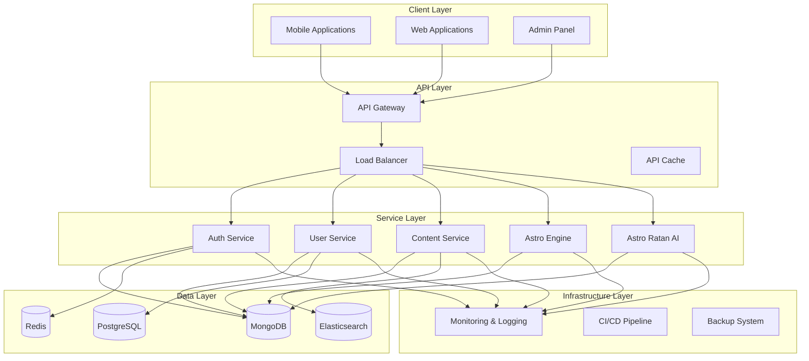

# Architecture Documentation

This section provides detailed information about the architecture of the Corp Astro Super Admin Panel (SAP) backend services.

## Contents

- [System Overview](./system-overview.md) - High-level overview of the entire system
- [Microservices Architecture](./microservices.md) - Details about the microservices approach
- [Database Design](./database-design.md) - Information about the hybrid database architecture
- [Communication Patterns](./communication-patterns.md) - How services communicate with each other

## Architecture Principles

The Corp Astro SAP architecture is built on the following principles:

1. **Microservices-based**: Each functional area is implemented as a separate service
2. **API-first**: All functionality is exposed through well-defined APIs
3. **Event-driven**: Services communicate through events for loose coupling
4. **Hybrid database approach**: Using the right database for the right job
5. **Scalability**: Designed to scale horizontally
6. **Resilience**: Fault tolerance and graceful degradation
7. **Security**: Security built-in from the ground up

## High-Level Architecture Diagram

## Key Components

For detailed information about each component, please refer to the specific documentation pages linked above.
