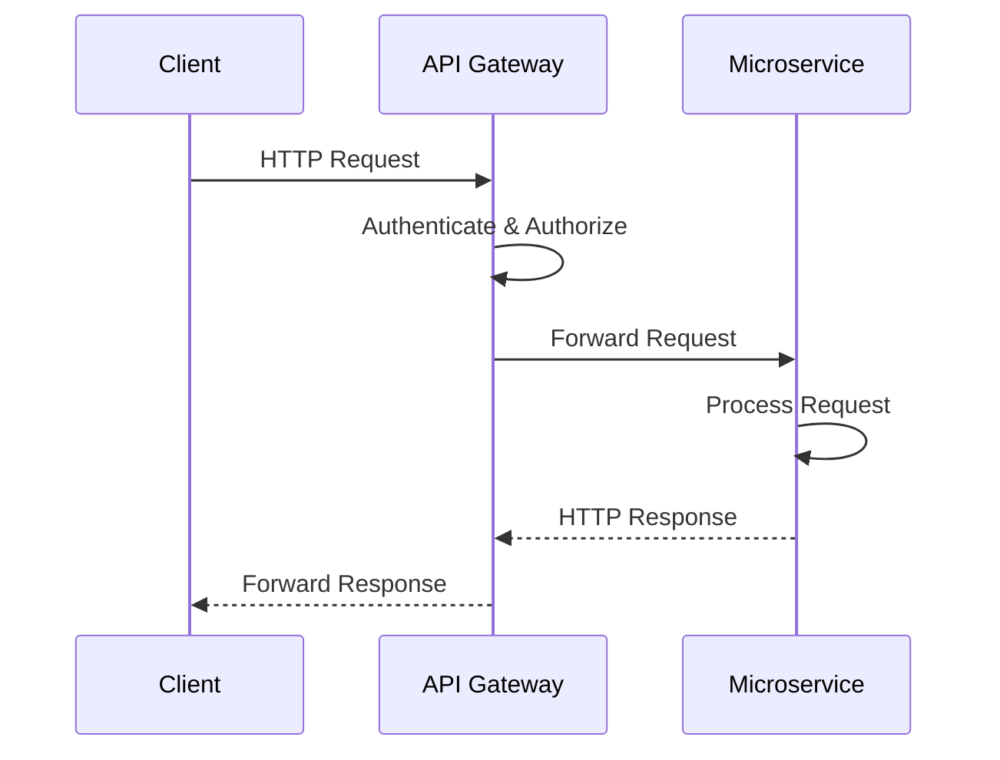
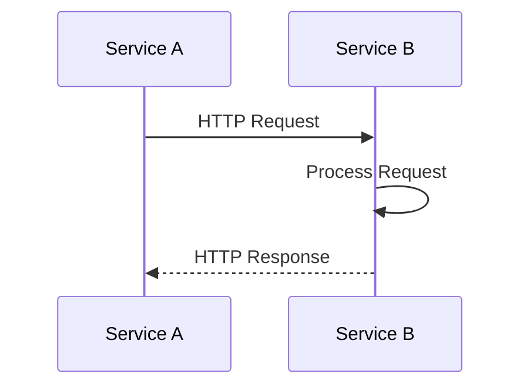
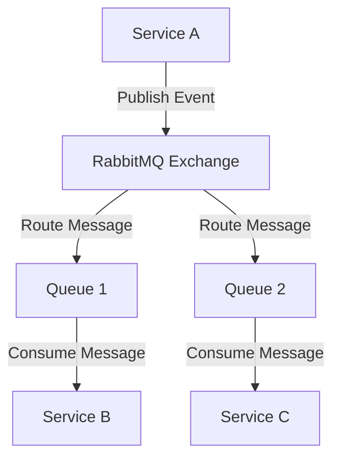
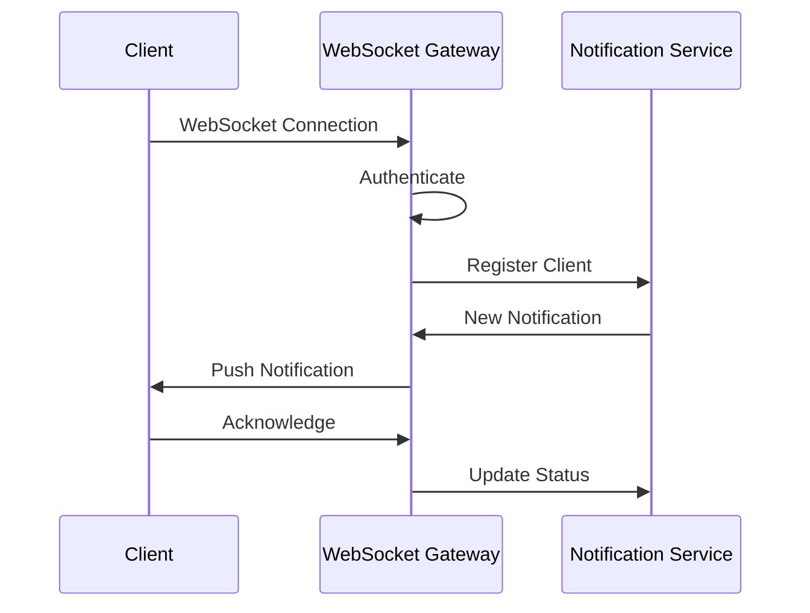
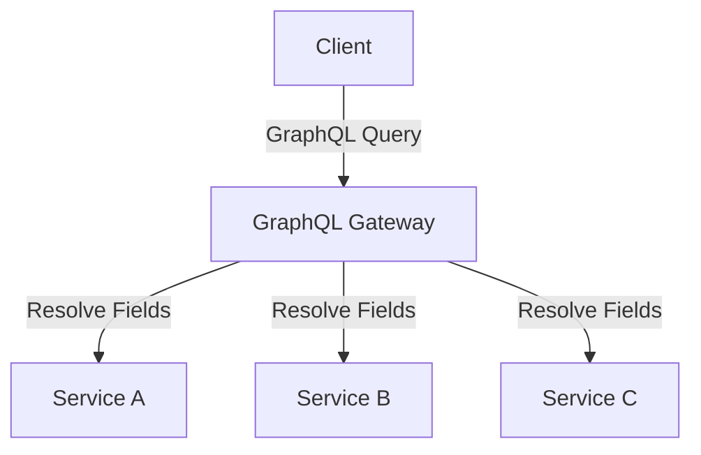

# Communication Patterns

This document details the communication patterns used between services in the Corp Astro Super Admin Panel (SAP) backend.

## Overview of Communication Patterns

The Corp Astro SAP uses multiple communication patterns to enable efficient and reliable service-to-service communication:

1. **REST APIs**: Synchronous request-response communication
2. **Event-Driven Architecture**: Asynchronous communication via message broker
3. **WebSockets**: Real-time bidirectional communication
4. **GraphQL**: Flexible data fetching for complex UIs

## REST API Communication

REST APIs are used for synchronous request-response communication between services and clients.

### API Gateway

All external requests go through the API Gateway, which:
- Routes requests to the appropriate service
- Handles authentication and authorization
- Provides rate limiting and throttling
- Logs requests and responses



### Service-to-Service REST Communication

Services communicate directly with each other for synchronous operations:



### REST API Standards

All REST APIs follow these standards:
- Use HTTP methods semantically (GET, POST, PUT, DELETE)
- Return appropriate HTTP status codes
- Use JSON for request and response bodies
- Include pagination for collection endpoints
- Implement consistent error handling
- Use versioning (e.g., /api/v1/users)

Example REST API endpoint:

```typescript
// User Service API
router.get('/users/:id', authenticate, authorize('admin'), async (req, res) => {
  try {
    const user = await userService.getUserById(req.params.id);
    if (!user) {
      return res.status(404).json({ message: 'User not found' });
    }
    return res.status(200).json(user);
  } catch (error) {
    logger.error('Error fetching user', { error, userId: req.params.id });
    return res.status(500).json({ message: 'Internal server error' });
  }
});
```

## Event-Driven Architecture

Event-driven architecture is used for asynchronous communication between services.

### Message Broker

RabbitMQ is used as the message broker for:
- Decoupling services
- Ensuring reliable message delivery
- Supporting different message exchange patterns
- Handling backpressure



### Event Types

Events are categorized into:

1. **Domain Events**: Represent business events (e.g., UserCreated, ContentPublished)
2. **Integration Events**: Used for cross-service communication
3. **Command Events**: Request for an action to be performed
4. **System Events**: Related to system operations (e.g., ServiceStarted, DatabaseConnected)

### Event Schema

Events follow a consistent schema:

```typescript
interface Event<T> {
  id: string;              // Unique event ID
  type: string;            // Event type
  source: string;          // Source service
  timestamp: string;       // ISO timestamp
  correlationId: string;   // For request tracing
  data: T;                 // Event payload
  metadata: {              // Additional metadata
    version: string;
    userId?: string;
  };
}
```

Example event:

```json
{
  "id": "evt_123456789",
  "type": "user.created",
  "source": "auth-service",
  "timestamp": "2025-05-19T18:30:00.000Z",
  "correlationId": "req_abcdef123",
  "data": {
    "userId": "usr_987654321",
    "email": "user@example.com",
    "roles": ["user"]
  },
  "metadata": {
    "version": "1.0",
    "userId": "usr_admin123"
  }
}
```

### Event Handling

Services publish and consume events:

```typescript
// Publishing an event
await messageBroker.publish('user.events', {
  id: uuidv4(),
  type: 'user.created',
  source: 'auth-service',
  timestamp: new Date().toISOString(),
  correlationId: req.correlationId,
  data: {
    userId: user.id,
    email: user.email,
    roles: user.roles
  },
  metadata: {
    version: '1.0',
    userId: req.user?.id
  }
});

// Consuming an event
messageBroker.subscribe('user.events', async (event) => {
  if (event.type === 'user.created') {
    await userService.createUserProfile(event.data);
    logger.info('User profile created from event', { userId: event.data.userId });
  }
});
```

## WebSocket Communication

WebSockets are used for real-time bidirectional communication:



### WebSocket Implementation

Socket.io is used for WebSocket implementation:

```typescript
// Server-side
const io = new Server(httpServer, {
  cors: {
    origin: process.env.CORS_ORIGIN,
    methods: ['GET', 'POST']
  }
});

io.use(authenticate);

io.on('connection', (socket) => {
  const userId = socket.user.id;
  
  // Join user's room
  socket.join(`user:${userId}`);
  
  // Handle events
  socket.on('read-notification', async (notificationId) => {
    await notificationService.markAsRead(notificationId, userId);
  });
  
  socket.on('disconnect', () => {
    // Handle disconnect
  });
});

// Sending notification to specific user
io.to(`user:${userId}`).emit('notification', {
  id: notificationId,
  type: 'content-published',
  message: 'New content is available',
  timestamp: new Date().toISOString()
});
```

## GraphQL

GraphQL is used for flexible data fetching in complex UIs:



### GraphQL Schema

The GraphQL schema defines the available queries, mutations, and types:

```graphql
type User {
  id: ID!
  email: String!
  profile: UserProfile
  roles: [String!]!
  createdAt: String!
  updatedAt: String!
}

type UserProfile {
  firstName: String
  lastName: String
  birthDate: String
  birthPlace: String
  profilePicture: String
}

type Query {
  user(id: ID!): User
  users(page: Int, limit: Int): [User!]!
}

type Mutation {
  createUser(input: CreateUserInput!): User!
  updateUser(id: ID!, input: UpdateUserInput!): User!
  deleteUser(id: ID!): Boolean!
}

input CreateUserInput {
  email: String!
  password: String!
  profile: UserProfileInput
  roles: [String!]
}

input UpdateUserInput {
  email: String
  profile: UserProfileInput
  roles: [String!]
}

input UserProfileInput {
  firstName: String
  lastName: String
  birthDate: String
  birthPlace: String
  profilePicture: String
}
```

### GraphQL Resolvers

Resolvers implement the schema functionality:

```typescript
const resolvers = {
  Query: {
    user: async (_, { id }, { dataSources }) => {
      return dataSources.userAPI.getUserById(id);
    },
    users: async (_, { page = 1, limit = 10 }, { dataSources }) => {
      return dataSources.userAPI.getUsers(page, limit);
    }
  },
  Mutation: {
    createUser: async (_, { input }, { dataSources }) => {
      return dataSources.userAPI.createUser(input);
    },
    updateUser: async (_, { id, input }, { dataSources }) => {
      return dataSources.userAPI.updateUser(id, input);
    },
    deleteUser: async (_, { id }, { dataSources }) => {
      return dataSources.userAPI.deleteUser(id);
    }
  },
  User: {
    profile: async (user, _, { dataSources }) => {
      if (user.profile) return user.profile;
      return dataSources.profileAPI.getProfileByUserId(user.id);
    }
  }
};
```

## API Documentation

All APIs are documented using:

1. **OpenAPI/Swagger**: For REST APIs
2. **GraphQL Playground**: For GraphQL APIs
3. **JSDoc**: For internal code documentation

## Error Handling

Consistent error handling across all communication patterns:

```typescript
// REST API error response
{
  "error": {
    "code": "USER_NOT_FOUND",
    "message": "User with ID 123 not found",
    "details": {
      "userId": "123"
    },
    "timestamp": "2025-05-19T18:30:00.000Z",
    "requestId": "req_abcdef123"
  }
}

// Event error handling
try {
  await processEvent(event);
} catch (error) {
  logger.error('Error processing event', {
    eventId: event.id,
    eventType: event.type,
    error: error.message,
    stack: error.stack
  });
  
  // Publish error event
  await messageBroker.publish('error.events', {
    id: uuidv4(),
    type: 'event.processing.failed',
    source: 'user-service',
    timestamp: new Date().toISOString(),
    correlationId: event.correlationId,
    data: {
      originalEvent: event,
      error: {
        message: error.message,
        code: error.code || 'UNKNOWN_ERROR'
      }
    },
    metadata: {
      version: '1.0'
    }
  });
}
```

## Circuit Breaking and Retries

To handle service failures:

```typescript
// Circuit breaker for REST calls
const circuitBreaker = new CircuitBreaker({
  name: 'userService',
  errorThresholdPercentage: 50,
  resetTimeout: 30000,
  timeout: 3000
});

// Making a request with circuit breaker and retries
async function getUserWithRetry(userId) {
  return await circuitBreaker.fire(async () => {
    return await retry(async () => {
      const response = await axios.get(`${USER_SERVICE_URL}/users/${userId}`);
      return response.data;
    }, {
      retries: 3,
      factor: 2,
      minTimeout: 1000,
      maxTimeout: 5000,
      onRetry: (error) => {
        logger.warn('Retrying user service request', { userId, error: error.message });
      }
    });
  });
}
```

## Service Discovery

Services discover each other through:

1. **Kubernetes Service Discovery**: For containerized deployments
2. **Consul/etcd**: For more complex service discovery needs
3. **Environment Variables**: For simple configurations

## Security

Communication security is ensured through:

1. **TLS/SSL**: For all external and service-to-service communication
2. **JWT Tokens**: For authentication and authorization
3. **API Keys**: For service-to-service authentication
4. **Rate Limiting**: To prevent abuse
5. **Input Validation**: To prevent injection attacks

For more detailed information about specific communication implementations, please refer to the individual service documentation.
