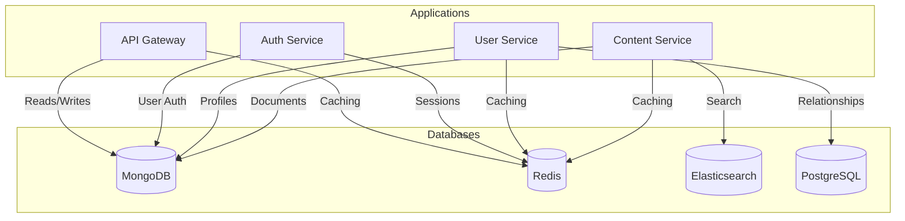

# Database Design

This document details the hybrid database architecture used in the Corp Astro Super Admin Panel (SAP) backend.

## Hybrid Database Approach

The Corp Astro SAP uses a hybrid database approach, leveraging different database technologies for different use cases:

- **MongoDB**: Primary document database for flexible schema data
- **Redis**: In-memory database for caching and session management
- **Elasticsearch**: Search engine for full-text search and analytics
- **PostgreSQL**: Relational database for structured data with complex relationships

## Database Selection Criteria

Each database was selected based on the following criteria:

| Database    | Strengths                                  | Use Cases                                |
|-------------|--------------------------------------------|-----------------------------------------|
| MongoDB     | Flexible schema, horizontal scaling        | User profiles, content, configurations   |
| Redis       | Fast in-memory operations, pub/sub         | Caching, sessions, real-time features    |
| Elasticsearch| Full-text search, analytics               | Content search, logging, analytics       |
| PostgreSQL  | ACID compliance, complex queries           | Financial data, relationships, reporting |

## Database Architecture



## Database Connection Management

The `DatabaseManager` class provides a centralized point for connecting to and managing multiple databases:

```typescript
class DatabaseManager {
  private mongoClient: MongoClient;
  private redisClient: RedisClient;
  private esClient: Client;
  private pgClient: Pool;
  
  // Initialize all database connections
  async initializeAll() {
    await this.initializeMongo();
    await this.initializeRedis();
    await this.initializeElasticsearch();
    await this.initializePostgres();
  }
  
  // Get database status
  getAllStatuses() {
    return {
      mongo: this.mongoStatus,
      redis: this.redisStatus,
      elasticsearch: this.esStatus,
      postgres: this.pgStatus
    };
  }
  
  // Close connections gracefully
  async gracefulShutdown(signal: string) {
    await this.closeMongo();
    await this.closeRedis();
    await this.closeElasticsearch();
    await this.closePostgres();
  }
}
```

## Data Models

### MongoDB Models

MongoDB models use Mongoose for schema definition and validation:

```typescript
// User Model
const UserSchema = new Schema({
  email: { type: String, required: true, unique: true },
  password: { type: String, required: true },
  profile: {
    firstName: String,
    lastName: String,
    birthDate: Date,
    birthTime: String,
    birthPlace: String,
    profilePicture: String
  },
  roles: [{ type: String, enum: ['user', 'admin', 'superadmin'] }],
  preferences: Schema.Types.Mixed,
  createdAt: { type: Date, default: Date.now },
  updatedAt: { type: Date, default: Date.now }
});
```

### Redis Data Structures

Redis is used for various data structures:

```
// Session Storage
SESSION:{sessionId} -> { userId, roles, permissions, expiresAt }

// Cache
CACHE:USER:{userId} -> { serialized user object }
CACHE:CONTENT:{contentId} -> { serialized content object }

// Rate Limiting
RATELIMIT:{ip}:{endpoint} -> { count, resetAt }

// Pub/Sub Channels
CHANNEL:notifications
CHANNEL:content-updates
```

### Elasticsearch Indices

Elasticsearch indices are defined with mappings:

```json
{
  "mappings": {
    "properties": {
      "title": { "type": "text", "analyzer": "english" },
      "content": { "type": "text", "analyzer": "english" },
      "tags": { "type": "keyword" },
      "author": { "type": "keyword" },
      "createdAt": { "type": "date" },
      "updatedAt": { "type": "date" }
    }
  }
}
```

### PostgreSQL Tables

PostgreSQL is used for relational data:

```sql
CREATE TABLE user_relationships (
  id SERIAL PRIMARY KEY,
  user_id_1 UUID NOT NULL,
  user_id_2 UUID NOT NULL,
  relationship_type VARCHAR(50) NOT NULL,
  status VARCHAR(20) NOT NULL,
  created_at TIMESTAMP WITH TIME ZONE DEFAULT CURRENT_TIMESTAMP,
  updated_at TIMESTAMP WITH TIME ZONE DEFAULT CURRENT_TIMESTAMP,
  UNIQUE(user_id_1, user_id_2, relationship_type)
);

CREATE TABLE subscription_transactions (
  id SERIAL PRIMARY KEY,
  user_id UUID NOT NULL,
  plan_id VARCHAR(50) NOT NULL,
  amount DECIMAL(10, 2) NOT NULL,
  currency VARCHAR(3) NOT NULL,
  status VARCHAR(20) NOT NULL,
  payment_method VARCHAR(50) NOT NULL,
  transaction_id VARCHAR(100) UNIQUE,
  created_at TIMESTAMP WITH TIME ZONE DEFAULT CURRENT_TIMESTAMP
);
```

## Data Synchronization

The `DataSyncService` keeps data synchronized between different databases:

```typescript
class DataSyncService {
  // Sync user data from MongoDB to Elasticsearch
  async syncUserToElasticsearch(userId: string) {
    const user = await this.userRepository.findById(userId);
    await this.elasticsearchService.index('users', userId, user);
  }
  
  // Sync content data from MongoDB to Elasticsearch
  async syncContentToElasticsearch(contentId: string) {
    const content = await this.contentRepository.findById(contentId);
    await this.elasticsearchService.index('content', contentId, content);
  }
}
```

## Database Migrations

Database migrations are managed using:

- **MongoDB**: mongoose-migrate
- **PostgreSQL**: node-pg-migrate
- **Elasticsearch**: Custom migration scripts

Example migration:

```typescript
// PostgreSQL migration
exports.up = pgm => {
  pgm.createTable('user_preferences', {
    id: 'id',
    user_id: { type: 'uuid', notNull: true },
    preference_key: { type: 'varchar(100)', notNull: true },
    preference_value: { type: 'jsonb', notNull: true },
    created_at: {
      type: 'timestamp',
      notNull: true,
      default: pgm.func('current_timestamp')
    }
  });
  
  pgm.addConstraint('user_preferences', 'user_preferences_user_id_preference_key_key', {
    unique: ['user_id', 'preference_key']
  });
};

exports.down = pgm => {
  pgm.dropTable('user_preferences');
};
```

## Backup and Recovery

Each database has its own backup strategy:

- **MongoDB**: Daily snapshots, oplog-based incremental backups
- **Redis**: RDB snapshots, AOF logs
- **Elasticsearch**: Snapshot and restore API
- **PostgreSQL**: pg_dump, WAL archiving

## Performance Optimization

Performance is optimized through:

- **Indexing**: Strategic indexes on frequently queried fields
- **Caching**: Redis caching for frequently accessed data
- **Read Replicas**: For read-heavy workloads
- **Sharding**: For horizontal scaling of large datasets
- **Query Optimization**: Profiling and optimizing slow queries

## Monitoring and Alerting

Database performance is monitored using:

- **MongoDB**: MongoDB Atlas monitoring, custom Prometheus metrics
- **Redis**: Redis INFO stats, custom Prometheus metrics
- **Elasticsearch**: Elasticsearch monitoring APIs
- **PostgreSQL**: pg_stat_statements, custom Prometheus metrics

For more detailed information about specific database implementations, please refer to the individual service documentation.
