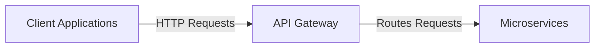
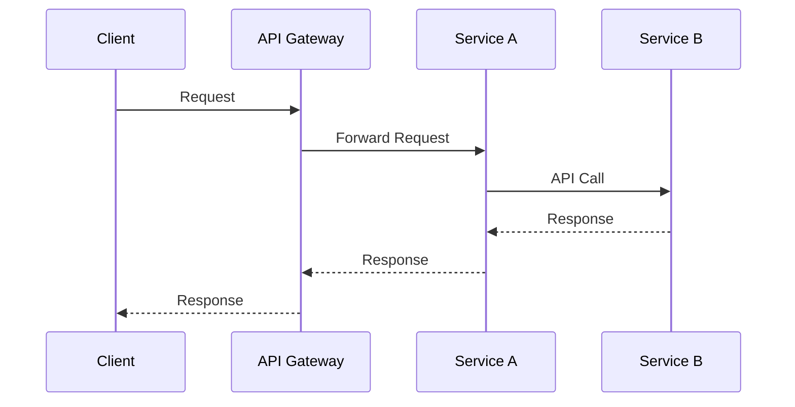
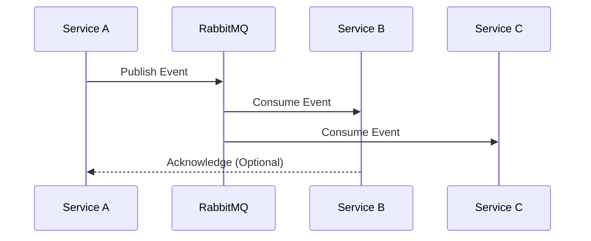
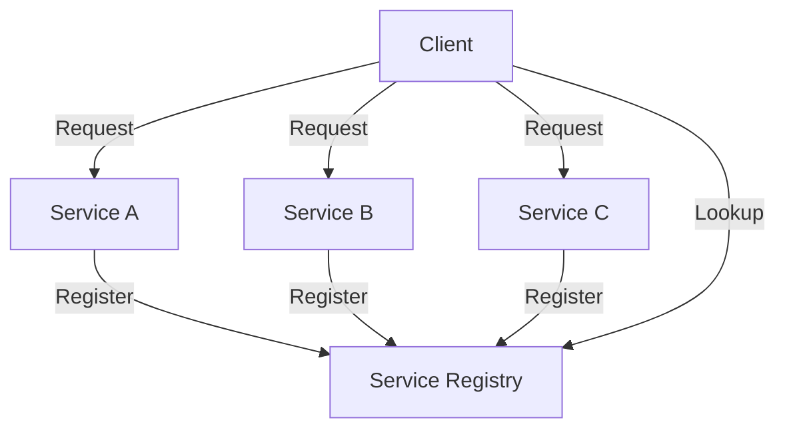
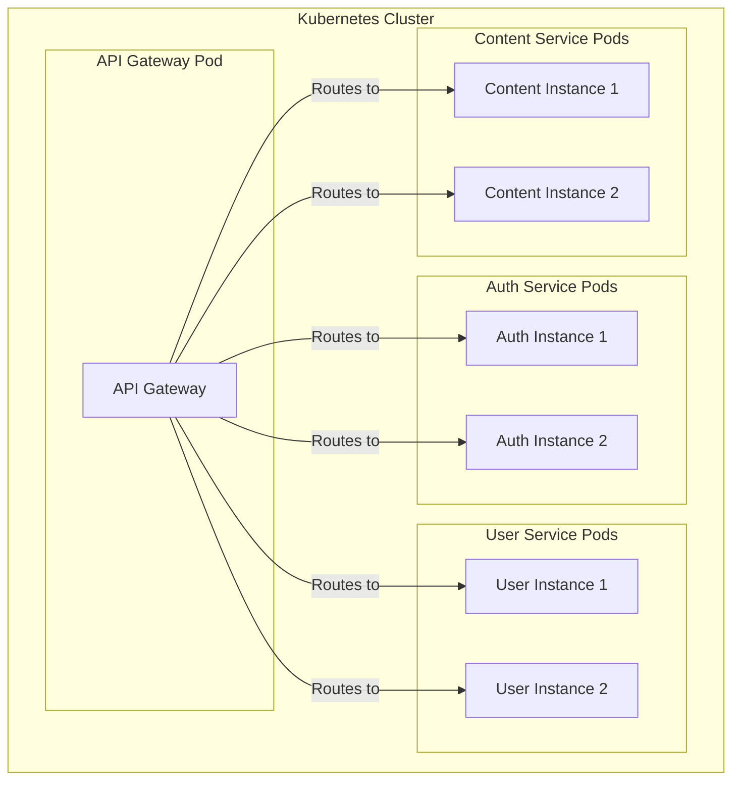

# Microservices Architecture

This document details the microservices architecture used in the Corp Astro Super Admin Panel (SAP) backend.

## Microservices Approach

The Corp Astro SAP uses a microservices architecture to achieve:

- **Scalability**: Services can be scaled independently based on demand
- **Resilience**: Failure in one service doesn't bring down the entire system
- **Maintainability**: Services can be developed, tested, and deployed independently
- **Technology Flexibility**: Different services can use different technologies as needed

## Service Boundaries

Services are divided along business domain boundaries, following Domain-Driven Design principles. Each service:

- Has its own database or database schema
- Exposes a well-defined API
- Is independently deployable
- Has a single responsibility

## Core Services

### API Gateway

The API Gateway serves as the entry point for all client requests, providing:

- Request routing to appropriate services
- Authentication and authorization
- Request/response transformation
- Rate limiting and throttling
- Request logging
- API documentation (Swagger/OpenAPI)



### Auth Service

The Auth Service handles all authentication and authorization concerns:

- User registration and login
- JWT token generation and validation
- OAuth provider integration
- Multi-factor authentication
- Password reset functionality
- Role-based access control

### User Service

The User Service manages user-related functionality:

- User profile management
- User preferences
- User activity tracking
- User relationships and connections
- User notifications

### Content Service

The Content Service handles content management:

- Content creation and editing
- Content categorization and tagging
- Content publishing and scheduling
- Content search and discovery
- Media management (images, videos)

### Astro Engine Service

The Astro Engine Service provides astrological calculations:

- Chart generation using Swiss Ephemeris
- Planetary positions and aspects
- Dashas and transits
- Compatibility calculations
- Astrological predictions

### Astro Ratan AI Service

The Astro Ratan AI Service provides AI-powered interpretations:

- Natural language processing of user queries
- Astrological interpretation generation
- Personalized recommendations
- Learning from user feedback
- Integration with astrological calculations

## Service Communication

Services communicate with each other through:

### Synchronous Communication (REST/GraphQL)

Used for request/response patterns where an immediate response is needed:



### Asynchronous Communication (Event-Driven)

Used for notifications and eventual consistency:



## Service Discovery and Load Balancing

Services register themselves with a service registry (Consul/etcd) and are discovered dynamically:



## Deployment Model

Each service is deployed as a Docker container, orchestrated with Kubernetes:



## Service Template

Each microservice follows a common structure:

```
service-name/
├── src/
│   ├── controllers/     # Request handlers
│   ├── services/        # Business logic
│   ├── models/          # Data models
│   ├── repositories/    # Data access
│   ├── middleware/      # Express middleware
│   ├── utils/           # Utility functions
│   ├── config/          # Configuration
│   ├── routes/          # API routes
│   └── app.ts           # Application setup
├── tests/
│   ├── unit/            # Unit tests
│   ├── integration/     # Integration tests
│   └── e2e/             # End-to-end tests
├── Dockerfile           # Container definition
├── package.json         # Dependencies
└── tsconfig.json        # TypeScript config
```

## Monitoring and Observability

Each service implements:

- Health check endpoints
- Metrics collection (Prometheus)
- Distributed tracing (Jaeger)
- Structured logging (ELK Stack)
- Error reporting

## Resilience Patterns

Services implement resilience patterns such as:

- Circuit breakers
- Retry with exponential backoff
- Rate limiting
- Bulkheads
- Timeouts
- Fallbacks

For more detailed information about specific services, please refer to their individual documentation.
