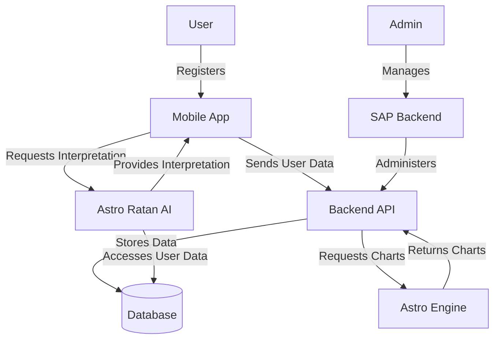

# System Overview

This document provides a high-level overview of the Corp Astro ecosystem and how the Super Admin Panel (SAP) fits into the broader architecture.

## Corp Astro Ecosystem

The Corp Astro ecosystem consists of the following major components:

1. **Mobile Applications**
   - Corp Astro (corporate astrology)
   - Future: GrahVani (Vedic astrology)
   - Future: TellMyStars (Western astrology)

2. **Backend Services**
   - Super Admin Panel (SAP) - This project
   - API Gateway
   - Microservices (Auth, User, Content, etc.)

3. **Specialized Engines**
   - Astro Engine - Generates charts and calculations using Swiss Ephemeris
   - Astro Ratan AI - Conversational AI trained on astrology texts

4. **Data Storage**
   - MongoDB - Primary document database
   - Redis - Caching and session management
   - Elasticsearch - Search functionality
   - PostgreSQL - Relational data storage

## System Interactions

The following diagram illustrates how these components interact with each other:

## Data Flow

1. **User Registration and Authentication**
   - Users register through mobile applications
   - Authentication requests are processed by the Auth Service
   - User data is stored in MongoDB
   - Session information is stored in Redis

2. **Content Management**
   - Admins create and manage content through the SAP
   - Content is stored in MongoDB
   - Content is indexed in Elasticsearch for search functionality
   - Users access content through mobile applications

3. **Astrological Calculations**
   - User requests astrological calculations through mobile applications
   - Requests are forwarded to the Astro Engine
   - Astro Engine performs calculations using Swiss Ephemeris
   - Results are returned to the user and stored in MongoDB

4. **AI Interpretations**
   - Users request interpretations through mobile applications
   - Requests are forwarded to Astro Ratan AI
   - AI accesses user data and astrological calculations
   - AI generates interpretations and returns them to the user

## Super Admin Panel (SAP) Role

The SAP serves as the central administration interface for the entire Corp Astro ecosystem. Key responsibilities include:

1. **User Management**
   - Creating and managing admin accounts
   - Managing user accounts and permissions
   - Viewing user statistics and activity

2. **Content Management**
   - Creating and editing content for mobile applications
   - Managing content categories and tags
   - Scheduling content publication

3. **System Configuration**
   - Configuring system parameters
   - Managing API keys and external integrations
   - Setting up notification rules

4. **Monitoring and Reporting**
   - Viewing system health and performance metrics
   - Generating usage reports
   - Monitoring error logs and alerts

## Technology Stack Overview

The Corp Astro ecosystem uses the following technology stack:

- **Frontend**: React, React Native, Next.js
- **Backend**: Node.js, Express, TypeScript
- **Databases**: MongoDB, Redis, Elasticsearch, PostgreSQL
- **Communication**: REST APIs, GraphQL, WebSockets, RabbitMQ
- **Deployment**: Docker, Kubernetes, AWS
- **Monitoring**: ELK Stack, Prometheus, Grafana

For more detailed information about specific components, please refer to the other architecture documentation pages.
