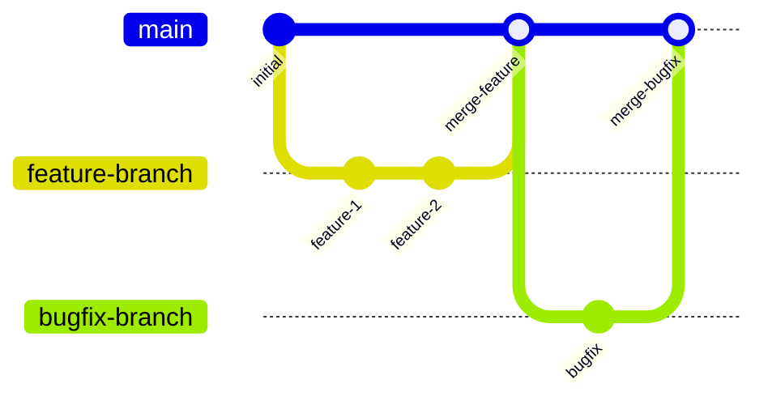

# Development Guide

This section provides comprehensive guides and documentation for developers working on the Corp Astro Super Admin Panel (SAP) backend.

## Contents

- [Development Environment Setup](./setup.md) - Setting up your local development environment
- [Coding Standards](./coding-standards.md) - Code style and best practices
- [Testing Guide](./testing.md) - Writing and running tests
- [Adding New Features](./adding-features.md) - Guide to implementing new features

## Development Workflow

The Corp Astro SAP follows a standard Git workflow:

1. **Fork the Repository**: Start by forking the repository to your GitHub account
2. **Clone the Repository**: Clone your fork to your local machine
3. **Create a Branch**: Create a feature branch for your work
4. **Develop and Test**: Make your changes and test them thoroughly
5. **Commit Changes**: Commit your changes with descriptive commit messages
6. **Push Changes**: Push your changes to your fork
7. **Create a Pull Request**: Submit a pull request to the main repository
8. **Code Review**: Address any feedback from code review
9. **Merge**: Once approved, your changes will be merged



## Commit Message Guidelines

We follow the Conventional Commits specification:

```
<type>[optional scope]: <description>

[optional body]

[optional footer(s)]
```

Types:
- **feat**: A new feature
- **fix**: A bug fix
- **docs**: Documentation only changes
- **style**: Changes that do not affect the meaning of the code
- **refactor**: A code change that neither fixes a bug nor adds a feature
- **perf**: A code change that improves performance
- **test**: Adding missing tests or correcting existing tests
- **chore**: Changes to the build process or auxiliary tools

Examples:
```
feat(auth): add multi-factor authentication support

Implement TOTP-based multi-factor authentication for user login.
Includes QR code generation and verification endpoints.

Closes #123
```

```
fix(api): correct user profile update endpoint

Fix issue where updating user profile would not save changes to the database.

Fixes #456
```

## Branch Naming Convention

Branches should be named according to the following convention:

```
<type>/<issue-number>-<short-description>
```

Examples:
- `feature/123-add-mfa-support`
- `bugfix/456-fix-profile-update`
- `docs/789-update-api-docs`
- `refactor/101-improve-error-handling`

## Development Environment

The development environment includes:

- **Node.js**: v18.0.0 or higher
- **npm**: v9.0.0 or higher
- **MongoDB**: v5.0 or higher
- **Redis**: v6.0 or higher
- **Elasticsearch**: v7.0 or higher (optional)
- **PostgreSQL**: v14.0 or higher (optional)

## Code Review Process

All code changes go through a code review process:

1. **Automated Checks**: CI/CD pipeline runs linting, tests, and security scans
2. **Peer Review**: At least one developer must review and approve the changes
3. **Maintainer Review**: A project maintainer reviews and approves the changes
4. **Merge**: Changes are merged into the main branch

## Development Tools

Recommended tools for development:

- **IDE**: Visual Studio Code with recommended extensions
- **API Testing**: Postman or Insomnia
- **Database Management**: MongoDB Compass, pgAdmin, Redis Desktop Manager
- **Git Client**: GitKraken, SourceTree, or command line
- **Docker**: For containerized development

## Debugging

Debugging can be done using:

- **Node.js Debugger**: Built-in Node.js debugging tools
- **VS Code Debugger**: Integrated debugging in VS Code
- **Logging**: Structured logging with Winston
- **API Testing**: Postman or Insomnia for API testing

## Continuous Integration

The project uses GitHub Actions for CI/CD:

- **Linting**: ESLint checks for code quality
- **Testing**: Jest runs unit and integration tests
- **Security Scanning**: Dependabot and CodeQL for security vulnerabilities
- **Build**: Builds the application for deployment
- **Deployment**: Deploys to staging or production environments

For more detailed information, please refer to the specific guides linked above.
