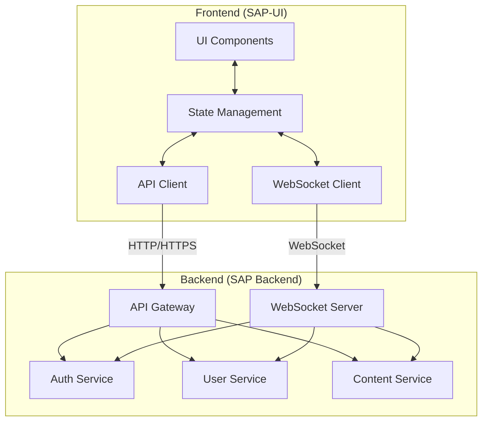

# Frontend-Backend Integration

This section provides comprehensive documentation on how the SAP-UI (frontend) integrates with the SAP Backend services.

## Contents

- [Integration Overview](./overview.md) - High-level overview of frontend-backend integration
- [Authentication Flow](./authentication-flow.md) - Detailed authentication process between frontend and backend
- [API Integration](./api-integration.md) - How the frontend consumes backend APIs
- [Real-time Communication](./realtime-communication.md) - WebSocket and real-time data updates
- [State Management](./state-management.md) - Frontend state management with backend data

## Integration Architecture

The SAP-UI frontend and SAP Backend services follow a modern client-server architecture with clear separation of concerns:

## Key Integration Points

### 1. Authentication and Authorization

The frontend handles user authentication through the backend Auth Service:

- Login/logout flows
- JWT token management
- Token refresh mechanism
- Role-based UI rendering
- Multi-factor authentication UI

### 2. Data Fetching and Mutation

The frontend consumes backend APIs for data operations:

- RESTful API calls for CRUD operations
- GraphQL queries for complex data requirements
- Optimistic UI updates with backend validation
- Error handling and retry mechanisms
- Caching strategies

### 3. Real-time Updates

Real-time communication between frontend and backend:

- WebSocket connections for live updates
- Notification system
- Live data synchronization
- Presence indicators
- Activity feeds

### 4. File Uploads and Downloads

Handling media and file operations:

- Secure file uploads to backend storage
- Progress tracking for large uploads
- File validation on both frontend and backend
- Streaming downloads for large files

### 5. Form Handling and Validation

Coordinated validation between frontend and backend:

- Client-side validation for immediate feedback
- Server-side validation for security
- Dynamic form generation based on backend schemas
- Error message normalization

For detailed information about each integration aspect, please refer to the specific documentation pages linked above.
