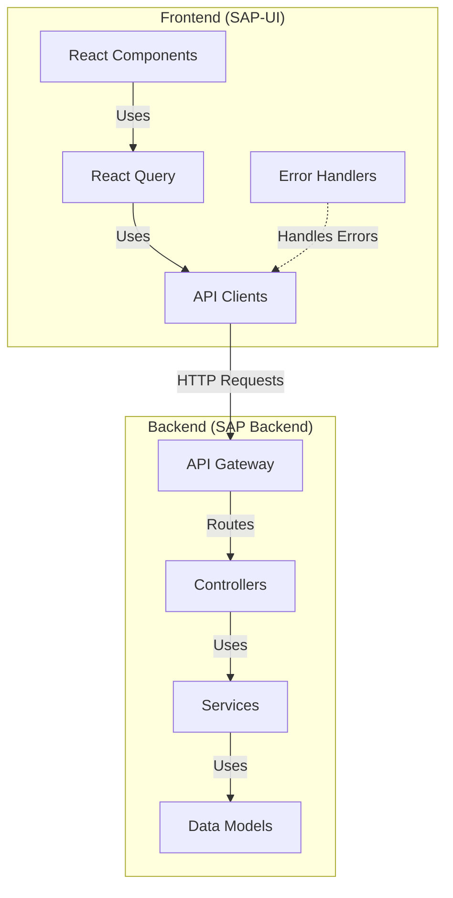

# API Integration

This document details how the SAP-UI frontend integrates with the SAP Backend APIs.

## API Architecture Overview

The SAP-UI communicates with the SAP Backend through a well-defined API layer:



## API Client Implementation

The frontend uses a structured approach to API integration:

### API Client Structure

```
src/
├── api/
│   ├── clients/
│   │   ├── authClient.ts
│   │   ├── userClient.ts
│   │   ├── contentClient.ts
│   │   └── baseClient.ts
│   ├── hooks/
│   │   ├── useAuth.ts
│   │   ├── useUsers.ts
│   │   └── useContent.ts
│   └── types/
│       ├── auth.types.ts
│       ├── user.types.ts
│       └── content.types.ts
```

### Base API Client

```typescript
// src/api/clients/baseClient.ts
import axios, { AxiosInstance, AxiosRequestConfig, AxiosResponse } from 'axios';
import { store } from '../../store';
import { refreshToken } from '../../store/auth/authSlice';
import tokenManager from '../../utils/tokenManager';

export class BaseApiClient {
  private client: AxiosInstance;
  private baseURL: string;
  
  constructor(baseURL: string) {
    this.baseURL = baseURL;
    this.client = axios.create({
      baseURL,
      headers: {
        'Content-Type': 'application/json'
      }
    });
    
    this.setupInterceptors();
  }
  
  private setupInterceptors() {
    // Request interceptor
    this.client.interceptors.request.use(
      async (config) => {
        // Add auth token if available
        const token = tokenManager.getAccessToken();
        if (token) {
          config.headers.Authorization = `Bearer ${token}`;
        }
        return config;
      },
      (error) => Promise.reject(error)
    );
    
    // Response interceptor
    this.client.interceptors.response.use(
      (response) => response,
      async (error) => {
        const originalRequest = error.config;
        
        // Handle token expiration
        if (error.response?.status === 401 && !originalRequest._retry) {
          originalRequest._retry = true;
          
          try {
            // Try to refresh the token
            await store.dispatch(refreshToken());
            
            // Retry the original request with new token
            const token = tokenManager.getAccessToken();
            if (token) {
              originalRequest.headers.Authorization = `Bearer ${token}`;
            }
            return this.client(originalRequest);
          } catch (refreshError) {
            // If refresh fails, redirect to login
            window.location.href = '/login';
            return Promise.reject(refreshError);
          }
        }
        
        return Promise.reject(error);
      }
    );
  }
  
  protected async get<T>(url: string, config?: AxiosRequestConfig): Promise<T> {
    const response: AxiosResponse<T> = await this.client.get(url, config);
    return response.data;
  }
  
  protected async post<T>(url: string, data?: any, config?: AxiosRequestConfig): Promise<T> {
    const response: AxiosResponse<T> = await this.client.post(url, data, config);
    return response.data;
  }
  
  protected async put<T>(url: string, data?: any, config?: AxiosRequestConfig): Promise<T> {
    const response: AxiosResponse<T> = await this.client.put(url, data, config);
    return response.data;
  }
  
  protected async patch<T>(url: string, data?: any, config?: AxiosRequestConfig): Promise<T> {
    const response: AxiosResponse<T> = await this.client.patch(url, data, config);
    return response.data;
  }
  
  protected async delete<T>(url: string, config?: AxiosRequestConfig): Promise<T> {
    const response: AxiosResponse<T> = await this.client.delete(url, config);
    return response.data;
  }
}
```

### Specific API Clients

```typescript
// src/api/clients/userClient.ts
import { BaseApiClient } from './baseClient';
import { User, UserProfile, UserListResponse, CreateUserRequest, UpdateUserRequest } from '../types/user.types';

export class UserApiClient extends BaseApiClient {
  constructor() {
    super(`${process.env.REACT_APP_API_URL}/api/v1/users`);
  }
  
  async getUsers(page: number = 1, limit: number = 10): Promise<UserListResponse> {
    return this.get<UserListResponse>(`?page=${page}&limit=${limit}`);
  }
  
  async getUserById(id: string): Promise<User> {
    return this.get<User>(`/${id}`);
  }
  
  async createUser(userData: CreateUserRequest): Promise<User> {
    return this.post<User>('', userData);
  }
  
  async updateUser(id: string, userData: UpdateUserRequest): Promise<User> {
    return this.put<User>(`/${id}`, userData);
  }
  
  async updateUserProfile(id: string, profileData: Partial<UserProfile>): Promise<User> {
    return this.patch<User>(`/${id}/profile`, profileData);
  }
  
  async deleteUser(id: string): Promise<void> {
    return this.delete<void>(`/${id}`);
  }
}

export const userApiClient = new UserApiClient();
```

## React Query Integration

The frontend uses React Query for data fetching, caching, and state management:

```typescript
// src/api/hooks/useUsers.ts
import { useQuery, useMutation, useQueryClient } from 'react-query';
import { userApiClient } from '../clients/userClient';
import { User, CreateUserRequest, UpdateUserRequest } from '../types/user.types';

// Query keys
export const userKeys = {
  all: ['users'] as const,
  lists: () => [...userKeys.all, 'list'] as const,
  list: (filters: any) => [...userKeys.lists(), filters] as const,
  details: () => [...userKeys.all, 'detail'] as const,
  detail: (id: string) => [...userKeys.details(), id] as const,
};

// Get users with pagination
export const useUsers = (page: number = 1, limit: number = 10) => {
  return useQuery(
    userKeys.list({ page, limit }),
    () => userApiClient.getUsers(page, limit),
    {
      keepPreviousData: true,
    }
  );
};

// Get a single user
export const useUser = (id: string) => {
  return useQuery(
    userKeys.detail(id),
    () => userApiClient.getUserById(id),
    {
      enabled: !!id,
    }
  );
};

// Create a user
export const useCreateUser = () => {
  const queryClient = useQueryClient();
  
  return useMutation(
    (userData: CreateUserRequest) => userApiClient.createUser(userData),
    {
      onSuccess: () => {
        // Invalidate users list queries
        queryClient.invalidateQueries(userKeys.lists());
      },
    }
  );
};

// Update a user
export const useUpdateUser = () => {
  const queryClient = useQueryClient();
  
  return useMutation(
    ({ id, userData }: { id: string; userData: UpdateUserRequest }) => 
      userApiClient.updateUser(id, userData),
    {
      onSuccess: (updatedUser) => {
        // Update the user in the cache
        queryClient.setQueryData(
          userKeys.detail(updatedUser.id),
          updatedUser
        );
        
        // Invalidate users list queries
        queryClient.invalidateQueries(userKeys.lists());
      },
    }
  );
};

// Delete a user
export const useDeleteUser = () => {
  const queryClient = useQueryClient();
  
  return useMutation(
    (id: string) => userApiClient.deleteUser(id),
    {
      onSuccess: (_, id) => {
        // Remove the user from the cache
        queryClient.removeQueries(userKeys.detail(id));
        
        // Invalidate users list queries
        queryClient.invalidateQueries(userKeys.lists());
      },
    }
  );
};
```

## Using API Hooks in Components

```tsx
// src/components/UserList.tsx
import React, { useState } from 'react';
import { useUsers, useDeleteUser } from '../api/hooks/useUsers';
import { User } from '../api/types/user.types';
import { DataTable, Button, Pagination, Modal, Alert } from '../ui';

const UserList: React.FC = () => {
  const [page, setPage] = useState(1);
  const [limit, setLimit] = useState(10);
  const [deleteUserId, setDeleteUserId] = useState<string | null>(null);
  
  const { 
    data, 
    isLoading, 
    isError, 
    error 
  } = useUsers(page, limit);
  
  const deleteUserMutation = useDeleteUser();
  
  const handlePageChange = (newPage: number) => {
    setPage(newPage);
  };
  
  const handleDeleteClick = (userId: string) => {
    setDeleteUserId(userId);
  };
  
  const confirmDelete = () => {
    if (deleteUserId) {
      deleteUserMutation.mutate(deleteUserId, {
        onSuccess: () => {
          setDeleteUserId(null);
        }
      });
    }
  };
  
  if (isLoading) {
    return <div>Loading users...</div>;
  }
  
  if (isError) {
    return <Alert type="error">Error loading users: {error.message}</Alert>;
  }
  
  return (
    <div>
      <h1>Users</h1>
      
      <DataTable
        data={data?.users || []}
        columns={[
          { header: 'Name', accessor: (user: User) => `${user.profile?.firstName} ${user.profile?.lastName}` },
          { header: 'Email', accessor: 'email' },
          { header: 'Roles', accessor: (user: User) => user.roles.join(', ') },
          { 
            header: 'Actions', 
            accessor: (user: User) => (
              <>
                <Button variant="secondary" href={`/users/${user.id}`}>Edit</Button>
                <Button variant="danger" onClick={() => handleDeleteClick(user.id)}>Delete</Button>
              </>
            ) 
          }
        ]}
      />
      
      <Pagination
        currentPage={page}
        totalPages={data?.meta.pagination.pages || 1}
        onPageChange={handlePageChange}
      />
      
      <Modal
        isOpen={!!deleteUserId}
        onClose={() => setDeleteUserId(null)}
        title="Confirm Delete"
      >
        <p>Are you sure you want to delete this user?</p>
        <div>
          <Button variant="danger" onClick={confirmDelete} isLoading={deleteUserMutation.isLoading}>
            Delete
          </Button>
          <Button variant="secondary" onClick={() => setDeleteUserId(null)}>
            Cancel
          </Button>
        </div>
      </Modal>
    </div>
  );
};

export default UserList;
```

## Error Handling

The frontend implements consistent error handling for API requests:

```typescript
// src/utils/errorHandler.ts
import { AxiosError } from 'axios';
import { toast } from 'react-toastify';

interface ApiError {
  error: {
    code: string;
    message: string;
    details?: Record<string, any>;
    timestamp: string;
    requestId: string;
  };
}

export const handleApiError = (error: unknown): string => {
  // Handle Axios errors
  if (isAxiosError(error)) {
    const apiError = error.response?.data as ApiError;
    
    // If it's a structured API error
    if (apiError?.error) {
      // Log detailed error for debugging
      console.error('API Error:', {
        code: apiError.error.code,
        message: apiError.error.message,
        details: apiError.error.details,
        requestId: apiError.error.requestId
      });
      
      // Handle specific error codes
      switch (apiError.error.code) {
        case 'VALIDATION_ERROR':
          return formatValidationError(apiError.error.details);
        case 'RESOURCE_NOT_FOUND':
          return 'The requested resource was not found.';
        case 'PERMISSION_DENIED':
          return 'You do not have permission to perform this action.';
        default:
          return apiError.error.message;
      }
    }
    
    // Handle HTTP status codes
    switch (error.response?.status) {
      case 401:
        return 'Authentication required. Please log in.';
      case 403:
        return 'You do not have permission to perform this action.';
      case 404:
        return 'The requested resource was not found.';
      case 500:
        return 'An internal server error occurred. Please try again later.';
      default:
        return error.message || 'An unknown error occurred.';
    }
  }
  
  // Handle other types of errors
  if (error instanceof Error) {
    return error.message;
  }
  
  return 'An unknown error occurred.';
};

// Helper to check if error is an Axios error
const isAxiosError = (error: any): error is AxiosError => {
  return error.isAxiosError === true;
};

// Format validation errors into a readable message
const formatValidationError = (details?: Record<string, any>): string => {
  if (!details) return 'Validation error occurred.';
  
  const errorMessages = Object.entries(details)
    .map(([field, message]) => `${field}: ${message}`)
    .join(', ');
  
  return `Validation error: ${errorMessages}`;
};

// Show error toast
export const showErrorToast = (error: unknown) => {
  const message = handleApiError(error);
  toast.error(message);
};
```

## API Request/Response Formats

### Request Format

```typescript
// Example API request
const createUserRequest: CreateUserRequest = {
  email: 'user@example.com',
  password: 'securePassword123',
  profile: {
    firstName: 'John',
    lastName: 'Doe',
    birthDate: '1990-01-01'
  },
  roles: ['user']
};

// HTTP Request
// POST /api/v1/users
// Content-Type: application/json
// Authorization: Bearer <token>
// Body: JSON.stringify(createUserRequest)
```

### Response Format

```typescript
// Example API response
interface ApiResponse<T> {
  data: T;
  meta: {
    timestamp: string;
    requestId: string;
    pagination?: {
      page: number;
      limit: number;
      total: number;
      pages: number;
    };
  };
}

// Example success response
// HTTP 200 OK
// Content-Type: application/json
// Body:
{
  "data": {
    "id": "usr_123456789",
    "email": "user@example.com",
    "roles": ["user"],
    "profile": {
      "firstName": "John",
      "lastName": "Doe",
      "birthDate": "1990-01-01"
    },
    "createdAt": "2025-05-20T00:43:08+05:30",
    "updatedAt": "2025-05-20T00:43:08+05:30"
  },
  "meta": {
    "timestamp": "2025-05-20T00:43:08+05:30",
    "requestId": "req_abcdef123"
  }
}

// Example error response
// HTTP 400 Bad Request
// Content-Type: application/json
// Body:
{
  "error": {
    "code": "VALIDATION_ERROR",
    "message": "Validation failed",
    "details": {
      "email": "Email is already in use",
      "password": "Password must be at least 8 characters"
    },
    "timestamp": "2025-05-20T00:43:08+05:30",
    "requestId": "req_abcdef123"
  }
}
```

## API Versioning

The SAP-UI handles API versioning to ensure compatibility:

```typescript
// src/config/api.config.ts
export const API_CONFIG = {
  BASE_URL: process.env.REACT_APP_API_URL || 'http://localhost:5000',
  VERSION: 'v1',
  ENDPOINTS: {
    AUTH: '/auth',
    USERS: '/users',
    CONTENT: '/content',
    SYSTEM: '/system'
  },
  getApiUrl: (endpoint: string) => {
    return `${API_CONFIG.BASE_URL}/api/${API_CONFIG.VERSION}${endpoint}`;
  }
};

// Usage
const usersUrl = API_CONFIG.getApiUrl(API_CONFIG.ENDPOINTS.USERS);
// http://localhost:5000/api/v1/users
```

## API Documentation Integration

The frontend integrates with the backend API documentation:

```typescript
// src/pages/ApiDocs.tsx
import React from 'react';
import SwaggerUI from 'swagger-ui-react';
import 'swagger-ui-react/swagger-ui.css';
import { API_CONFIG } from '../config/api.config';

const ApiDocs: React.FC = () => {
  const swaggerUrl = `${API_CONFIG.BASE_URL}/api-docs/swagger.json`;
  
  return (
    <div className="api-docs-container">
      <h1>API Documentation</h1>
      <SwaggerUI url={swaggerUrl} />
    </div>
  );
};

export default ApiDocs;
```

## Best Practices

1. **Use typed API clients**: Ensure type safety between frontend and backend
2. **Implement consistent error handling**: Standardize error handling across the application
3. **Use React Query for data fetching**: Leverage caching, refetching, and state management
4. **Handle loading and error states**: Always show appropriate loading and error states
5. **Implement optimistic updates**: Update UI immediately, then confirm with backend
6. **Use pagination for large datasets**: Don't load all data at once
7. **Implement proper retry logic**: Handle network failures gracefully
8. **Use API versioning**: Ensure compatibility as APIs evolve
9. **Document API contracts**: Keep frontend and backend in sync
10. **Use environment variables for API configuration**: Support different environments

For more detailed information about authentication flow and real-time communication, please refer to the other documents in this section.
