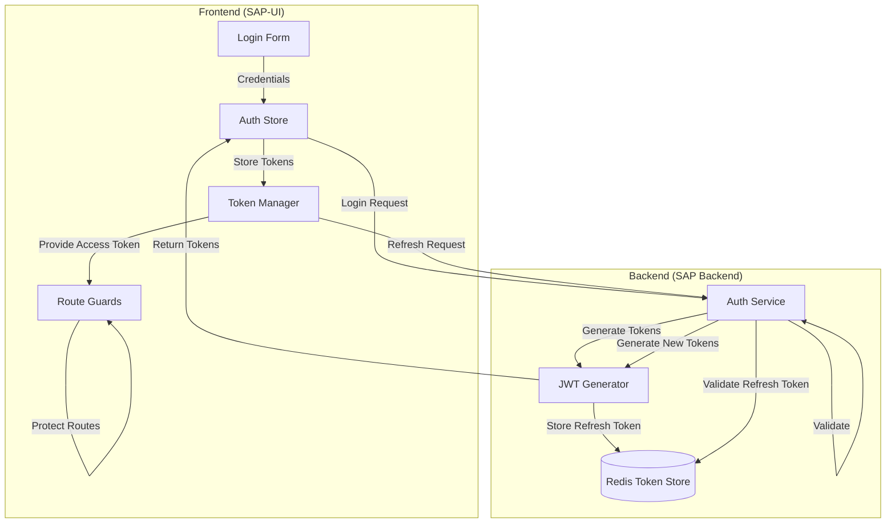
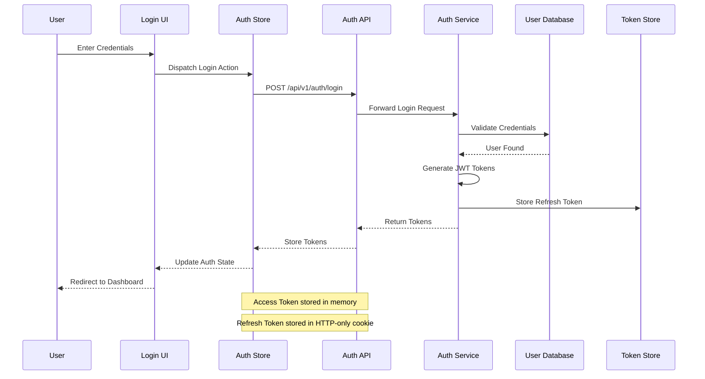
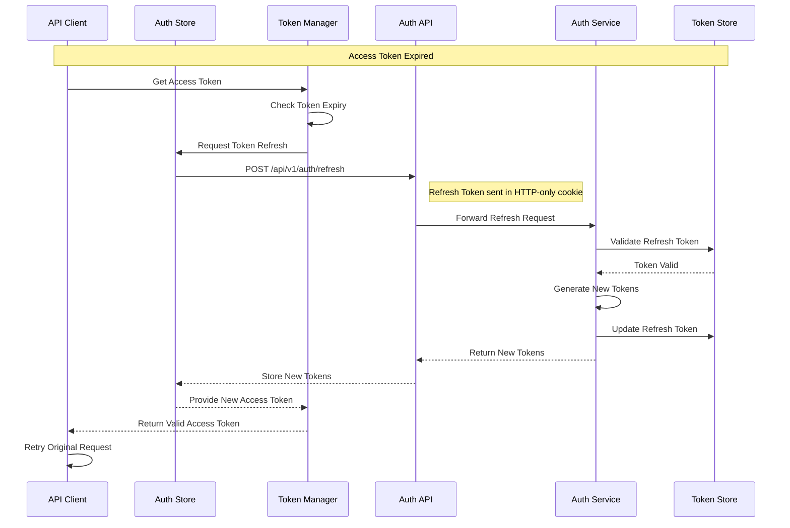
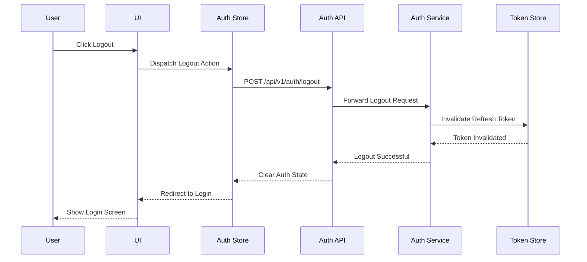

# Authentication Flow

This document details the authentication flow between the SAP-UI frontend and the SAP Backend services.

## Authentication Architecture

The SAP system uses a token-based authentication system with JWT (JSON Web Tokens):



## Authentication Flows

### Login Flow



### Token Refresh Flow



### Logout Flow



### Multi-Factor Authentication Flow


## Frontend Implementation

### Auth Store (Redux Toolkit)

```typescript
// Auth slice
import { createSlice, createAsyncThunk } from '@reduxjs/toolkit';
import authService from '../services/authService';

export const login = createAsyncThunk(
  'auth/login',
  async (credentials: { email: string; password: string }, { rejectWithValue }) => {
    try {
      return await authService.login(credentials);
    } catch (error) {
      return rejectWithValue(error.response?.data || { message: error.message });
    }
  }
);

export const refreshToken = createAsyncThunk(
  'auth/refreshToken',
  async (_, { rejectWithValue }) => {
    try {
      return await authService.refreshToken();
    } catch (error) {
      return rejectWithValue(error.response?.data || { message: error.message });
    }
  }
);

export const logout = createAsyncThunk(
  'auth/logout',
  async (_, { rejectWithValue }) => {
    try {
      return await authService.logout();
    } catch (error) {
      return rejectWithValue(error.response?.data || { message: error.message });
    }
  }
);

const authSlice = createSlice({
  name: 'auth',
  initialState: {
    user: null,
    accessToken: null,
    isAuthenticated: false,
    isLoading: false,
    error: null,
    mfaRequired: false,
    mfaToken: null
  },
  reducers: {
    clearError: (state) => {
      state.error = null;
    }
  },
  extraReducers: (builder) => {
    builder
      .addCase(login.pending, (state) => {
        state.isLoading = true;
        state.error = null;
      })
      .addCase(login.fulfilled, (state, action) => {
        state.isLoading = false;
        if (action.payload.mfaRequired) {
          state.mfaRequired = true;
          state.mfaToken = action.payload.mfaToken;
        } else {
          state.isAuthenticated = true;
          state.user = action.payload.user;
          state.accessToken = action.payload.accessToken;
        }
      })
      .addCase(login.rejected, (state, action) => {
        state.isLoading = false;
        state.error = action.payload;
      })
      // Handle other actions (refreshToken, logout, etc.)
  }
});

export const { clearError } = authSlice.actions;
export default authSlice.reducer;
```

### Token Manager

```typescript
// Token manager service
class TokenManager {
  private accessToken: string | null = null;
  private refreshToken: string | null = null;
  private tokenExpiry: number | null = null;
  
  setTokens(accessToken: string, refreshToken: string, expiresIn: number) {
    this.accessToken = accessToken;
    this.refreshToken = refreshToken;
    this.tokenExpiry = Date.now() + expiresIn * 1000;
    
    // Store refresh token in HTTP-only cookie (handled by the backend)
    // Access token is only stored in memory for security
  }
  
  getAccessToken() {
    return this.accessToken;
  }
  
  isTokenExpired() {
    return this.tokenExpiry ? Date.now() > this.tokenExpiry : true;
  }
  
  clearTokens() {
    this.accessToken = null;
    this.refreshToken = null;
    this.tokenExpiry = null;
  }
}

export default new TokenManager();
```

### Auth Service

```typescript
// Auth service for API calls
import axios from 'axios';
import tokenManager from './tokenManager';

const API_URL = process.env.REACT_APP_API_URL || 'http://localhost:5000/api/v1';

const authService = {
  async login(credentials) {
    const response = await axios.post(`${API_URL}/auth/login`, credentials);
    if (response.data.accessToken) {
      tokenManager.setTokens(
        response.data.accessToken,
        response.data.refreshToken,
        response.data.expiresIn
      );
    }
    return response.data;
  },
  
  async refreshToken() {
    const response = await axios.post(`${API_URL}/auth/refresh`);
    if (response.data.accessToken) {
      tokenManager.setTokens(
        response.data.accessToken,
        response.data.refreshToken,
        response.data.expiresIn
      );
    }
    return response.data;
  },
  
  async logout() {
    const response = await axios.post(`${API_URL}/auth/logout`);
    tokenManager.clearTokens();
    return response.data;
  },
  
  async verifyMfa(mfaToken, code) {
    const response = await axios.post(`${API_URL}/auth/verify-mfa`, {
      mfaToken,
      code
    });
    if (response.data.accessToken) {
      tokenManager.setTokens(
        response.data.accessToken,
        response.data.refreshToken,
        response.data.expiresIn
      );
    }
    return response.data;
  }
};

export default authService;
```

### API Client with Auth Interceptors

```typescript
// API client with auth interceptors
import axios from 'axios';
import store from '../store';
import { refreshToken } from '../store/authSlice';
import tokenManager from './tokenManager';

const API_URL = process.env.REACT_APP_API_URL || 'http://localhost:5000/api/v1';

const apiClient = axios.create({
  baseURL: API_URL,
  headers: {
    'Content-Type': 'application/json'
  }
});

// Request interceptor to add auth token
apiClient.interceptors.request.use(
  async (config) => {
    // If token is expired, refresh it
    if (tokenManager.isTokenExpired()) {
      await store.dispatch(refreshToken());
    }
    
    const token = tokenManager.getAccessToken();
    if (token) {
      config.headers.Authorization = `Bearer ${token}`;
    }
    return config;
  },
  (error) => Promise.reject(error)
);

// Response interceptor to handle auth errors
apiClient.interceptors.response.use(
  (response) => response,
  async (error) => {
    const originalRequest = error.config;
    
    // If error is 401 and not already retrying
    if (error.response?.status === 401 && !originalRequest._retry) {
      originalRequest._retry = true;
      
      try {
        // Try to refresh the token
        await store.dispatch(refreshToken());
        
        // Retry the original request
        const token = tokenManager.getAccessToken();
        if (token) {
          originalRequest.headers.Authorization = `Bearer ${token}`;
        }
        return axios(originalRequest);
      } catch (refreshError) {
        // If refresh fails, redirect to login
        window.location.href = '/login';
        return Promise.reject(refreshError);
      }
    }
    
    return Promise.reject(error);
  }
);

export default apiClient;
```

### Protected Routes

```typescript
// Protected route component
import React from 'react';
import { Route, Redirect, RouteProps } from 'react-router-dom';
import { useSelector } from 'react-redux';
import { RootState } from '../store';

interface ProtectedRouteProps extends RouteProps {
  component: React.ComponentType<any>;
  requiredRoles?: string[];
}

const ProtectedRoute: React.FC<ProtectedRouteProps> = ({
  component: Component,
  requiredRoles = [],
  ...rest
}) => {
  const { isAuthenticated, user } = useSelector((state: RootState) => state.auth);
  
  return (
    <Route
      {...rest}
      render={(props) => {
        // Check if user is authenticated
        if (!isAuthenticated) {
          return <Redirect to="/login" />;
        }
        
        // Check if user has required roles
        if (requiredRoles.length > 0) {
          const hasRequiredRole = requiredRoles.some(role => 
            user?.roles.includes(role)
          );
          
          if (!hasRequiredRole) {
            return <Redirect to="/unauthorized" />;
          }
        }
        
        // Render the protected component
        return <Component {...props} />;
      }}
    />
  );
};

export default ProtectedRoute;
```

## Backend Implementation

### JWT Authentication Middleware

```typescript
// JWT authentication middleware
import { Request, Response, NextFunction } from 'express';
import jwt from 'jsonwebtoken';
import { User } from '../models/User';
import { redisClient } from '../config/redis';

interface TokenPayload {
  userId: string;
  roles: string[];
  iat: number;
  exp: number;
}

declare global {
  namespace Express {
    interface Request {
      user?: User;
      userId?: string;
      roles?: string[];
    }
  }
}

export const authenticate = async (
  req: Request,
  res: Response,
  next: NextFunction
) => {
  try {
    // Get token from header
    const authHeader = req.headers.authorization;
    if (!authHeader?.startsWith('Bearer ')) {
      return res.status(401).json({
        error: {
          code: 'AUTHENTICATION_REQUIRED',
          message: 'Authentication required',
          timestamp: new Date().toISOString(),
          requestId: req.id
        }
      });
    }
    
    const token = authHeader.split(' ')[1];
    
    // Verify token
    const decoded = jwt.verify(
      token,
      process.env.JWT_SECRET as string
    ) as TokenPayload;
    
    // Check if token is blacklisted
    const isBlacklisted = await redisClient.get(`blacklist:${token}`);
    if (isBlacklisted) {
      return res.status(401).json({
        error: {
          code: 'TOKEN_REVOKED',
          message: 'Token has been revoked',
          timestamp: new Date().toISOString(),
          requestId: req.id
        }
      });
    }
    
    // Add user info to request
    req.userId = decoded.userId;
    req.roles = decoded.roles;
    
    next();
  } catch (error) {
    if (error.name === 'TokenExpiredError') {
      return res.status(401).json({
        error: {
          code: 'TOKEN_EXPIRED',
          message: 'Token has expired',
          timestamp: new Date().toISOString(),
          requestId: req.id
        }
      });
    }
    
    return res.status(401).json({
      error: {
        code: 'INVALID_TOKEN',
        message: 'Invalid token',
        timestamp: new Date().toISOString(),
        requestId: req.id
      }
    });
  }
};
```

### Role-Based Authorization Middleware

```typescript
// Role-based authorization middleware
import { Request, Response, NextFunction } from 'express';

export const authorize = (roles: string[]) => {
  return (req: Request, res: Response, next: NextFunction) => {
    if (!req.roles) {
      return res.status(401).json({
        error: {
          code: 'AUTHENTICATION_REQUIRED',
          message: 'Authentication required',
          timestamp: new Date().toISOString(),
          requestId: req.id
        }
      });
    }
    
    const hasRole = req.roles.some(role => roles.includes(role));
    if (!hasRole) {
      return res.status(403).json({
        error: {
          code: 'PERMISSION_DENIED',
          message: 'Permission denied',
          timestamp: new Date().toISOString(),
          requestId: req.id
        }
      });
    }
    
    next();
  };
};
```

### Auth Controller

```typescript
// Auth controller
import { Request, Response } from 'express';
import jwt from 'jsonwebtoken';
import bcrypt from 'bcrypt';
import { v4 as uuidv4 } from 'uuid';
import { User } from '../models/User';
import { redisClient } from '../config/redis';
import { generateTOTP, verifyTOTP } from '../utils/mfa';

export const login = async (req: Request, res: Response) => {
  try {
    const { email, password } = req.body;
    
    // Find user
    const user = await User.findOne({ email });
    if (!user) {
      return res.status(401).json({
        error: {
          code: 'INVALID_CREDENTIALS',
          message: 'Invalid email or password',
          timestamp: new Date().toISOString(),
          requestId: req.id
        }
      });
    }
    
    // Verify password
    const isPasswordValid = await bcrypt.compare(password, user.password);
    if (!isPasswordValid) {
      return res.status(401).json({
        error: {
          code: 'INVALID_CREDENTIALS',
          message: 'Invalid email or password',
          timestamp: new Date().toISOString(),
          requestId: req.id
        }
      });
    }
    
    // Check if MFA is enabled
    if (user.mfaEnabled) {
      const mfaToken = uuidv4();
      
      // Store MFA token in Redis with short expiry
      await redisClient.set(
        `mfa:${mfaToken}`,
        user.id,
        'EX',
        300 // 5 minutes
      );
      
      return res.status(200).json({
        mfaRequired: true,
        mfaToken
      });
    }
    
    // Generate tokens
    const tokens = generateTokens(user);
    
    // Set refresh token as HTTP-only cookie
    res.cookie('refreshToken', tokens.refreshToken, {
      httpOnly: true,
      secure: process.env.NODE_ENV === 'production',
      maxAge: 7 * 24 * 60 * 60 * 1000, // 7 days
      sameSite: 'strict'
    });
    
    // Store refresh token in Redis
    await redisClient.set(
      `refresh:${user.id}`,
      tokens.refreshToken,
      'EX',
      7 * 24 * 60 * 60 // 7 days
    );
    
    // Return user info and access token
    return res.status(200).json({
      user: {
        id: user.id,
        email: user.email,
        roles: user.roles,
        profile: user.profile
      },
      accessToken: tokens.accessToken,
      expiresIn: 3600 // 1 hour
    });
  } catch (error) {
    console.error('Login error:', error);
    return res.status(500).json({
      error: {
        code: 'INTERNAL_SERVER_ERROR',
        message: 'An internal server error occurred',
        timestamp: new Date().toISOString(),
        requestId: req.id
      }
    });
  }
};

export const verifyMfa = async (req: Request, res: Response) => {
  try {
    const { mfaToken, code } = req.body;
    
    // Get user ID from MFA token
    const userId = await redisClient.get(`mfa:${mfaToken}`);
    if (!userId) {
      return res.status(401).json({
        error: {
          code: 'INVALID_MFA_TOKEN',
          message: 'Invalid or expired MFA token',
          timestamp: new Date().toISOString(),
          requestId: req.id
        }
      });
    }
    
    // Find user
    const user = await User.findById(userId);
    if (!user) {
      return res.status(401).json({
        error: {
          code: 'USER_NOT_FOUND',
          message: 'User not found',
          timestamp: new Date().toISOString(),
          requestId: req.id
        }
      });
    }
    
    // Verify MFA code
    const isCodeValid = verifyTOTP(code, user.mfaSecret);
    if (!isCodeValid) {
      return res.status(401).json({
        error: {
          code: 'INVALID_MFA_CODE',
          message: 'Invalid MFA code',
          timestamp: new Date().toISOString(),
          requestId: req.id
        }
      });
    }
    
    // Delete MFA token
    await redisClient.del(`mfa:${mfaToken}`);
    
    // Generate tokens
    const tokens = generateTokens(user);
    
    // Set refresh token as HTTP-only cookie
    res.cookie('refreshToken', tokens.refreshToken, {
      httpOnly: true,
      secure: process.env.NODE_ENV === 'production',
      maxAge: 7 * 24 * 60 * 60 * 1000, // 7 days
      sameSite: 'strict'
    });
    
    // Store refresh token in Redis
    await redisClient.set(
      `refresh:${user.id}`,
      tokens.refreshToken,
      'EX',
      7 * 24 * 60 * 60 // 7 days
    );
    
    // Return user info and access token
    return res.status(200).json({
      user: {
        id: user.id,
        email: user.email,
        roles: user.roles,
        profile: user.profile
      },
      accessToken: tokens.accessToken,
      expiresIn: 3600 // 1 hour
    });
  } catch (error) {
    console.error('MFA verification error:', error);
    return res.status(500).json({
      error: {
        code: 'INTERNAL_SERVER_ERROR',
        message: 'An internal server error occurred',
        timestamp: new Date().toISOString(),
        requestId: req.id
      }
    });
  }
};

export const refresh = async (req: Request, res: Response) => {
  try {
    // Get refresh token from cookie
    const refreshToken = req.cookies.refreshToken;
    if (!refreshToken) {
      return res.status(401).json({
        error: {
          code: 'REFRESH_TOKEN_REQUIRED',
          message: 'Refresh token required',
          timestamp: new Date().toISOString(),
          requestId: req.id
        }
      });
    }
    
    // Verify refresh token
    const decoded = jwt.verify(
      refreshToken,
      process.env.JWT_REFRESH_SECRET as string
    ) as { userId: string };
    
    // Check if refresh token is valid in Redis
    const storedToken = await redisClient.get(`refresh:${decoded.userId}`);
    if (!storedToken || storedToken !== refreshToken) {
      return res.status(401).json({
        error: {
          code: 'INVALID_REFRESH_TOKEN',
          message: 'Invalid refresh token',
          timestamp: new Date().toISOString(),
          requestId: req.id
        }
      });
    }
    
    // Find user
    const user = await User.findById(decoded.userId);
    if (!user) {
      return res.status(401).json({
        error: {
          code: 'USER_NOT_FOUND',
          message: 'User not found',
          timestamp: new Date().toISOString(),
          requestId: req.id
        }
      });
    }
    
    // Generate new tokens
    const tokens = generateTokens(user);
    
    // Set new refresh token as HTTP-only cookie
    res.cookie('refreshToken', tokens.refreshToken, {
      httpOnly: true,
      secure: process.env.NODE_ENV === 'production',
      maxAge: 7 * 24 * 60 * 60 * 1000, // 7 days
      sameSite: 'strict'
    });
    
    // Update refresh token in Redis
    await redisClient.set(
      `refresh:${user.id}`,
      tokens.refreshToken,
      'EX',
      7 * 24 * 60 * 60 // 7 days
    );
    
    // Return new access token
    return res.status(200).json({
      accessToken: tokens.accessToken,
      expiresIn: 3600 // 1 hour
    });
  } catch (error) {
    if (error.name === 'TokenExpiredError') {
      return res.status(401).json({
        error: {
          code: 'REFRESH_TOKEN_EXPIRED',
          message: 'Refresh token has expired',
          timestamp: new Date().toISOString(),
          requestId: req.id
        }
      });
    }
    
    console.error('Token refresh error:', error);
    return res.status(401).json({
      error: {
        code: 'INVALID_REFRESH_TOKEN',
        message: 'Invalid refresh token',
        timestamp: new Date().toISOString(),
        requestId: req.id
      }
    });
  }
};

export const logout = async (req: Request, res: Response) => {
  try {
    // Get refresh token from cookie
    const refreshToken = req.cookies.refreshToken;
    if (refreshToken) {
      try {
        // Verify refresh token to get user ID
        const decoded = jwt.verify(
          refreshToken,
          process.env.JWT_REFRESH_SECRET as string
        ) as { userId: string };
        
        // Delete refresh token from Redis
        await redisClient.del(`refresh:${decoded.userId}`);
      } catch (error) {
        // Ignore token verification errors during logout
      }
    }
    
    // Get access token from header
    const authHeader = req.headers.authorization;
    if (authHeader?.startsWith('Bearer ')) {
      const token = authHeader.split(' ')[1];
      
      // Add access token to blacklist with short TTL
      await redisClient.set(
        `blacklist:${token}`,
        '1',
        'EX',
        3600 // 1 hour (matching token expiry)
      );
    }
    
    // Clear refresh token cookie
    res.clearCookie('refreshToken');
    
    return res.status(200).json({
      message: 'Logged out successfully'
    });
  } catch (error) {
    console.error('Logout error:', error);
    return res.status(500).json({
      error: {
        code: 'INTERNAL_SERVER_ERROR',
        message: 'An internal server error occurred',
        timestamp: new Date().toISOString(),
        requestId: req.id
      }
    });
  }
};

// Helper function to generate tokens
const generateTokens = (user: any) => {
  // Generate access token
  const accessToken = jwt.sign(
    {
      userId: user.id,
      roles: user.roles
    },
    process.env.JWT_SECRET as string,
    { expiresIn: '1h' }
  );
  
  // Generate refresh token
  const refreshToken = jwt.sign(
    { userId: user.id },
    process.env.JWT_REFRESH_SECRET as string,
    { expiresIn: '7d' }
  );
  
  return { accessToken, refreshToken };
};
```

## Security Considerations

### Token Storage

- **Access Token**: Stored in memory only (not in localStorage or sessionStorage)
- **Refresh Token**: Stored as HTTP-only cookie to prevent XSS attacks
- **Token Validation**: Both frontend and backend validate tokens

### Protection Against Common Attacks

- **XSS (Cross-Site Scripting)**: Tokens not accessible via JavaScript
- **CSRF (Cross-Site Request Forgery)**: CSRF tokens for sensitive operations
- **Token Leakage**: Access tokens have short expiry (1 hour)
- **Token Theft**: Refresh tokens can be revoked server-side
- **Brute Force**: Rate limiting on authentication endpoints

### Secure Communication

- **HTTPS**: All communication over TLS/SSL
- **Secure Headers**: Content Security Policy, X-XSS-Protection, etc.
- **CORS**: Strict Cross-Origin Resource Sharing policy

## Best Practices

1. **Never store access tokens in localStorage or sessionStorage**
2. **Use HTTP-only cookies for refresh tokens**
3. **Implement token rotation on refresh**
4. **Keep access token expiry short (1 hour or less)**
5. **Implement proper error handling for authentication failures**
6. **Use role-based access control for authorization**
7. **Support multi-factor authentication for sensitive operations**
8. **Implement token blacklisting for logout**
9. **Use secure, HttpOnly, SameSite cookies for refresh tokens**
10. **Validate tokens on both client and server**

For more detailed information about API integration and real-time communication, please refer to the other documents in this section.
