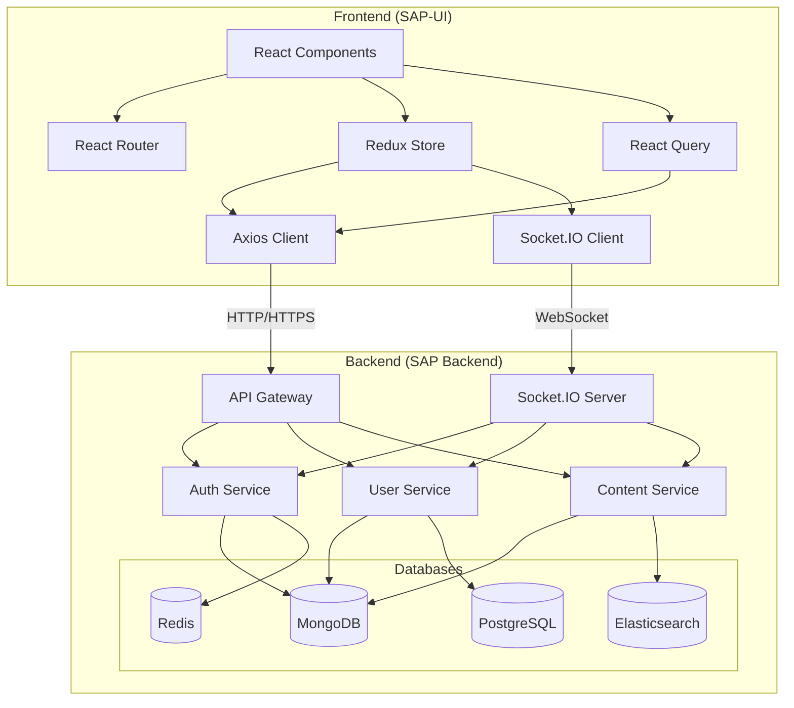
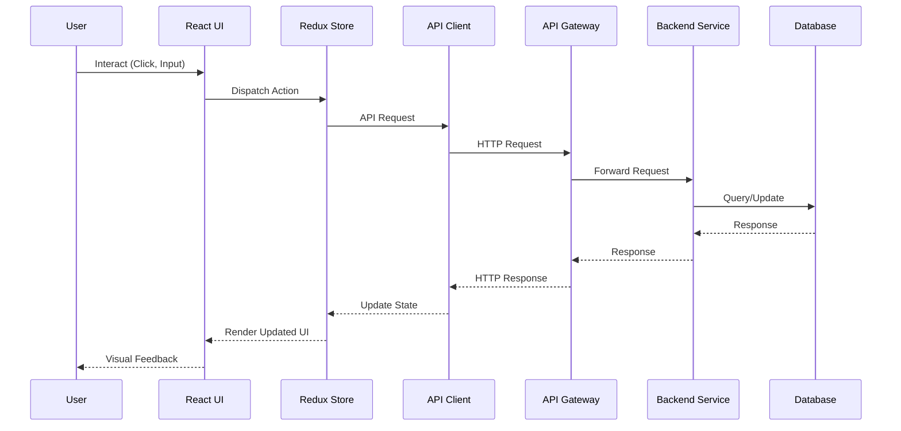
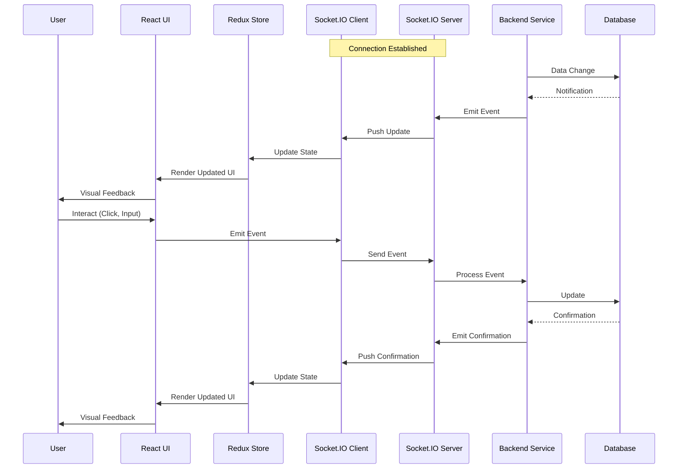

# Frontend-Backend Integration Overview

This document provides a high-level overview of how the SAP-UI (frontend) integrates with the SAP Backend services.

## Technology Stack Integration

### Frontend Stack (SAP-UI)

The SAP-UI is built using:

- **React**: UI library for building component-based interfaces
- **TypeScript**: For type-safe code
- **Redux Toolkit**: For state management
- **React Router**: For navigation
- **Axios**: For HTTP requests
- **Socket.IO Client**: For WebSocket communication
- **Material-UI**: For UI components
- **React Query**: For data fetching and caching
- **Formik**: For form handling
- **Yup**: For validation schemas

### Backend Stack (SAP Backend)

The SAP Backend is built using:

- **Node.js**: JavaScript runtime
- **Express**: Web framework
- **TypeScript**: For type-safe code
- **MongoDB**: Primary document database
- **Redis**: For caching and session management
- **Elasticsearch**: For search functionality
- **PostgreSQL**: For relational data
- **Socket.IO**: For WebSocket communication
- **JWT**: For authentication
- **Swagger/OpenAPI**: For API documentation

## Integration Architecture

The following diagram illustrates the high-level architecture of the frontend-backend integration:



## Data Flow Between Frontend and Backend

### Request-Response Flow



### Real-time Data Flow



## Frontend-Backend Contract

The integration between frontend and backend is governed by a clear contract:

### API Contract

- **REST API Endpoints**: Well-defined endpoints with consistent URL structure
- **Request/Response Formats**: Standardized JSON formats
- **Error Handling**: Consistent error response structure
- **Versioning**: API versioning to manage changes
- **OpenAPI Specification**: Machine-readable API documentation

### Data Models

Shared data models between frontend and backend:

```typescript
// Example shared type definitions
interface User {
  id: string;
  email: string;
  roles: string[];
  profile?: UserProfile;
  createdAt: string;
  updatedAt: string;
}

interface UserProfile {
  firstName?: string;
  lastName?: string;
  birthDate?: string;
  birthPlace?: string;
  profilePicture?: string;
}

// Error response format
interface ErrorResponse {
  error: {
    code: string;
    message: string;
    details?: Record<string, any>;
    timestamp: string;
    requestId: string;
  };
}
```

### Event Contract

For WebSocket communication:

```typescript
// Event types
type EventType = 
  | 'notification'
  | 'status-update'
  | 'user-activity'
  | 'content-update'
  | 'system-alert';

// Event structure
interface Event<T> {
  type: EventType;
  payload: T;
  timestamp: string;
  meta?: Record<string, any>;
}

// Example event
const notificationEvent: Event<Notification> = {
  type: 'notification',
  payload: {
    id: 'notif_123',
    message: 'New content published',
    read: false
  },
  timestamp: '2025-05-20T00:43:08+05:30'
};
```

## Integration Testing

The frontend-backend integration is tested through:

- **End-to-End Tests**: Testing the complete user flow across frontend and backend
- **Integration Tests**: Testing API contracts and WebSocket communication
- **Mock Servers**: Frontend development with mock backend services
- **API Contract Tests**: Ensuring API responses match expected schemas

## Development Workflow

The development workflow for frontend-backend integration:

1. **API Design**: Define API contracts before implementation
2. **Parallel Development**: Frontend and backend teams develop against the contract
3. **Mock Services**: Frontend uses mock services during development
4. **Integration Testing**: Regular integration testing to catch issues early
5. **Documentation**: Keep API documentation updated

## Deployment and Environment Configuration

The frontend and backend are deployed as separate applications but configured to work together:

- **Environment Variables**: Configure API endpoints and authentication settings
- **CORS Configuration**: Backend configured to accept requests from frontend origins
- **Deployment Pipeline**: Coordinated deployment of compatible versions
- **Feature Flags**: Coordinated feature rollout across frontend and backend

For more detailed information about specific aspects of the integration, please refer to the other documents in this section.
