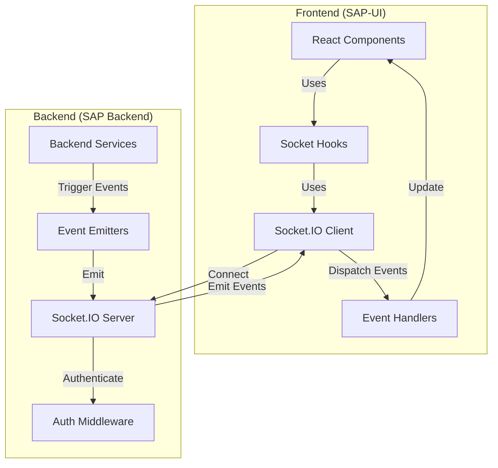

# Real-time Communication

This document details the real-time communication between the SAP-UI frontend and the SAP Backend services.

## WebSocket Architecture

The SAP system uses Socket.IO for real-time, bidirectional communication:



## Real-time Event Types

The system uses several types of real-time events:

1. **Notifications**: System and user notifications
2. **Data Updates**: Real-time updates to data
3. **User Presence**: Online/offline status
4. **Chat Messages**: Real-time messaging
5. **System Alerts**: Critical system information

## Backend Implementation

### Socket.IO Server Setup

```typescript
// src/socket/index.ts
import { Server } from 'socket.io';
import http from 'http';
import { verifyJWT } from '../middleware/auth';
import { registerAuthHandlers } from './handlers/authHandlers';
import { registerUserHandlers } from './handlers/userHandlers';
import { registerContentHandlers } from './handlers/contentHandlers';
import { SocketUser } from '../types/socket';

declare module 'socket.io' {
  interface Socket {
    user?: SocketUser;
  }
}

export const setupSocketServer = (httpServer: http.Server) => {
  const io = new Server(httpServer, {
    cors: {
      origin: process.env.CORS_ORIGIN?.split(',') || 'http://localhost:3000',
      methods: ['GET', 'POST'],
      credentials: true
    }
  });
  
  // Authentication middleware
  io.use(async (socket, next) => {
    try {
      const token = socket.handshake.auth.token;
      if (!token) {
        return next(new Error('Authentication required'));
      }
      
      const user = await verifyJWT(token);
      if (!user) {
        return next(new Error('Invalid token'));
      }
      
      // Attach user to socket
      socket.user = {
        id: user.id,
        email: user.email,
        roles: user.roles
      };
      
      next();
    } catch (error) {
      next(new Error('Authentication failed'));
    }
  });
  
  // Connection handler
  io.on('connection', (socket) => {
    console.log(`User connected: ${socket.user?.id}`);
    
    // Join user's room for private messages
    if (socket.user?.id) {
      socket.join(`user:${socket.user.id}`);
    }
    
    // Join rooms based on user roles
    if (socket.user?.roles) {
      socket.user.roles.forEach(role => {
        socket.join(`role:${role}`);
      });
    }
    
    // Register event handlers
    registerAuthHandlers(io, socket);
    registerUserHandlers(io, socket);
    registerContentHandlers(io, socket);
    
    // Disconnect handler
    socket.on('disconnect', () => {
      console.log(`User disconnected: ${socket.user?.id}`);
    });
  });
  
  return io;
};
```

### Event Handlers

```typescript
// src/socket/handlers/userHandlers.ts
import { Server, Socket } from 'socket.io';
import { userService } from '../../services/userService';

export const registerUserHandlers = (io: Server, socket: Socket) => {
  // Handle user status change
  socket.on('user:status', async (status: 'online' | 'away' | 'offline') => {
    if (!socket.user?.id) return;
    
    try {
      // Update user status in database
      await userService.updateUserStatus(socket.user.id, status);
      
      // Broadcast to relevant users
      socket.broadcast.emit('user:status-changed', {
        userId: socket.user.id,
        status
      });
    } catch (error) {
      console.error('Error updating user status:', error);
      socket.emit('error', {
        event: 'user:status',
        message: 'Failed to update status'
      });
    }
  });
  
  // Handle user typing indicator
  socket.on('user:typing', (data: { conversationId: string; isTyping: boolean }) => {
    if (!socket.user?.id) return;
    
    socket.to(`conversation:${data.conversationId}`).emit('user:typing', {
      userId: socket.user.id,
      conversationId: data.conversationId,
      isTyping: data.isTyping
    });
  });
};
```

### Event Emitters

```typescript
// src/services/notificationService.ts
import { getSocketServer } from '../socket';
import { Notification } from '../models/Notification';

export class NotificationService {
  async createNotification(userId: string, notification: Partial<Notification>) {
    try {
      // Create notification in database
      const newNotification = await Notification.create({
        userId,
        message: notification.message,
        type: notification.type,
        data: notification.data,
        read: false
      });
      
      // Emit real-time notification
      const io = getSocketServer();
      io.to(`user:${userId}`).emit('notification:new', {
        id: newNotification.id,
        message: newNotification.message,
        type: newNotification.type,
        data: newNotification.data,
        createdAt: newNotification.createdAt
      });
      
      return newNotification;
    } catch (error) {
      console.error('Error creating notification:', error);
      throw error;
    }
  }
  
  async markAsRead(userId: string, notificationId: string) {
    try {
      // Update notification in database
      const notification = await Notification.findOneAndUpdate(
        { _id: notificationId, userId },
        { read: true },
        { new: true }
      );
      
      if (!notification) {
        throw new Error('Notification not found');
      }
      
      // Emit read status update
      const io = getSocketServer();
      io.to(`user:${userId}`).emit('notification:read', {
        id: notificationId
      });
      
      return notification;
    } catch (error) {
      console.error('Error marking notification as read:', error);
      throw error;
    }
  }
}

export const notificationService = new NotificationService();
```

## Frontend Implementation

### Socket.IO Client Setup

```typescript
// src/socket/socketClient.ts
import { io, Socket } from 'socket.io-client';
import { store } from '../store';
import tokenManager from '../utils/tokenManager';

let socket: Socket | null = null;

export const initializeSocket = () => {
  // Close existing connection if any
  if (socket) {
    socket.close();
  }
  
  const token = tokenManager.getAccessToken();
  if (!token) {
    console.warn('Cannot initialize socket: No auth token available');
    return null;
  }
  
  // Create new socket connection
  socket = io(process.env.REACT_APP_SOCKET_URL || 'http://localhost:5000', {
    auth: { token },
    withCredentials: true,
    reconnection: true,
    reconnectionAttempts: 5,
    reconnectionDelay: 1000
  });
  
  // Setup event listeners
  socket.on('connect', () => {
    console.log('Socket connected');
  });
  
  socket.on('disconnect', (reason) => {
    console.log(`Socket disconnected: ${reason}`);
  });
  
  socket.on('error', (error) => {
    console.error('Socket error:', error);
  });
  
  socket.on('notification:new', (notification) => {
    store.dispatch({
      type: 'notifications/newNotification',
      payload: notification
    });
  });
  
  socket.on('notification:read', (data) => {
    store.dispatch({
      type: 'notifications/markAsRead',
      payload: data.id
    });
  });
  
  socket.on('user:status-changed', (data) => {
    store.dispatch({
      type: 'users/updateUserStatus',
      payload: data
    });
  });
  
  return socket;
};

export const getSocket = () => {
  if (!socket || !socket.connected) {
    return initializeSocket();
  }
  return socket;
};

export const closeSocket = () => {
  if (socket) {
    socket.close();
    socket = null;
  }
};
```

### React Hooks for Socket.IO

```typescript
// src/hooks/useSocket.ts
import { useEffect, useRef, useCallback } from 'react';
import { Socket } from 'socket.io-client';
import { useSelector } from 'react-redux';
import { RootState } from '../store';
import { getSocket, closeSocket } from '../socket/socketClient';

export const useSocket = () => {
  const { isAuthenticated } = useSelector((state: RootState) => state.auth);
  const socketRef = useRef<Socket | null>(null);
  
  useEffect(() => {
    if (isAuthenticated) {
      socketRef.current = getSocket();
    } else {
      closeSocket();
      socketRef.current = null;
    }
    
    return () => {
      // No need to close on component unmount
      // Socket is managed globally
    };
  }, [isAuthenticated]);
  
  const emit = useCallback((event: string, data: any, callback?: (response: any) => void) => {
    if (socketRef.current) {
      socketRef.current.emit(event, data, callback);
    } else {
      console.warn(`Cannot emit ${event}: Socket not connected`);
    }
  }, []);
  
  const on = useCallback((event: string, callback: (...args: any[]) => void) => {
    if (socketRef.current) {
      socketRef.current.on(event, callback);
      
      // Return cleanup function
      return () => {
        socketRef.current?.off(event, callback);
      };
    }
    return () => {}; // Empty cleanup if no socket
  }, []);
  
  const off = useCallback((event: string, callback?: (...args: any[]) => void) => {
    if (socketRef.current) {
      socketRef.current.off(event, callback);
    }
  }, []);
  
  return {
    socket: socketRef.current,
    isConnected: socketRef.current?.connected || false,
    emit,
    on,
    off
  };
};
```

### Using Socket Hooks in Components

```tsx
// src/components/Chat/ChatRoom.tsx
import React, { useState, useEffect, useRef } from 'react';
import { useSocket } from '../../hooks/useSocket';
import { useSelector } from 'react-redux';
import { RootState } from '../../store';
import { Message, MessageInput, UserTypingIndicator } from './components';

interface ChatMessage {
  id: string;
  senderId: string;
  content: string;
  timestamp: string;
}

const ChatRoom: React.FC<{ roomId: string }> = ({ roomId }) => {
  const { user } = useSelector((state: RootState) => state.auth);
  const { socket, emit, on } = useSocket();
  const [messages, setMessages] = useState<ChatMessage[]>([]);
  const [typingUsers, setTypingUsers] = useState<string[]>([]);
  const [isTyping, setIsTyping] = useState(false);
  const typingTimeoutRef = useRef<NodeJS.Timeout | null>(null);
  
  // Load initial messages
  useEffect(() => {
    if (socket && roomId) {
      emit('chat:join', { roomId });
      
      emit('chat:history', { roomId }, (response: { messages: ChatMessage[] }) => {
        setMessages(response.messages);
      });
      
      // Cleanup when leaving room
      return () => {
        emit('chat:leave', { roomId });
      };
    }
  }, [socket, roomId, emit]);
  
  // Listen for new messages
  useEffect(() => {
    if (!socket) return;
    
    const handleNewMessage = (message: ChatMessage) => {
      setMessages(prev => [...prev, message]);
    };
    
    const cleanup = on('chat:message', handleNewMessage);
    return cleanup;
  }, [socket, on]);
  
  // Listen for typing indicators
  useEffect(() => {
    if (!socket) return;
    
    const handleTyping = (data: { userId: string; isTyping: boolean }) => {
      setTypingUsers(prev => {
        if (data.isTyping) {
          // Add user to typing list if not already there
          if (!prev.includes(data.userId)) {
            return [...prev, data.userId];
          }
        } else {
          // Remove user from typing list
          return prev.filter(id => id !== data.userId);
        }
        return prev;
      });
    };
    
    const cleanup = on('chat:typing', handleTyping);
    return cleanup;
  }, [socket, on]);
  
  // Handle sending messages
  const sendMessage = (content: string) => {
    if (!socket || !content.trim() || !user) return;
    
    const messageData = {
      roomId,
      content,
      senderId: user.id
    };
    
    emit('chat:message', messageData);
    
    // Clear typing indicator
    setIsTyping(false);
    emit('chat:typing', { roomId, isTyping: false });
  };
  
  // Handle typing indicator
  const handleTyping = () => {
    if (!socket || !user) return;
    
    if (!isTyping) {
      setIsTyping(true);
      emit('chat:typing', { roomId, isTyping: true });
    }
    
    // Reset timeout
    if (typingTimeoutRef.current) {
      clearTimeout(typingTimeoutRef.current);
    }
    
    // Set timeout to clear typing indicator
    typingTimeoutRef.current = setTimeout(() => {
      setIsTyping(false);
      emit('chat:typing', { roomId, isTyping: false });
    }, 3000);
  };
  
  return (
    <div className="chat-room">
      <div className="messages-container">
        {messages.map(message => (
          <Message
            key={message.id}
            message={message}
            isOwnMessage={message.senderId === user?.id}
          />
        ))}
      </div>
      
      {typingUsers.length > 0 && (
        <UserTypingIndicator userIds={typingUsers} />
      )}
      
      <MessageInput
        onSend={sendMessage}
        onTyping={handleTyping}
      />
    </div>
  );
};

export default ChatRoom;
```

## Real-time Notifications

```tsx
// src/components/Notifications/NotificationCenter.tsx
import React, { useEffect } from 'react';
import { useSelector, useDispatch } from 'react-redux';
import { RootState } from '../../store';
import { useSocket } from '../../hooks/useSocket';
import { markAsRead, fetchNotifications } from '../../store/notifications/notificationsSlice';
import { NotificationItem, NotificationBadge } from './components';

const NotificationCenter: React.FC = () => {
  const dispatch = useDispatch();
  const { notifications, unreadCount } = useSelector(
    (state: RootState) => state.notifications
  );
  const { on } = useSocket();
  
  // Load initial notifications
  useEffect(() => {
    dispatch(fetchNotifications());
  }, [dispatch]);
  
  // Listen for new notifications
  useEffect(() => {
    const cleanup = on('notification:new', (notification) => {
      // New notifications are handled by the socket client
      // which dispatches to the store
    });
    
    return cleanup;
  }, [on]);
  
  const handleMarkAsRead = (notificationId: string) => {
    dispatch(markAsRead(notificationId));
  };
  
  return (
    <div className="notification-center">
      <NotificationBadge count={unreadCount} />
      
      <div className="notifications-list">
        {notifications.length === 0 ? (
          <div className="empty-state">No notifications</div>
        ) : (
          notifications.map(notification => (
            <NotificationItem
              key={notification.id}
              notification={notification}
              onMarkAsRead={handleMarkAsRead}
            />
          ))
        )}
      </div>
    </div>
  );
};

export default NotificationCenter;
```

## Real-time Dashboard Updates

```tsx
// src/pages/Dashboard/Dashboard.tsx
import React, { useEffect, useState } from 'react';
import { useSocket } from '../../hooks/useSocket';
import { DashboardMetrics, ActivityFeed, StatusPanel } from './components';

interface Metrics {
  activeUsers: number;
  totalContent: number;
  systemHealth: 'good' | 'warning' | 'critical';
  lastUpdated: string;
}

const Dashboard: React.FC = () => {
  const { on } = useSocket();
  const [metrics, setMetrics] = useState<Metrics | null>(null);
  const [activities, setActivities] = useState<any[]>([]);
  
  // Listen for dashboard updates
  useEffect(() => {
    const metricsCleanup = on('dashboard:metrics', (data: Metrics) => {
      setMetrics(data);
    });
    
    const activityCleanup = on('dashboard:activity', (activity: any) => {
      setActivities(prev => [activity, ...prev].slice(0, 10));
    });
    
    return () => {
      metricsCleanup();
      activityCleanup();
    };
  }, [on]);
  
  return (
    <div className="dashboard">
      <h1>Dashboard</h1>
      
      {metrics && (
        <DashboardMetrics
          activeUsers={metrics.activeUsers}
          totalContent={metrics.totalContent}
          systemHealth={metrics.systemHealth}
          lastUpdated={metrics.lastUpdated}
        />
      )}
      
      <div className="dashboard-grid">
        <ActivityFeed activities={activities} />
        <StatusPanel />
      </div>
    </div>
  );
};

export default Dashboard;
```

## Real-time Data Synchronization

```typescript
// src/store/middleware/socketMiddleware.ts
import { Middleware } from 'redux';
import { getSocket } from '../../socket/socketClient';

export const socketMiddleware: Middleware = store => next => action => {
  // Process the action first
  const result = next(action);
  
  // Get socket instance
  const socket = getSocket();
  if (!socket) return result;
  
  // Handle specific actions that need to sync with server
  switch (action.type) {
    case 'users/updateUserStatus':
      socket.emit('user:status', action.payload.status);
      break;
      
    case 'notifications/markAsRead':
      socket.emit('notification:read', { id: action.payload });
      break;
      
    case 'content/updateContent':
      socket.emit('content:update', action.payload);
      break;
  }
  
  return result;
};
```

## Security Considerations

### Authentication

- **Token-based Authentication**: WebSocket connections authenticated with JWT
- **Connection Validation**: Validate user on connection and reconnection
- **Room Authorization**: Users can only join authorized rooms

### Data Validation

- **Input Validation**: Validate all incoming socket events
- **Rate Limiting**: Prevent event flooding
- **Message Size Limits**: Prevent large payload attacks

### Connection Management

- **Reconnection Strategy**: Exponential backoff for reconnection attempts
- **Heartbeat Mechanism**: Detect and handle dead connections
- **Connection Monitoring**: Track connection status and errors

## Best Practices

1. **Use namespaced events**: Organize events by feature (e.g., `user:status`, `chat:message`)
2. **Implement reconnection logic**: Handle network disruptions gracefully
3. **Use room-based broadcasting**: Target specific users or groups
4. **Handle connection errors**: Provide feedback for connection issues
5. **Implement presence management**: Track online/offline status
6. **Use event acknowledgements**: Confirm event receipt when needed
7. **Optimize payload size**: Send minimal data to reduce bandwidth
8. **Implement proper error handling**: Handle socket errors gracefully
9. **Use middleware for authentication**: Ensure all connections are authenticated
10. **Document event contracts**: Keep frontend and backend events in sync

For more detailed information about authentication flow and API integration, please refer to the other documents in this section.
