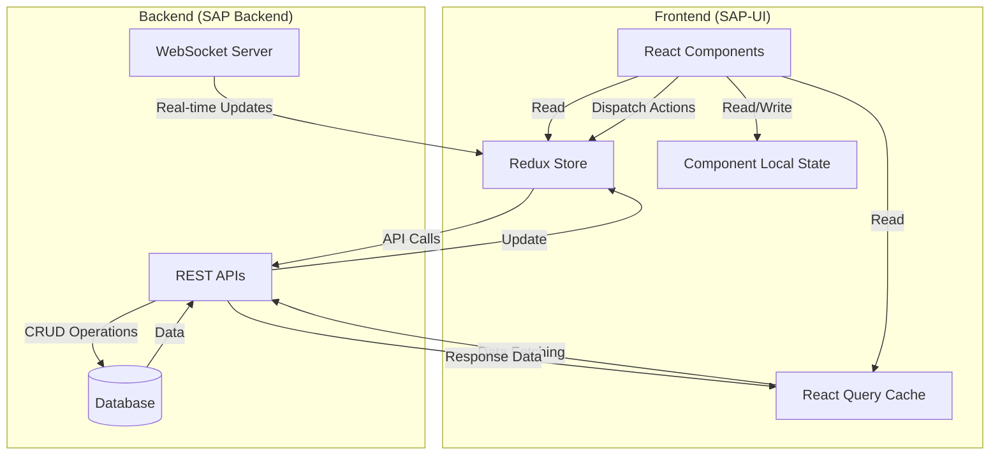

# State Management

This document details how the SAP-UI frontend manages state in relation to backend data.

## State Management Architecture

The SAP-UI uses a combination of Redux and React Query for state management:



## State Management Strategy

The SAP-UI follows a clear strategy for state management:

| State Type | Storage | Use Case |
|------------|---------|----------|
| UI State | Local Component State | Component-specific UI state (open/closed, selected items) |
| Form State | Formik/Local State | Form values, validation, submission state |
| Entity Data | React Query | Server data that needs caching, pagination, etc. |
| Global App State | Redux | Authentication, notifications, global settings |
| Real-time Data | Redux + WebSocket | Data that needs real-time updates |

## Redux Store Structure

```typescript
// src/store/index.ts
import { configureStore } from '@reduxjs/toolkit';
import { socketMiddleware } from './middleware/socketMiddleware';
import authReducer from './auth/authSlice';
import notificationsReducer from './notifications/notificationsSlice';
import uiReducer from './ui/uiSlice';
import settingsReducer from './settings/settingsSlice';

export const store = configureStore({
  reducer: {
    auth: authReducer,
    notifications: notificationsReducer,
    ui: uiReducer,
    settings: settingsReducer
  },
  middleware: (getDefaultMiddleware) => 
    getDefaultMiddleware().concat(socketMiddleware)
});

export type RootState = ReturnType<typeof store.getState>;
export type AppDispatch = typeof store.dispatch;
```

## Redux Slices

### Auth Slice

```typescript
// src/store/auth/authSlice.ts
import { createSlice, createAsyncThunk } from '@reduxjs/toolkit';
import { authService } from '../../services/authService';
import tokenManager from '../../utils/tokenManager';
import { User } from '../../types/user';

interface AuthState {
  user: User | null;
  isAuthenticated: boolean;
  isLoading: boolean;
  error: string | null;
}

const initialState: AuthState = {
  user: null,
  isAuthenticated: false,
  isLoading: false,
  error: null
};

export const login = createAsyncThunk(
  'auth/login',
  async (credentials: { email: string; password: string }, { rejectWithValue }) => {
    try {
      return await authService.login(credentials);
    } catch (error) {
      return rejectWithValue(error.response?.data?.error?.message || 'Login failed');
    }
  }
);

export const logout = createAsyncThunk(
  'auth/logout',
  async (_, { rejectWithValue }) => {
    try {
      await authService.logout();
      tokenManager.clearTokens();
      return null;
    } catch (error) {
      return rejectWithValue(error.response?.data?.error?.message || 'Logout failed');
    }
  }
);

export const refreshToken = createAsyncThunk(
  'auth/refreshToken',
  async (_, { rejectWithValue }) => {
    try {
      return await authService.refreshToken();
    } catch (error) {
      return rejectWithValue(error.response?.data?.error?.message || 'Token refresh failed');
    }
  }
);

const authSlice = createSlice({
  name: 'auth',
  initialState,
  reducers: {
    clearError: (state) => {
      state.error = null;
    }
  },
  extraReducers: (builder) => {
    builder
      // Login
      .addCase(login.pending, (state) => {
        state.isLoading = true;
        state.error = null;
      })
      .addCase(login.fulfilled, (state, action) => {
        state.isLoading = false;
        state.isAuthenticated = true;
        state.user = action.payload.user;
      })
      .addCase(login.rejected, (state, action) => {
        state.isLoading = false;
        state.error = action.payload as string;
      })
      
      // Logout
      .addCase(logout.fulfilled, (state) => {
        state.isAuthenticated = false;
        state.user = null;
      })
      
      // Refresh token
      .addCase(refreshToken.fulfilled, (state, action) => {
        // Only update token, not user state
      })
      .addCase(refreshToken.rejected, (state) => {
        // If refresh fails, log out
        state.isAuthenticated = false;
        state.user = null;
      });
  }
});

export const { clearError } = authSlice.actions;
export default authSlice.reducer;
```

### Notifications Slice

```typescript
// src/store/notifications/notificationsSlice.ts
import { createSlice, createAsyncThunk } from '@reduxjs/toolkit';
import { notificationService } from '../../services/notificationService';
import { Notification } from '../../types/notification';

interface NotificationsState {
  notifications: Notification[];
  unreadCount: number;
  isLoading: boolean;
  error: string | null;
}

const initialState: NotificationsState = {
  notifications: [],
  unreadCount: 0,
  isLoading: false,
  error: null
};

export const fetchNotifications = createAsyncThunk(
  'notifications/fetchNotifications',
  async (_, { rejectWithValue }) => {
    try {
      return await notificationService.getNotifications();
    } catch (error) {
      return rejectWithValue(error.response?.data?.error?.message || 'Failed to fetch notifications');
    }
  }
);

export const markAsRead = createAsyncThunk(
  'notifications/markAsRead',
  async (notificationId: string, { rejectWithValue }) => {
    try {
      await notificationService.markAsRead(notificationId);
      return notificationId;
    } catch (error) {
      return rejectWithValue(error.response?.data?.error?.message || 'Failed to mark notification as read');
    }
  }
);

const notificationsSlice = createSlice({
  name: 'notifications',
  initialState,
  reducers: {
    newNotification: (state, action) => {
      state.notifications.unshift(action.payload);
      state.unreadCount += 1;
    },
    clearNotifications: (state) => {
      state.notifications = [];
      state.unreadCount = 0;
    }
  },
  extraReducers: (builder) => {
    builder
      // Fetch notifications
      .addCase(fetchNotifications.pending, (state) => {
        state.isLoading = true;
        state.error = null;
      })
      .addCase(fetchNotifications.fulfilled, (state, action) => {
        state.isLoading = false;
        state.notifications = action.payload.notifications;
        state.unreadCount = action.payload.notifications.filter(n => !n.read).length;
      })
      .addCase(fetchNotifications.rejected, (state, action) => {
        state.isLoading = false;
        state.error = action.payload as string;
      })
      
      // Mark as read
      .addCase(markAsRead.fulfilled, (state, action) => {
        const notificationId = action.payload;
        const notification = state.notifications.find(n => n.id === notificationId);
        if (notification && !notification.read) {
          notification.read = true;
          state.unreadCount -= 1;
        }
      });
  }
});

export const { newNotification, clearNotifications } = notificationsSlice.actions;
export default notificationsSlice.reducer;
```

## React Query Setup

```typescript
// src/api/queryClient.ts
import { QueryClient } from 'react-query';
import { showErrorToast } from '../utils/errorHandler';

export const queryClient = new QueryClient({
  defaultOptions: {
    queries: {
      refetchOnWindowFocus: false,
      retry: (failureCount, error: any) => {
        // Don't retry on 4xx errors
        if (error.response?.status >= 400 && error.response?.status < 500) {
          return false;
        }
        // Retry up to 3 times on other errors
        return failureCount < 3;
      },
      onError: (error) => {
        showErrorToast(error);
      },
      staleTime: 5 * 60 * 1000, // 5 minutes
      cacheTime: 10 * 60 * 1000 // 10 minutes
    },
    mutations: {
      onError: (error) => {
        showErrorToast(error);
      }
    }
  }
});
```

## React Query Hooks

```typescript
// src/api/hooks/useContent.ts
import { useQuery, useMutation, useQueryClient } from 'react-query';
import { contentApiClient } from '../clients/contentApiClient';
import { Content, ContentListResponse, CreateContentRequest, UpdateContentRequest } from '../types/content';

// Query keys
export const contentKeys = {
  all: ['content'] as const,
  lists: () => [...contentKeys.all, 'list'] as const,
  list: (filters: any) => [...contentKeys.lists(), filters] as const,
  details: () => [...contentKeys.all, 'detail'] as const,
  detail: (id: string) => [...contentKeys.details(), id] as const,
};

// Get content with pagination and filters
export const useContent = (page = 1, limit = 10, filters = {}) => {
  return useQuery<ContentListResponse>(
    contentKeys.list({ page, limit, ...filters }),
    () => contentApiClient.getContent(page, limit, filters),
    {
      keepPreviousData: true,
    }
  );
};

// Get a single content item
export const useContentItem = (id: string) => {
  return useQuery<Content>(
    contentKeys.detail(id),
    () => contentApiClient.getContentById(id),
    {
      enabled: !!id,
    }
  );
};

// Create content
export const useCreateContent = () => {
  const queryClient = useQueryClient();
  
  return useMutation<Content, Error, CreateContentRequest>(
    (data) => contentApiClient.createContent(data),
    {
      onSuccess: () => {
        queryClient.invalidateQueries(contentKeys.lists());
      },
    }
  );
};

// Update content
export const useUpdateContent = () => {
  const queryClient = useQueryClient();
  
  return useMutation<Content, Error, { id: string; data: UpdateContentRequest }>(
    ({ id, data }) => contentApiClient.updateContent(id, data),
    {
      onSuccess: (updatedContent) => {
        queryClient.setQueryData(
          contentKeys.detail(updatedContent.id),
          updatedContent
        );
        queryClient.invalidateQueries(contentKeys.lists());
      },
    }
  );
};

// Delete content
export const useDeleteContent = () => {
  const queryClient = useQueryClient();
  
  return useMutation<void, Error, string>(
    (id) => contentApiClient.deleteContent(id),
    {
      onSuccess: (_, id) => {
        queryClient.removeQueries(contentKeys.detail(id));
        queryClient.invalidateQueries(contentKeys.lists());
      },
    }
  );
};
```

## Using State Management in Components

### Redux State in Components

```tsx
// src/components/Header/Header.tsx
import React from 'react';
import { useSelector, useDispatch } from 'react-redux';
import { RootState } from '../../store';
import { logout } from '../../store/auth/authSlice';
import { NotificationCenter, UserMenu } from '../';

const Header: React.FC = () => {
  const dispatch = useDispatch();
  const { user, isAuthenticated } = useSelector((state: RootState) => state.auth);
  const { unreadCount } = useSelector((state: RootState) => state.notifications);
  
  const handleLogout = () => {
    dispatch(logout());
  };
  
  return (
    <header className="app-header">
      <div className="logo">
        
        <span>Corp Astro SAP</span>
      </div>
      
      {isAuthenticated && (
        <div className="header-actions">
          <NotificationCenter unreadCount={unreadCount} />
          <UserMenu user={user} onLogout={handleLogout} />
        </div>
      )}
    </header>
  );
};

export default Header;
```

### React Query in Components

```tsx
// src/pages/Content/ContentList.tsx
import React, { useState } from 'react';
import { useContent, useDeleteContent } from '../../api/hooks/useContent';
import { DataTable, Button, Pagination, FilterPanel } from '../../components';

const ContentList: React.FC = () => {
  const [page, setPage] = useState(1);
  const [limit, setLimit] = useState(10);
  const [filters, setFilters] = useState({});
  
  const { 
    data, 
    isLoading, 
    isError, 
    error 
  } = useContent(page, limit, filters);
  
  const deleteContentMutation = useDeleteContent();
  
  const handlePageChange = (newPage: number) => {
    setPage(newPage);
  };
  
  const handleFilterChange = (newFilters: any) => {
    setFilters(newFilters);
    setPage(1); // Reset to first page when filters change
  };
  
  const handleDelete = (id: string) => {
    if (window.confirm('Are you sure you want to delete this content?')) {
      deleteContentMutation.mutate(id);
    }
  };
  
  if (isLoading) {
    return <div className="loading">Loading content...</div>;
  }
  
  if (isError) {
    return <div className="error">Error: {error.message}</div>;
  }
  
  return (
    <div className="content-list-page">
      <div className="page-header">
        <h1>Content Management</h1>
        <Button to="/content/new" variant="primary">Create New</Button>
      </div>
      
      <FilterPanel onFilterChange={handleFilterChange} />
      
      <DataTable
        data={data?.content || []}
        columns={[
          { header: 'Title', accessor: 'title' },
          { header: 'Type', accessor: 'type' },
          { header: 'Status', accessor: 'status' },
          { header: 'Created', accessor: (item) => new Date(item.createdAt).toLocaleDateString() },
          { 
            header: 'Actions', 
            accessor: (item) => (
              <div className="table-actions">
                <Button to={`/content/${item.id}`} variant="secondary" size="small">Edit</Button>
                <Button 
                  onClick={() => handleDelete(item.id)} 
                  variant="danger" 
                  size="small"
                  isLoading={deleteContentMutation.isLoading && deleteContentMutation.variables === item.id}
                >
                  Delete
                </Button>
              </div>
            ) 
          }
        ]}
      />
      
      <Pagination
        currentPage={page}
        totalPages={data?.meta.pagination.pages || 1}
        onPageChange={handlePageChange}
      />
    </div>
  );
};

export default ContentList;
```

### Combining Redux and React Query

```tsx
// src/pages/Dashboard/Dashboard.tsx
import React from 'react';
import { useSelector } from 'react-redux';
import { RootState } from '../../store';
import { useSystemStats } from '../../api/hooks/useSystem';
import { useRecentUsers } from '../../api/hooks/useUsers';
import { useRecentContent } from '../../api/hooks/useContent';
import { 
  DashboardMetrics, 
  ActivityFeed, 
  SystemHealthPanel, 
  RecentUsersPanel,
  RecentContentPanel
} from '../../components';

const Dashboard: React.FC = () => {
  const { user } = useSelector((state: RootState) => state.auth);
  const { notifications } = useSelector((state: RootState) => state.notifications);
  
  const { data: systemStats, isLoading: statsLoading } = useSystemStats();
  const { data: recentUsers, isLoading: usersLoading } = useRecentUsers();
  const { data: recentContent, isLoading: contentLoading } = useRecentContent();
  
  // Filter recent notifications for activity feed
  const recentActivity = notifications.slice(0, 10);
  
  return (
    <div className="dashboard-page">
      <div className="page-header">
        <h1>Dashboard</h1>
        <div className="welcome-message">
          Welcome back, {user?.profile?.firstName || 'Admin'}
        </div>
      </div>
      
      <DashboardMetrics
        isLoading={statsLoading}
        metrics={systemStats?.metrics}
      />
      
      <div className="dashboard-grid">
        <ActivityFeed activities={recentActivity} />
        
        <SystemHealthPanel
          isLoading={statsLoading}
          health={systemStats?.health}
        />
        
        <RecentUsersPanel
          isLoading={usersLoading}
          users={recentUsers?.users}
        />
        
        <RecentContentPanel
          isLoading={contentLoading}
          content={recentContent?.content}
        />
      </div>
    </div>
  );
};

export default Dashboard;
```

## Form State Management

The SAP-UI uses Formik for form state management:

```tsx
// src/pages/Content/ContentForm.tsx
import React from 'react';
import { useParams, useNavigate } from 'react-router-dom';
import { Formik, Form, Field } from 'formik';
import * as Yup from 'yup';
import { useContentItem, useCreateContent, useUpdateContent } from '../../api/hooks/useContent';
import { TextField, SelectField, TextAreaField, Button, Alert } from '../../components';

const ContentSchema = Yup.object().shape({
  title: Yup.string().required('Title is required'),
  type: Yup.string().required('Type is required'),
  content: Yup.string().required('Content is required'),
  status: Yup.string().required('Status is required')
});

const ContentForm: React.FC = () => {
  const { id } = useParams<{ id: string }>();
  const navigate = useNavigate();
  const isEditing = !!id;
  
  const { data: contentItem, isLoading, isError } = useContentItem(id || '');
  const createContentMutation = useCreateContent();
  const updateContentMutation = useUpdateContent();
  
  const initialValues = isEditing && contentItem
    ? {
        title: contentItem.title,
        type: contentItem.type,
        content: contentItem.content,
        status: contentItem.status
      }
    : {
        title: '',
        type: 'article',
        content: '',
        status: 'draft'
      };
  
  const handleSubmit = (values: any) => {
    if (isEditing && id) {
      updateContentMutation.mutate(
        { id, data: values },
        {
          onSuccess: () => {
            navigate('/content');
          }
        }
      );
    } else {
      createContentMutation.mutate(
        values,
        {
          onSuccess: () => {
            navigate('/content');
          }
        }
      );
    }
  };
  
  if (isLoading) {
    return <div className="loading">Loading content...</div>;
  }
  
  if (isEditing && isError) {
    return <Alert type="error">Content not found or error loading content</Alert>;
  }
  
  return (
    <div className="content-form-page">
      <div className="page-header">
        <h1>{isEditing ? 'Edit Content' : 'Create Content'}</h1>
      </div>
      
      <Formik
        initialValues={initialValues}
        validationSchema={ContentSchema}
        onSubmit={handleSubmit}
        enableReinitialize
      >
        {({ isSubmitting }) => (
          <Form className="form">
            <Field
              name="title"
              label="Title"
              component={TextField}
            />
            
            <Field
              name="type"
              label="Content Type"
              component={SelectField}
              options={[
                { value: 'article', label: 'Article' },
                { value: 'video', label: 'Video' },
                { value: 'infographic', label: 'Infographic' }
              ]}
            />
            
            <Field
              name="content"
              label="Content"
              component={TextAreaField}
              rows={10}
            />
            
            <Field
              name="status"
              label="Status"
              component={SelectField}
              options={[
                { value: 'draft', label: 'Draft' },
                { value: 'published', label: 'Published' },
                { value: 'archived', label: 'Archived' }
              ]}
            />
            
            <div className="form-actions">
              <Button
                type="button"
                variant="secondary"
                onClick={() => navigate('/content')}
              >
                Cancel
              </Button>
              
              <Button
                type="submit"
                variant="primary"
                isLoading={isSubmitting || createContentMutation.isLoading || updateContentMutation.isLoading}
              >
                {isEditing ? 'Update' : 'Create'}
              </Button>
            </div>
          </Form>
        )}
      </Formik>
    </div>
  );
};

export default ContentForm;
```

## Optimistic Updates

The SAP-UI implements optimistic updates for a better user experience:

```typescript
// src/api/hooks/useUsers.ts (excerpt)
export const useUpdateUserStatus = () => {
  const queryClient = useQueryClient();
  
  return useMutation<
    User,
    Error,
    { userId: string; status: 'active' | 'inactive' }
  >(
    ({ userId, status }) => userApiClient.updateUserStatus(userId, status),
    {
      // Optimistically update the user status
      onMutate: async ({ userId, status }) => {
        // Cancel any outgoing refetches
        await queryClient.cancelQueries(userKeys.detail(userId));
        
        // Snapshot the previous value
        const previousUser = queryClient.getQueryData<User>(userKeys.detail(userId));
        
        // Optimistically update to the new value
        if (previousUser) {
          queryClient.setQueryData(userKeys.detail(userId), {
            ...previousUser,
            status
          });
        }
        
        return { previousUser };
      },
      
      // If the mutation fails, roll back to the previous value
      onError: (err, { userId }, context) => {
        if (context?.previousUser) {
          queryClient.setQueryData(
            userKeys.detail(userId),
            context.previousUser
          );
        }
      },
      
      // Always refetch after error or success
      onSettled: (_, __, { userId }) => {
        queryClient.invalidateQueries(userKeys.detail(userId));
      }
    }
  );
};
```

## Handling Offline State

The SAP-UI handles offline state to provide a better user experience:

```typescript
// src/hooks/useOnlineStatus.ts
import { useState, useEffect } from 'react';

export const useOnlineStatus = () => {
  const [isOnline, setIsOnline] = useState(navigator.onLine);
  
  useEffect(() => {
    const handleOnline = () => setIsOnline(true);
    const handleOffline = () => setIsOnline(false);
    
    window.addEventListener('online', handleOnline);
    window.addEventListener('offline', handleOffline);
    
    return () => {
      window.removeEventListener('online', handleOnline);
      window.removeEventListener('offline', handleOffline);
    };
  }, []);
  
  return isOnline;
};

// Usage in a component
const OfflineIndicator: React.FC = () => {
  const isOnline = useOnlineStatus();
  
  if (isOnline) return null;
  
  return (
    <div className="offline-indicator">
      You are currently offline. Some features may be unavailable.
    </div>
  );
};
```

## Synchronizing Local Changes

The SAP-UI synchronizes local changes when reconnecting:

```typescript
// src/hooks/useSyncQueue.ts
import { useEffect, useRef } from 'react';
import { useOnlineStatus } from './useOnlineStatus';

interface QueueItem<T> {
  id: string;
  action: () => Promise<T>;
  timestamp: number;
}

export const useSyncQueue = <T>() => {
  const isOnline = useOnlineStatus();
  const queueRef = useRef<QueueItem<T>[]>([]);
  
  // Process queue when coming back online
  useEffect(() => {
    if (isOnline && queueRef.current.length > 0) {
      const processQueue = async () => {
        const queue = [...queueRef.current];
        queueRef.current = [];
        
        for (const item of queue) {
          try {
            await item.action();
            console.log(`Successfully processed queued item: ${item.id}`);
          } catch (error) {
            console.error(`Failed to process queued item: ${item.id}`, error);
            // Re-add to queue if it's a network error
            if (error.message.includes('network')) {
              queueRef.current.push(item);
            }
          }
        }
      };
      
      processQueue();
    }
  }, [isOnline]);
  
  const addToQueue = (id: string, action: () => Promise<T>) => {
    const queueItem: QueueItem<T> = {
      id,
      action,
      timestamp: Date.now()
    };
    
    queueRef.current.push(queueItem);
    
    // If online, process immediately
    if (isOnline) {
      action().catch(error => {
        console.error(`Failed to process action: ${id}`, error);
        // Only keep in queue if it's a network error
        if (error.message.includes('network')) {
          queueRef.current.push(queueItem);
        }
      });
    }
    
    return queueItem;
  };
  
  const removeFromQueue = (id: string) => {
    queueRef.current = queueRef.current.filter(item => item.id !== id);
  };
  
  return {
    addToQueue,
    removeFromQueue,
    queueSize: queueRef.current.length,
    isOnline
  };
};
```

## Best Practices

1. **Separate concerns**: Use Redux for global state, React Query for server state
2. **Normalize data**: Store entities in a normalized format to avoid duplication
3. **Use selectors**: Create reusable selectors for accessing state
4. **Implement optimistic updates**: Update UI immediately for better UX
5. **Handle loading and error states**: Always show appropriate feedback
6. **Use middleware for side effects**: Keep reducers pure
7. **Cache invalidation strategy**: Carefully plan when to invalidate cache
8. **Persist necessary state**: Use localStorage for critical state
9. **Handle offline scenarios**: Queue changes when offline
10. **Type everything**: Use TypeScript for type safety

For more detailed information about authentication flow, API integration, and real-time communication, please refer to the other documents in this section.
