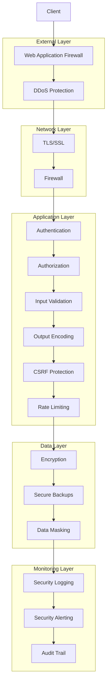

# Security Documentation

This section provides comprehensive information about the security measures, best practices, and guidelines implemented in the Corp Astro Super Admin Panel (SAP) backend.

## Contents

- [Security Overview](./overview.md) - High-level overview of security architecture
- [Authentication and Authorization](./auth.md) - Details about the authentication system
- [Data Protection](./data-protection.md) - Information about data security measures
- [Security Best Practices](./best-practices.md) - Guidelines for secure development

## Security Principles

The Corp Astro SAP security architecture is built on the following principles:

1. **Defense in Depth**: Multiple layers of security controls
2. **Least Privilege**: Minimal access rights for users and processes
3. **Secure by Default**: Security enabled by default in all components
4. **Data Protection**: Protecting sensitive data at rest and in transit
5. **Continuous Monitoring**: Ongoing security monitoring and alerting
6. **Regular Updates**: Keeping dependencies and systems up-to-date
7. **Security Testing**: Regular security testing and vulnerability scanning

## Security Architecture Overview

## Key Security Features

### Authentication

- JWT-based authentication with access and refresh tokens
- Multi-factor authentication (MFA) support
- OAuth integration (Google, GitHub)
- Account locking after failed attempts
- Password strength requirements
- Secure password reset flow

### Authorization

- Role-based access control (RBAC)
- Permission-based authorization
- API endpoint protection
- Resource-level access control
- Attribute-based access control (ABAC)

### Data Protection

- Encryption at rest for sensitive data
- TLS/SSL for all communications
- PII data protection
- Data anonymization for analytics
- Secure data deletion

### Application Security

- Input validation and sanitization
- Output encoding
- CSRF protection
- XSS prevention
- SQL injection prevention
- Security headers
- Rate limiting and throttling

### Infrastructure Security

- Secure container configuration
- Network segmentation
- Firewall rules
- Regular security updates
- Vulnerability scanning

### Monitoring and Response

- Security event logging
- Real-time alerting
- Incident response plan
- Security audit trail
- Automated threat detection

## Security Compliance

The Corp Astro SAP is designed to comply with:

- GDPR (General Data Protection Regulation)
- HIPAA (Health Insurance Portability and Accountability Act)
- SOC 2 (Service Organization Control 2)
- OWASP Top 10 security risks

## Security Responsibilities

### Development Team

- Follow secure coding practices
- Conduct peer code reviews with security focus
- Run security tests before deployment
- Keep dependencies up-to-date
- Report security vulnerabilities

### Operations Team

- Monitor security logs and alerts
- Apply security patches promptly
- Conduct regular security scans
- Maintain secure infrastructure
- Implement security controls

### Security Team

- Define security policies and standards
- Conduct security assessments
- Provide security training
- Respond to security incidents
- Perform penetration testing

## Reporting Security Issues

If you discover a security vulnerability, please follow the [Vulnerability Reporting](../../README.md#vulnerability-reporting) guidelines in the main README.

For more detailed information about specific security aspects, please refer to the individual documentation pages linked above.
